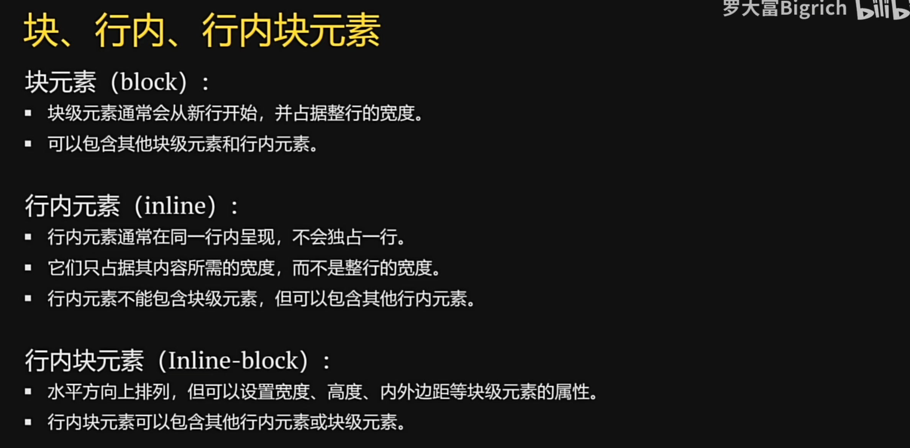
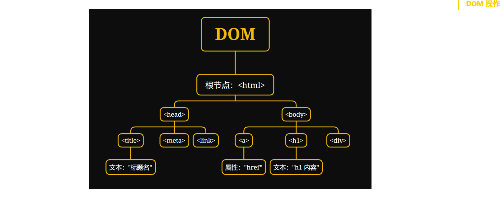

# 前端

## HTML

`HTML(Hypertext Markup Language)` 中文名就是 **`超文本标记语言`**，用于**创建网页的结构和内容**。HTML 是 Web 页面的基础，它描述了页面的语义结构，使浏览器能够正确地显示和解释内容。它使用一系列的**标签**（也称为元素）来定义文本、图像、链接、表格等在网页上的排布和呈现方式.

标签分为两种主要类型：单标签（Self-Closing Tags）和双标签（Paired Tags）。

> 单标签（Self-Closing Tags）：
>
> - 单标签通常用于表示没有内容的元素，例如图像、换行、横线等。
> - 它们以自封闭的方式出现，不需要闭合标签，因为它们没有内部内容。
> - 单标签的典型形式是 `<tagname>`，其中 tagname 是标签名称。 示例：`` 表示插入一张图片，而 `<br>` 表示换行。
>
> 双标签（Paired Tags）：
>
> - 双标签用于定义包含内容的元素，例如段落、标题、列表等。
> - 它们由两部分组成：开始标签和结束标签，开始标签用表示，结束标签用表示。
> - 开始标签用于定义元素的起始位置，结束标签用于定义元素的结束位置。
> - 在开始标签和结束标签之间可以包含元素的内容。 示例：`<p>` 这是一个段落。`</p>` 表示一个段落元素，其中 `<p>` 是开始标签，`</p>` 是结束标签，之间的文本是该段落的内容。

一个 HTML 文档通常由以下部分组成：

```html
<!DOCTYPE html>
<html>
<head>
    <!-- 这里放置文档的元信息 -->
    <title>文档标题</title>
    <meta charset="UTF-8">
    <!-- 连接外部样式表或脚本文件等 -->
    <link rel="stylesheet" type="text/css" href="styles.css">
    <script src="script.js"></script>
</head>
<body>
<!-- 这里放置页面内容 -->
<h1>这是一个标题</h1>
<p>这是一个段落。</p>
<a href="https://www.example.com">这是一个链接</a>
<!-- 其他内容 -->
</body>
</html>
```

`<!DOCTYPE html>`：声明文档类型为 HTML5。让浏览器知道这是html文档。

`<html>`：HTML 文档的根元素，包含了整个文档的内容。

`<head>`：包含一些文档的元信息，如标题、字符编码等。

`<title>`：定义网页标题，会显示在浏览器的标签页上。

`<body>`：包含实际的页面内容。

#### HTML 的基本语法

##### 文本内容

使用 `<p>` 标签定义段落，`<h1>` 到 `<h6>` 标签定义标题，`<strong>`、`<del>` 和 `<em>` 标签可以用于强调文本。

```html
<h1>这是一个一级标题</h1>
<h2>这是一个二级标题</h2>
<h3>这是一个三级标题</h3>
<h4>这是一个四级标题</h4>
<h5>这是一个五级标题</h5>
<h6>这是一个六级标题</h6>
<p>这是一个段落。</p>
<p><strong>重要信息：</strong>这是一个重要的内容。</p>
```

<b>加粗	<i>斜体	<u>下划线	<s>删除线

##### 列表

 使用 `<ul>` 和 `<li>` 标签创建无序列表，使用 `<ol>` 和 `<li>` 标签创建有序列表。

```html
<ul>
    <li>无序项目1</li>
    <li>无序项目2</li>
</ul>

<ol>
    <li>有序项目1</li>
    <li>有序项目2</li>
</ol>
```

##### 表格

使用 `<table>`、`<tr>`、`<td>`、`<th>` 等标签创建表格，`<table>` 是表格标签的根元素，然后是 `<tr>` 表格的**行标签**(table row)，

在 `<tr>` 内部是 `<td>` (table data)**列数据**与 `<th>`(table head)**列标题**

```html
<table border="1">
    <tr>
        <th>列A</th>
        <th>列B</th>
    </tr>
    <tr>
        <td>A1</td>
        <td>B1</td>
    </tr>
    <tr>
        <td>A2</td>
        <td>B2</td>
    </tr>
</table>
```

##### 图像 

使用 `` 标签插入图像。

```html

```

其中，`src` 是指定图片的文件路径的属性，`alt` 是指定在无法加载图片时显示的替代文本的属性。

##### 链接

使用 `<a>` 标签创建链接。

```html
<a href="https://github.com/">访问 GitHub </a>
<a href="https://github.com/" target="_blank">访问 GitHub </a>
```

target:选择打开该网站的方式。

##### 注释

使用 `<!-- 注释内容 -->` 添加注释，不会在浏览器中显示。

```html
<!-- 这是一个注释 -->
```

##### **水平线**

```python
<hr>
```


#### HTML属性

属性在 HTML 中起到非常重要的作用，它们用于定义元素的行为和外观，以及与其他元素的关系。

| 属性  |                       描述                       |
| :---: | :----------------------------------------------: |
| class | 为HTML元素定义一个或多个类名(类名从样式文件引入) |
|  id   |                 定义元素唯一的id                 |
| style |                规定元素的行内样式                |

- `class` 属性：`class` 属性是用于向元素添加一个或多个类名，以便通过 CSS 样式表定义样式。此外，类名还可以用来实现 JavaScript 的交互效果。例如：

```html
<p class="note">这是一个带有 note 类属性的 p 标签</p>
```

- `id` 属性：`id` 属性是用于将元素标识为唯一的标识符。它使得我们可以通过 JavaScript 或 CSS 来定位和操作该元素。例如：

```html
<div id="header">这是一个带有 header id 的 div 标签</div>
```

- `style` 属性：`style` 属性是用于将CSS样式规则直接应用于元素。它可以用于控制元素的颜色、字体、大小和布局等。例如：

```html
<div style="color: red; font-size: 20px;">这是一段红色的文字</div>
```

#### 区块

涉及到 HTML 元素时，可以将它们分为两个主要类别： `块级元素`和`行内元素` 。

`块级元素（block）`：块级元素通常用于组织和布局页面的主要结构和内容，例如段落、标题、列表、表格等。它们用于创建页面的主要部分，将内容分隔成逻辑块。

- 块级元素通常会从新行开始，并占据整行的宽度，因此它们会在页面上呈现为一块独立的内容块。
- 可以包含其他块级元素和行内元素。
- **常见的块级元素**包括 **`<div>`**, `<p>`, `<h1>` 到 `<h6>`, `<ul>`, `<ol>`, `<li>`, `<table>`, `<form>` 等。

`行内元素（inline）`：行内元素通常用于添加文本样式或为文本中的一部分应用样式。它们可以在文本中插入小的元素，例如超链接、强调文本等。

- 行内元素通常在同一行内呈现，不会独占一行。
- 它们只占据其内容所需的宽度，而不是整行的宽度。
- 行内元素不能包含块级元素，但可以包含其他行内元素。
- **常见的行内元素**包括 **`<span>`**, `<a>`, `<strong>`, `<em>`, ``, `<br>`, `<input>` 等。

#### 表单

HTML 表单（form）是一种重要的元素， 用于收集和提交用户输入的数据。表单允许用户输入文本、选择选项、上传文件等，然后将这些数据提交到服务器进行处理。一个基本的HTML表单由以下几个主要部分组成：

`<form>` 元素：表单元素是表单的容器，它定义了数据提交到哪里以及使用哪种 HTTP 方法（通常是 GET 或 POST ）来提交数据。它可以包含输入字段、按钮等元素。

```html
<form action="/submit" method="post">
    <!-- 表单元素 -->
</form>
```

`输入字段`：`<input>` 标签是 HTML 中用于创建表单元素的最常见标签之一。它允许用户输入文本、选择选项、上传文件等等。`<input>` 元素有多个属性，用于指定不同类型的输入和控制输入的方式。以下是一些常见的 `<input>` 标签的属性和它们的详细说明：

`type` 属性：指定输入字段的类型，它可以有以下不同的值：

- `text`：创建文本输入框，用于用户输入文本。
- `password`：创建密码输入框，输入内容会被隐藏。
- `radio`：创建单选按钮，用户只能选择一个选项。
- `checkbox`：创建复选框，用户可以选择多个选项。
- `number`：创建数字输入框，允许用户输入数字。
- `email`：创建用于输入电子邮件地址的输入框。
- `file`：创建文件上传字段，用户可以上传文件。
- `submit`：创建提交按钮，用于提交表单数据。
- `reset`：创建重置按钮，用于重置表单数据。
- `button`：创建自定义按钮，通常与 JavaScript 一起使用。

```html
<input type="text" name="username" placeholder="用户名">
<input type="password" name="password" placeholder="密码">
<input type="radio" name="gender" value="male"> 男
<input type="radio" name="gender" value="female"> 女
<input type="checkbox" name="subscribe" value="yes"> 订阅
<select name="country">
    <option value="zh">中国</option>
    <option value="us">美国</option>
    <!-- 其他选项 -->
</select>
```

表单元素可以包含一些属性，以指定表单的行为和样式。常见的表单属性包括：

|  属性  |                          描述                          |
| :----: | :----------------------------------------------------: |
| action |            指定表单数据提交到服务器的 URL。            |
| method | 指定用于提交数据的 HTTP 方法，通常为 `get` 或 `post`。 |
|  name  |         为表单命名，以便在 JavaScript 中引用。         |
| target |            指定表单提交后的目标窗口或框架。            |

表单提交方式的区别

> `get`：默认值，主动地获取方式，参数放在 URL 上，数据的容量有限，安全性差，有缓存；
>
> `post`：数据存放在请求体中，数据量理论上没有限制，相对安全，没有缓存。

## CSS

CSS（Cascading Style Sheets）是一种用于定义网页样式和布局的样式表语言。它与 HTML 一起用于构建 Web 页面，HTML 负责定义页面的结构和内容，而 CSS 则负责控制页面的外观和样式。

CSS 规则通常由选择器、属性和属性值组成，多个规则可以组合在一起，以便同时应用多个样式，以下是 CSS 的基本语法：

```css
选择器 {
    属性1: 属性值1;
    属性2: 属性值2;
}
```

> **注意事项**
>
> 1. 声明的每一行属性，都需要以英文分号结尾；
> 2. 声明中的所有属性和值都是以键值对这种形式出现的；
> 3. 选择器的声明中可以写无数条属性

#### **样式表导入方式**

##### **内联样式**

​	内联样式（Inline Styles）是将 CSS 样式直接嵌入到 HTML 元素中的一种方式。你可以在 HTML 标签的 style 属性中定义样式规则。这些样式仅适用于特定元素，优先级较高。

示例：

```html
<h1 style="color: blue; font-size: 30px;">这是一段内联样式文本。</h1>
```

##### **内部样式表**

​	内部样式表（Internal Stylesheet）是将 CSS 样式放置在 HTML 文档的 `<head>` 部分的 `<style>` 标签内。这些样式将应用于整个文档，但仍具有较高的优先级。

示例：

```html
<head>
    <style>
        h2 {
            color: red;
            font-size: 16px;
        }
    </style>
</head>
<body>
<h2>这是一段内部样式表控制文本。</h2>
</body>
```

##### **外部样式表**

​	外部样式表（External Stylesheet）是将 CSS 样式定义在一个单独的 .css 文件中，并使用 `<link>` 元素将其链接到 HTML 文档中。这是一种最常用的方式，允许你在多个页面上重用相同的样式。外部样式表具有较低的优先级。

示例：

在该 HTML 文件目录下创建名为 `css` 的目录，并创建 `style.css` 的外部样式表文件，在其中加入以下代码：

```css
p {
    color: purple;
    font-size: 16px;
}
```

在 HTML 文档中链接外部样式表：

```html
<head>
    <link rel="stylesheet" type="text/css" href="./css/style.css">
</head>
<body>
<p>这是一段外部样式表控制文本。</p>
</body>
```

​	使用外部样式表的优势在于它可以帮助你更好地维护和管理样式，使样式与内容分离，提高代码的可维护性。根据需要，你可以选择其中一种或多种导入方式，具体取决于项目的要求和结构。

> **三种导入方式的优先级**
>
> 不同的导入方式（内联样式、内部样式表、外部样式表）具有不同的优先级，优先级高的会覆盖掉优先级低的样式：`内联样式` > `内部样式表` > `外部样式表`


#### 选择器（Selectors）

选择器用于选择要应用样式的 HTML 元素。可以选择所有的元素、特定元素、特定类或 ID 的元素，甚至更多。选择器位于规则的开头。

- 元素选择器：选择特定类型的 HTML 元素（例如，`p` 选择所有段落）。
- 类选择器：选择具有特定类的元素（例如，`.highlight` 选择具有 highlight 类的元素）。
- ID 选择器：选择具有特定 ID 的元素（例如，`#header` 选择 ID 为 header 的元素）。
- 通用选择器：选择页面上所有的元素。
- 子元素选择器：选择直接位于父元素内部的子元素。语法：`父元素 > 子元素`，例如，`ul > li` 选择了 `<ul>` 元素内直接包含的 `<li>` 元素。
- 后代选择器（包含选择器）：选择元素的后代元素。语法：`元素名 元素名`，例如，`ul li` 选择了所有在 `<ul>` 元素内部的 `<li>` 元素。
- 相邻兄弟选择器：选择紧邻在另一个元素后面的兄弟元素。`元素名 + 元素名`，例如，`h2 + p` 选择了与 `<h2>` 相邻的 `<p>` 元素。
- 伪类选择器：选择 HTML 文档中的元素的特定状态或位置，而不仅仅是元素自身的属性。伪类选择器以冒号（:）开头，通常用于为用户交互、文档结构或其他条件下的元素应用样式。这些条件可以包括鼠标悬停（`:hover` ）、链接状态（`:active`）、第一个子元素（`:first-child`）等。

> **选择器的优先级**
>
> CSS 中，样式的优先级顺序为：`内联样式 > ID选择器 > 类选择器、属性选择器、伪类选择器 > 元素选择器 > 伪元素选择器 > 通用选择器`，且在样式表链接时后链接的规则覆盖先链接的规则，而**! important**标志可覆盖所有其他规则。

示例：

```html
<!DOCTYPE html>
<html lang="en">
<head>
    <title>CSS 选择器</title>
    <style>
        /* 元素选择器 */
        h2 {
            color: aqua;
        }

        /* 类选择器 */
        .highlight {
            background-color: yellow;
        }

        /* ID选择器 */
        #header {
            font-size: 35px;
        }

        /* 子元素选择器 */
        .box > .element {
            color: yellowgreen;
        }

        /* 后代选择器 */
        div .element {
            font-size: x-large;
            color: brown;
        }

        /* 相邻兄弟选择器 */
        h3 + p {
            color: red;
        }

        /* 通用兄弟选择器 */
        h4 ~ p {
            background-color: #1b91ff;
        }

        /* 伪类选择器 */
        .hover:hover {
            background-color: blueviolet;
        }

        /* 通用选择器 */
        * {
            font-family: 'KaiTi';
            font-weight: bold;
        }
    </style>
</head>

<body>
<h1>不同类型的CSS选择器示例</h1>
<h2>这是一个元素选择器示例</h2>
<h3 class="highlight">这是一个类选择器示例</h3>
<h4 id="header">这是一个ID选择器示例</h4>
<div class="box">
    <p class="element">这是一个子元素选择器示例</p>
    <div>
        <p class="element">这是一个后代选择器示例</p>
    </div>
</div>
<p>选中标签之前的 p 标签</p>
<h3>这是相邻兄弟选择器示例</h3>
<p>相邻兄弟元素示例</p>
<h4>这是通用兄弟元素选择器示例</h4>
<p>通用兄弟元素示例</p>
<h3 class="hover">这是一个 hover 伪类选择器示例</h3>
</body>

</html>

```

#### CSS属性

常用属性，更多的属性可以参考[这里](https://www.runoob.com/cssref/css-reference.html)

|       属性名       |                             说明                             |
| :----------------: | :----------------------------------------------------------: |
|   `font-family`    | 用于设置文本的字体。示例：`font-family: Arial, sans-serif;`  |
|    `font-size`     |       用于设置文本的字号大小。示例：`font-size: 16px;`       |
|      `color`       |           用于设置文本的颜色。示例：`color: #333;`           |
|   `font-weight`    | 用于设置文本的粗细，可以是 normal、bold 等。示例：`font-weight: bold;` |
|   `line-height`    |        用于设置文本的行高。示例：`line-height: 1.5;`         |
|    `text-align`    | 用于设置文本的对齐方式，可以是 left、right、center 等。示例：`text-align: center;` |
| `text-decoration`  | 用于添加文本装饰效果，如下划线、删除线。示例：`text-decoration: underline;` |
| `background-color` |                  设置或检索对象的背景颜色。                  |
|      `height`      |                        设置元素的高度                        |
|      `width`       |                        设置元素的宽度                        |
|       `font`       |                    可以设置字体的多种属性                    |

  

比如在<style>使用	`display: inline-block`	可以转换成行内块元素

##### 盒子模型

盒子模型是 CSS 中一种用于布局的基本概念，它描述了文档中的每个元素都被看作是一个矩形的盒子，这个盒子包含了内容、内边距、边框和外边距。


其中，从内到外分别是：

|       属性名        |                             说明                             |
| :-----------------: | :----------------------------------------------------------: |
|  `内容（Content）`  |            盒子包含的实际内容，比如文本、图片等。            |
| `内边距（Padding）` | 围绕在内容的内部，是内容与边框之间的空间。可以使用 `padding` 属性来设置。 |
|  `边框（Border）`   | 围绕在内边距的外部，是盒子的边界。可以使用 `border` 属性来设置。 |
| `外边距（Margin）`  | 围绕在边框的外部，是盒子与其他元素之间的空间。可以使用 `margin` 属性来设置。 |

理解盒子模型是构建网页布局的基础，它允许你更精确地控制元素在页面中的位置和大小。

传统的网页布局方式有 `标准流（普通流、文档流）`、`浮动` 和 `定位`。这三种传统布局方式都是用来摆放盒子的，盒子摆放到合适位置，布局自然完成了。多个块级元素纵向排列用 `标准流`，多个块级元素横向排列用 `浮动`。

##### 浮动

用到的属性就是 `float: 属性值`（left,right）

> 添加浮动之后具有行内块元素相似的特性。
>
> 浮动的元素是互相贴靠在一起的（不会有缝隙），如果父级宽度装不下这些浮动的盒子，多出的盒子会另起一行对齐。
>
> 而如果使用元素模式转换，让块级元素转换成行内块元素，彼此之间是有空隙的。

**清除浮动**

清除浮动是为了解决浮动元素可能引起的布局问题，特别是在包含浮动元素的容器的高度无法自动适应内部浮动元素的情况下

- 空的块级元素 + clear 属性

  这是最经典的清除浮动方法之一，通过在浮动元素后添加一个空的块级元素，并设置其 clear 属性，使其不允许浮动元素在其左侧或右侧浮动。

```html
<!doctype html>
<html lang="en">
<head>
    <title>Document</title>
    <style>
        .clearfix::after {
            content: "";
            display: table;
            clear: both;
        }
    </style>
</head>
<body>
<div class="clearfix">
    <!-- 浮动元素放在这里 -->
</div>
</body>
</html>
```

- 伪元素清除浮动 

  类似于上述方法，但使用伪元素来创建清除浮动的元素，而不需要在 HTML 中添加额外的空元素。

```css
.clearfix::after {
    content: "";
    display: table;
    clear: both;
}
```

- 使用 overflow 属性

   将包含浮动元素的容器设置为 `overflow: hidden;`，可以触发 BFC（块级格式上下文），从而清除浮动。

```css
.clearfix {
    overflow: hidden;
}
```

##### **定位**

CSS 定位是一种用于控制元素在网页上的位置的布局技术。通过定位，可以将元素放置在页面的特定位置，而不受文档流的约束。CSS 提供了几种定位属性，包括相对定位、绝对定位和固定定位。

- 相对定位（Relative Positioning）

   相对定位是相对于元素在正常文档流中的位置进行定位的。通过使用 `position: relative;` 属性，可以在不脱离文档流的情况下调整元素的位置。

```css
.relative-box {
    position: relative;
    top: 10px;
    left: 20px;
}
```

- 绝对定位（Absolute Positioning）

 		绝对定位是相对于元素的最近的已定位（非 static）祖先元素进行定位的。如果没有已定位的祖先元素，那么它将相对于初始包含块进行定位。通过使用 `position: absolute;` 属性，可以自由地调整元素的位置。

```css
.absolute-box {
    position: absolute;
    top: 50px;
    left: 100px;
}
```

- 固定定位（Fixed Positioning）

​		固定定位是相对于浏览器窗口进行定位的，即使页面滚动，元素也会保持在窗口的相同位置。通过使用 `position: fixed;` 属性，可以创建固定定位的元素。

```css
.fixed-box {
    position: fixed;
    top: 10px;
    right: 10px;
}
```


## JavaScript

JavaScript 是一种轻量级、解释型、面向对象的脚本语言。它主要被设计用于在网页上实现动态效果，增加用户与网页的交互性。作为一种客户端脚本语言，JavaScript 可以直接嵌入 HTML，并在浏览器中执行。与 HTML 和 CSS 不同，JavaScript 使得网页不再是静态的，而是可以根据用户的操作动态变化的。

JavaScript 在前端开发中扮演着重要的角色，其应用领域包括但不限于：

1. `客户端脚本`： 用于在用户浏览器中执行，实现动态效果和用户交互。
2. `网页开发`： 与 HTML 和 CSS 协同工作，使得网页具有更强的交互性和动态性。
3. `后端开发`： 使用 Node.js，JavaScript 也可以在服务器端运行，实现服务器端应用的开发。

#### 导入方式

1. `内联方式（Inline）`：在 HTML 文件中直接嵌入 JavaScript 代码，放置在 `<script>` 标签内，**通常位于文档的 `<head>` 或 `<body>` 部分**。

   ```html
   <script>
       console.log('Hello');
   </script>
   ```

2. `外部引入方式（External）`：将 JavaScript 代码保存在独立的外部文件中，通过 `<script>` 标签的 src 属性引入。

   ```html
    <!-- 引入外部JavaScript文件 -->
    <script src="myscript.js"></script>
   ```

#### 基本语法

**变量**

```javascript
var x; 			 // 声明一个变量x
let y = 5; 		 // 声明一个变量y并初始化为5
const PI = 3.14; // 声明一个常量PI，并初始化为3.14
```

**条件**

```javascript
if (condition) {
    // 如果条件为真，执行这里的代码
}else {
    // 如果条件为假，执行这里的代码
}
```

**循环**

```javascript
for (var i = 0; i < 5; i++) {
    console.log(i); // 输出 0 到 4
}
while (i < 5) {
    console.log(i); // 输出 0 到 4
    i++;
}
do {
    // 循环体，执行这里的代码
} while (循环条件);
```

**函数**

```javascript
function function_name(参数) { // 参数可以不写，表示不传参
    // 函数体，执行这里的代码
    return 返回值; // 可选，返回值
}
```

#### 事件

事件处理程序是与特定事件相关联的函数。当事件发生时，关联的事件处理程序将被调用。在 HTML 中，可以通过以下方式添加事件处理程序：

|     事件      |       描述       |
| :-----------: | :--------------: |
|   `onClick`   |     点击事件     |
| `onMouseOver` |     鼠标经过     |
| `onMouseOut`  |     鼠标移出     |
|  `onChange`   | 文本内容改变事件 |
|  `onSelect`   |    文本框选中    |
|   `onFocus`   |     光标聚集     |
|   `onBlur`    |     移开光标     |
|   `onLoad`    |     网页加载     |
|  `onUnload`   |     关闭网页     |

1. `HTML` 属性：

   ```html
   <button onclick="myFunction()">Click me</button>
   ```

2. `DOM` 属性：

   ```javascript
   var button = document.getElementById('myButton');
   button.onclick = function () {
       alert('Button clicked!');
   };
   ```

3. `addEventListener` 方法：

   ```javascript
   var button = document.getElementById('myButton');
   button.addEventListener('click', function () {
       alert('Button clicked!');
   });
   ```

##### DMO操作

当网页被加载时，浏览器会创建页面的文档对象模型，也就是 DOM（Document Object Model）。

想要让让 JavaScript 与 HTML、CSS 结合在一起，这时候我们就需要用到 JavaScript 中的 DOM（文档对象模型），它操作允许开发者通过 JavaScript 与 HTML 文档交互，动态地改变文档的结构、样式和内容。

> 如果你不理解什么是对象也没关系，你只需要知道对象的作用就是让函数和变量之前建立关系，对象中的属性就是变量，方法就是函数。与普通的变量、函数相比，区别就是在调用的使用前面需要加对象名

在 Web 开发中，DOM 通常与 JavaScript 一起使用。每个 HTML 或 XML 文档都可以被视为一个文档树，文档树是整个文档的层次结构表示。每个节点都有父节点、子节点和同级节点。文档节点是整个文档树的根节点，而其他节点则分布在树的不同层次上。DOM 为这个文档树提供了一个编程接口，开发者可以使用 JavaScript 来操作这个树状结构。



DOM 中的一切都是节点。文档本身是一个文档节点，而文档中的元素、属性和文本都是不同类型的节点。主要的节点类型包括：

1. `元素节点（Element Nodes）`： 表示 HTML 或 XML 文档中的元素，如 `<div>`、`<p>` 等。
2. `属性节点（Attribute Nodes）`： 表示元素的属性，如 class、id 等。
3. `文本节点（Text Nodes）`： 表示元素的文本内容。

首先，如果我们想要在 JavaScript 中获取 HTML、CSS 节点，也就是元素，就需要使用一些 DOM API 提供的方法来获取文档中的元素。常见的方法包括：

1. `getElementById`： 通过元素的 ID 获取元素。

   ```javascript
   var element = document.getElementById('myElement');
   ```

2. `getElementsByClassName`： 通过类名获取元素。

   ```javascript
   var elements = document.getElementsByClassName('myClass');
   ```

3. `getElementsByTagName`： 通过标签名获取元素。

   ```javascript
   var paragraphs = document.getElementsByTagName('p');
   ```

一旦获取了元素，你就可以通过 DOM 提供的方法来操作它。

```javascript
// 修改元素文本内容
element.innerHTML = '新的文本内容';
```

一些常用的 DOM 对象方法：

|            方法            |                             描述                             |
| :------------------------: | :----------------------------------------------------------: |
|     `getElementById()`     |                   返回带有指定 ID 的元素。                   |
|  `getElementsByTagName()`  | 返回包含带有指定标签名称的所有元素的节点列表（集合/节点数组）。 |
| `getElementsByClassName()` |          返回包含带有指定类名的所有元素的节点列表。          |
|      `appendChild()`       |                 把新的子节点添加到指定节点。                 |
|      `removeChild()`       |                         删除子节点。                         |
|      `replaceChild()`      |                         替换子节点。                         |
|      `insertBefore()`      |              在指定的子节点前面插入新的子节点。              |
|    `createAttribute()`     |                        创建属性节点。                        |
|     `createElement() `     |                        创建元素节点。                        |
|     `createTextNode()`     |                        创建文本节点。                        |
|     `getAttribute() `      |                      返回指定的属性值。                      |
|      `setAttribute()`      |               把指定属性设置或修改为指定的值。               |

你可以通过 DOM 修改元素的样式，例如改变颜色、大小等。

```javascript
// 修改元素样式
element.style.color = 'red';
element.style.fontSize = '20px';
```

通过 DOM，你可以监听和响应用户的交互事件，例如点击、输入等。这使得你能够创建交互性更强的页面。

```javascript
// 监听点击事件
element.onclick = function(){
    alert('DOM属性按键触发！')
}
element.addEventListener('click', function () {
    console.log('元素被点击了！');
});
```


**其他**

```python
console.log("")		//控制台中打印信息
alert("")			//弹出提示框
prompt("")			//弹出弹窗
```

