# 嵌入式笔记

## 基本概念

### 基础知识

**1 Byte = 8 bits**

- **比特（bit）** ：是计算机中最小的数据单位，表示一个二进制位，只能表示两个值：0 或 1。
- **字节（Byte）** ：是由8个比特组成的基本数据单位，常用于表示一个字符或小型数据单位。

> - 英文字符在ASCII编码下通常占用1字节（即8 bit）
> - 一个汉字在UTF-8编码下通常占用3字节（即24 bit）


### 不同操作系统

#### Ubuntu

用途：Ubuntu 是一个通用的桌面和服务器操作系统，适用于个人电脑、服务器、云环境以及开发者等多种场景。

包管理器：Ubuntu 使用 apt 包管理器来管理软件包的安装、升级和卸载。

- **特点**：
  - 基于 Debian，使用 `apt` 包管理系统，软件生态丰富。
  - Ubuntu Core 针对 IoT 设备优化，支持安全更新和沙盒化应用（Snap 包）。
  - 提供商业支持（Canonical 公司）。
  - 资源占用高

#### Openwrt

用途：OpenWRT 是一个专注于路由器和嵌入式网络设备的Linux发行版。它提供了一个优化的Linux环境，旨在将网络设备变成功能丰富、高度可定制的路由器。

包管理器：OpenWRT 使用 opkg 包管理器，它是一个轻量级的包管理器，用于安装、升级和卸载软件包。

- **特点**：
  - 轻量级，针对低性能硬件优化。
  - 基于 `opkg` 的软件包管理系统，支持灵活扩展。
  - 提供 Web 管理界面（LuCI），简化配置。
  - 支持大量网络协议和驱动（如 Wi-Fi、4G）。

#### Buildroot

用途：Buildroot 是一个构建嵌入式Linux系统的工具。它旨在从源代码构建一个最小化、定制化的Linux发行版，可以应用于各种嵌入式设备。

包管理器：Buildroot 并没有像Ubuntu或OpenWRT那样的包管理器。它主要通过构建和集成源代码来生成完整的系统镜像。

- **特点**：
  - 简单易用，通过 `make menuconfig` 配置内核、工具链和软件包。
  - 自动处理依赖关系，适合快速原型开发。
  - 输出单一镜像文件（如 `rootfs`），部署方便。

#### **Yocto Project**

用途：Yocto Project 是一个用于构建定制嵌入式Linux发行版的开源项目。它提供了一个灵活的构建框架，可以针对各种嵌入式平台和应用场景创建定制的Linux系统。

包管理器：Yocto Project 不像传统的Linux发行版一样提供一个标准的包管理器。相反，它使用了一种不同的方法，将所有软件包和组件整合到构建系统中。

- **特点**：
  - 基于“层（Layer）”的模块化架构，支持高度定制。
  - 提供 `BitBake` 构建工具，支持跨平台编译。
  - 生成最小化系统，适合资源受限设备。
  - 支持长期维护（LTS），适合工业级应用。

##### **对比总结**

| 特性           | OpenWRT              | Yocto                | Buildroot           | Ubuntu                |
| :------------- | :------------------- | :------------------- | :------------------ | :-------------------- |
| **定位**       | 网络设备专用         | 嵌入式系统构建框架   | 嵌入式快速构建工具  | 通用系统 / IoT 扩展   |
| **定制化**     | 中等（网络功能优先） | 极高（全栈定制）     | 中等（快速配置）    | 低（基于预编译包）    |
| **构建复杂度** | 中等                 | 高（需编写层和配方） | 低（图形化配置）    | 极低（直接安装）      |
| **资源占用**   | 极低                 | 低                   | 低                  | 较高                  |
| **适用硬件**   | MIPS/ARM 路由器      | ARM/x86 嵌入式设备   | ARM/MIPS 嵌入式设备 | x86/ARM 服务器或桌面  |
| **典型用户**   | 网络设备开发者       | 工业嵌入式开发者     | 快速原型开发者      | 通用开发者 / IoT 厂商 |

------

##### 选择建议

- 路由器/网络设备 → OpenWRT
- 复杂嵌入式系统（需长期维护） → Yocto
- 快速构建轻量级系统→ Buildroot
- 全功能服务器或 IoT 设备（需商业支持）→ Ubuntu Core


### 编译器

编译器（Compiler）是计算机科学中一种至关重要的工具，它的主要作用是将**高级编程语言** （如C、C++、Java等）编写的源代码转换为**低级语言** （如机器语言或汇编语言），从而使程序能够在目标硬件上运行。

编译器的主要作用可以概括为以下几点：

1. **翻译** : 将高级语言代码转换为低级语言代码即编译。
2. **优化** : 对源代码进行优化，提高程序的运行效率。
3. **诊断** : 检查代码中的错误并提供反馈。
4. **链接** : 将多个模块组合成完整的可执行程序。将多个目标文件（Object Files）链接在一起，生成最终的可执行文件。
5. **跨平台支持** : 实现代码的跨平台兼容性。


#### gcc

**GCC** 是 **GNU Compiler Collection** 的缩写，意为“GNU编译器集合”。它是一个由GNU项目开发的开源编译器套件。它包括了C、C++、Objective-C、Fortran、Java、Ada、Go语言和D语言的前端，也包括了这些语言的库（如libstdc++、libgcj等等）。

GCC的主要功能是将源代码（如`.c`或`.cpp`文件）编译成可执行程序或其他目标文件。它广泛用于Linux和类Unix系统中，同时也支持Windows（通过MinGW或Cygwin等工具链）。


**Clang/LLVM**

Clang是一个C语言、C++、Objective-C语言的轻量级编译器。


**MSVC (Microsoft Visual C++)**

微软公司的C++开发工具，具有集成开发环境，可提供编辑C语言，C++以及C++/CLI等编程语言。VC++集成了便利的除错工具，特别是集成了微软Windows视窗操作系统应用程序接口（Windows API）、三维动画DirectX API，Microsoft .NET框架。


**Intel C++ Compiler (ICC)**


**TinyCC (TCC)**

Tiny C Compiler（TCC） 是一个轻量级高速的C语言编译器。与其他C语言编译器不同，它是一个自我依赖的系统，不需要其他外部的汇编器和连接器。TCC的编译速度十分快，以至于编译一些大型项目都不需要Makefile文件。

 

**Zig Compiler**


### Bootloader开发

Bootloader是在应用程序开始前运行的一个小程序，里面可以进行一些初始化操作，升级引用程序等，在嵌入式设备中很常见。**为特定硬件平台编写或定制一段最底层的启动程序，负责初始化硬件并引导操作系统或主程序运行，是嵌入式系统开发的关键第一步。** 

**Bootloader 的作用**

1. **硬件初始化**
   - 设置 CPU 频率
   - 初始化内存（如 DDR）
   - 初始化串口、GPIO、时钟等外设
2. **加载操作系统或应用程序**
   - 把内核镜像（如 Linux kernel）从存储介质（Flash、SD卡、NAND等）加载到内存中
   - 跳转到内核入口地址执行
3. **提供调试功能**
   - 提供命令行接口（CLI），用于查看寄存器、内存内容、加载程序等
   - 支持通过串口、网络下载程序（如 TFTP）
4. **提供启动选项**
   - 可以让用户选择启动哪个系统（如 Android 和 Linux 双系统）
5. **升级固件** 
   - 提供 OTA 升级、烧录新版本固件的功能

**常见的Bootloader实现**

| 名称         | 应用领域      | 特点                   |
| ------------ | ------------- | ---------------------- |
| U-Boot       | 嵌入式 Linux  | 开源、跨平台、功能强大 |
| GRUB / GRUB2 | PC/Linux 系统 | 支持多种操作系统       |
| RedBoot      | 嵌入式系统    | 基于 eCos，轻量        |
| Barebox      | 嵌入式 Linux  | 类似 U-Boot，更现代    |

**典型运行阶段**

1. **Stage 1：一级引导（通常在 ROM 中）**
   - 初始化最基本的硬件（如时钟、内存控制器）
   - 加载 Stage 2 到内存中
2. **Stage 2：二级引导（U-Boot 主体）**
   - 完整的硬件初始化
   - 提供命令行界面
   - 加载内核和设备树（device tree）
   - 启动内核

> **Bootloader 的开发”具体指什么？**
>
> 当你听到“进行 Bootloader 开发”，通常是指以下几种工作：
>
> ✅ 1. 移植 Bootloader 到新的硬件平台
>
> - 例如将 U-Boot 移植到一个新的 ARM 开发板上
> - 需要修改底层汇编代码、驱动、配置文件等
>
> ✅ 2. 修改 Bootloader 功能
>
> - 添加对某个外设的支持（如 SPI、USB）
> - 添加自动启动逻辑（如开机自动运行某个程序）
> - 实现新的升级机制（如通过 Wi-Fi 更新固件）
>
> ✅ 3. 编写自己的 Bootloader
>
> - 从零开始写一个最小的引导程序（适用于学习、教学）
> - 在裸机（bare-metal）环境下运行，不依赖操作系统
>
> ✅ 4. 调试 Bootloader
>
> - 使用 JTAG、串口、LED 灯等方式排查问题
> - 分析启动失败的原因（如内存初始化失败、跳转地址错误）


## 基本知识

#### 二极管

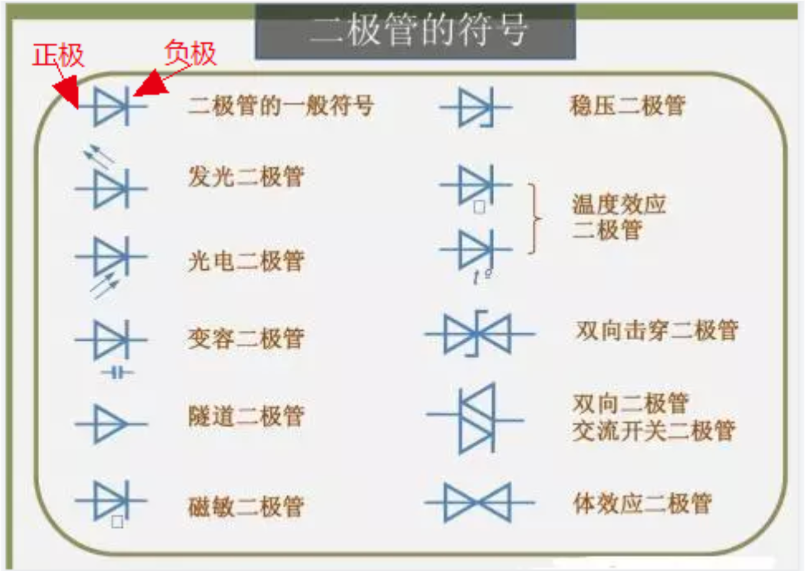


#### ESD管

静电放电（Electro-Static discharge），具有不同静电电位的物体互相靠近或直接接触引起的电荷转移。

ESD二极管的正负接在电源引脚，公共端接在被保护引脚上起到释放静电的作用。


#### TVS管

 [瞬变电压抑制二极管](https://zhida.zhihu.com/search?content_id=213065715&content_type=Article&match_order=1&q=瞬变电压抑制二极管&zhida_source=entity)（Transient Voltage Suppressors）

TVS主要用在电源输入端起到防浪涌的作用，瞬间吸收浪涌电流对后级电路起到保护作用。

TVS管和ESD管的区别是：工作原理是一样的，但功率和封装是不一样的；ESD主要是用来防静电，防静电就要求电容值低；TVS就做不到这一点，TVS的电容值比较高。

#### 运算放大电路


#### 模数转换

ADC全称是（Analog-to-Digital Converter）模拟-数字转换器

**采样—保持—量化—编码**

采样和保持


常用的**量化**方法有只舍不入和四舍五入。

**编码**为方便数字信号数据的传输与存储，需要将量化得到的十进制数字信号转换成二进制编码。


[**并行比较型模数转换器**](https://blog.csdn.net/qq_28149763/article/details/132776689)

并行比较型模数转换器结构由分压器、比较器、寄存器和编码器组成。


**逐次逼近型模数转换器**

**双积分型模数转换器**


#### SWD

Serial Wire Debug，串行线调试。

- 允许开发者通过调试器（如ST-Link、J-Link）与目标芯片通信，实现代码下载、断点设置、寄存器读写、单步执行等调试功能。
- 支持实时监控和故障诊断（如捕获异常原因）。

SWD只需两根信号线：

- **SWDIO**：数据线，双向传输
- **SWCLK**：时钟线，由主机产生
- （通常还需**GND**）

**通讯过程**


**SWD帧结构**

每个SWD命令帧一般包含：

- 起始位（Start）
- AP/DP选择位（Access Port / Debug Port）
- 读/写位
- 地址位
- 奇偶校验位
- 停止位


# STM32


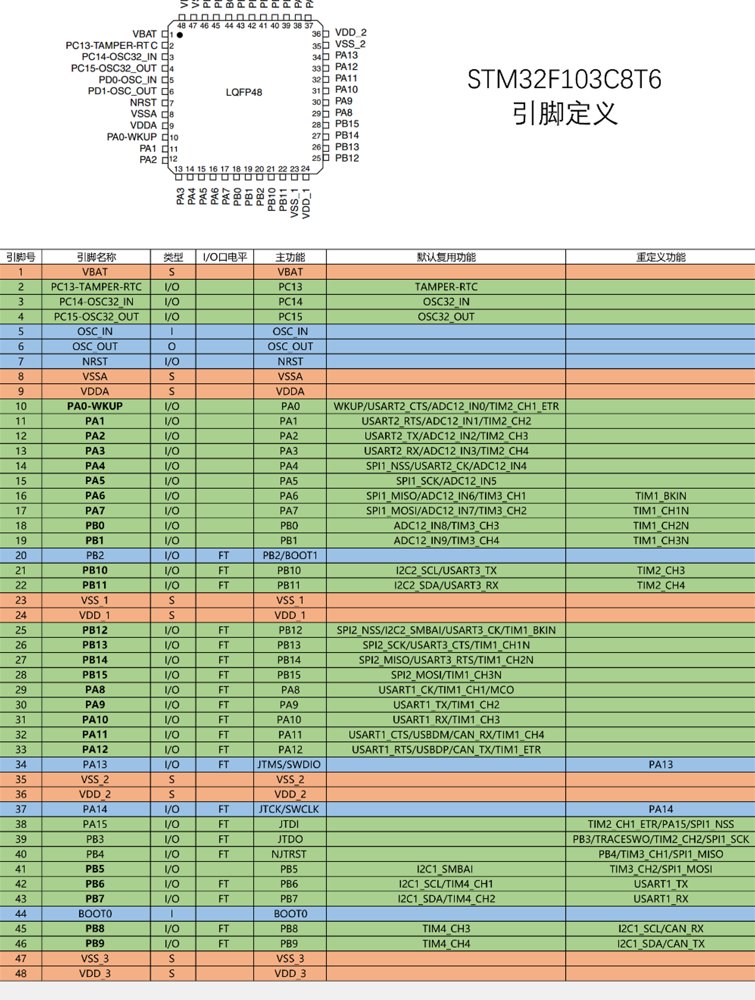

**系统结构**


### NVIC基本结构

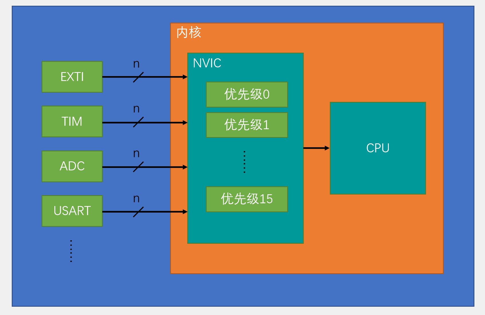

### **EXTI基本结构**


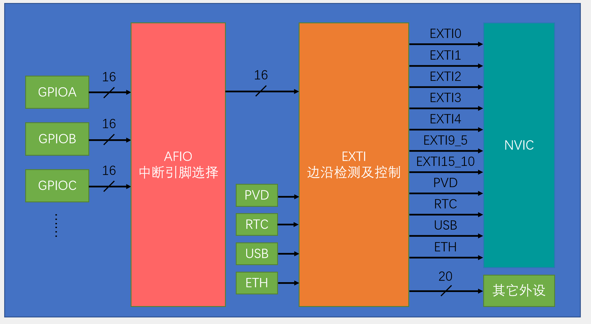

**EXIT**（External Interrupt，外部中断控制器）和**NVIC**（Nested Vectored Interrupt Controller，嵌套向量中断控制器）是处理中断的两个核心组件

EXTI专门检测**外部引脚的电平变化**（如GPIO引脚），并根据配置的触发条件（如上升沿、下降沿）生成中断或事件信号。

NVIC管理所有中断的**优先级**和**响应顺序**，决定哪个中断优先处理，是否允许嵌套。

### 定时器

定时器可以对输入的时钟进行计数，并在计数值达到设定值时触发中断16位计数器、预分频器、自动重装寄存器的时基单元，在72MHz计数时钟下可以实现最大59.65s的定时。

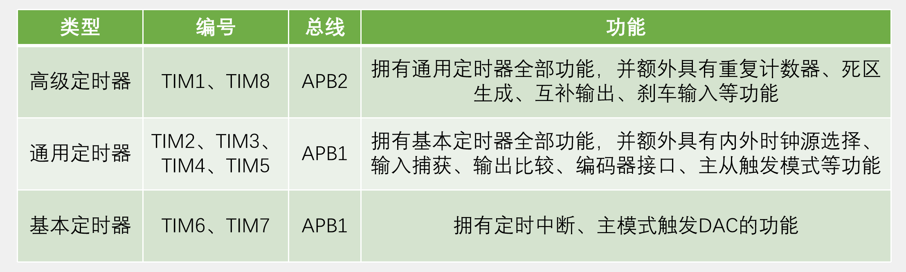

- STM32F103C8T6定时器资源：TIM1、TIM2、TIM3、TIM4

### 定时中断基本结构

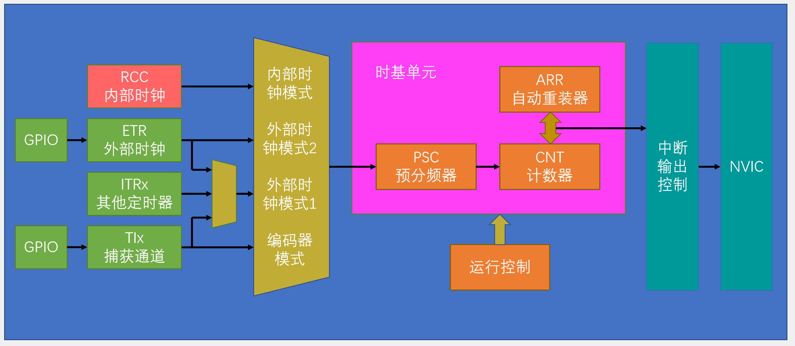

### PWM基本结构

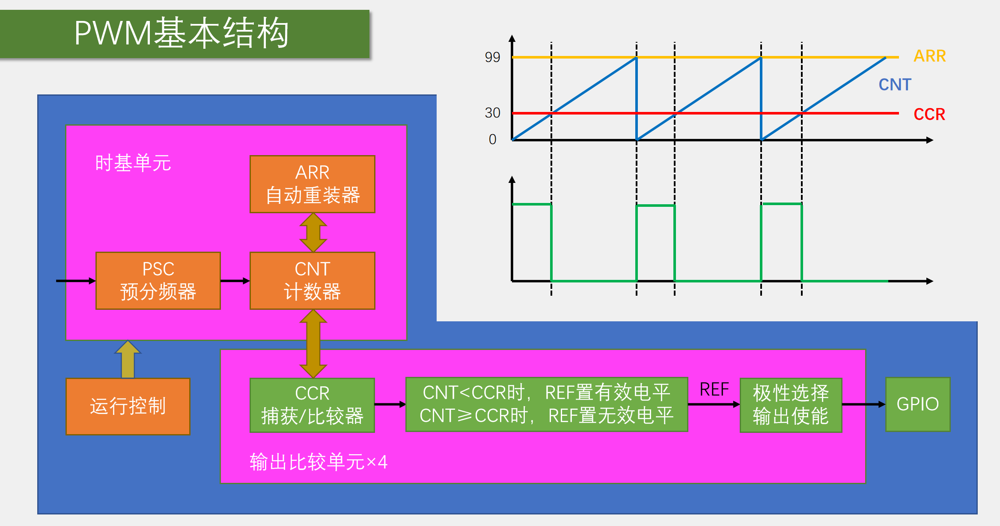

- PWM频率：	     $Freq = CK\_PSC / (PSC + 1) / (ARR + 1)$

- PWM占空比：	$Duty = CCR / (ARR + 1)$

- PWM分辨率：	$Reso = 1 / (ARR + 1)$

  `CK_PSC` 代表定时器的时钟源频率，也就是定时器输入的原始时钟信号的频率

  `PSC`预分频器寄存器（Prescaler Register）的值

  `ARR`自动重装载寄存器（Auto - Reload Register）的值

  `CCR`比较寄存器（Compare Register）的值

### [ADC模数转换](https://blog.csdn.net/m0_61712829/article/details/136723340?csdn_share_tail=%7B%22type%22%3A%22blog%22%2C%22rType%22%3A%22article%22%2C%22rId%22%3A%22136723340%22%2C%22source%22%3A%22m0_61712829%22%7D)

- ADC（Analog-Digital Converter）模拟-数字转换器，简称模数转换器或AD转换器

- ADC可以将引脚上连续变化的模拟电压转换为内存中存储的数字变量，建立模拟电路到数字电路的桥梁。（STM32主要是数字电路，数字电路只有高低电平，没有几v电压的概念，所以想读取电压值，就需要借助adc模数转换器来实现，adc读取引脚上的模拟电压转换为一个数据存在寄存器里，我们再把这个数据读取到变量里来就可以进行显示、判断、记录等操作）

- 12位逐次逼近型ADC，1us转换时间。

- 18个输入通道，可测量16个外部和2个内部信号源。

- 规则组和注入组两个转换单元。

- 模拟看门狗自动监测输入电压范围。

  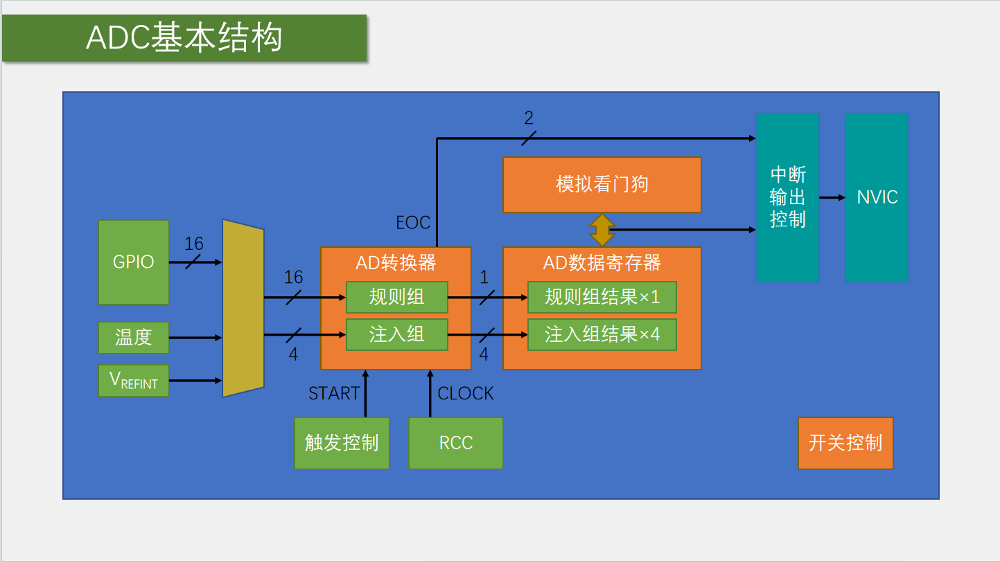

### DMA

- DMA（Direct Memory Access）直接存储器存取
- DMA可以提供外设和存储器或者存储器和存储器之间的高速数据传输，无须CPU干预，节省了CPU的资源
- 12个独立可配置的通道： DMA1（7个通道）， DMA2（5个通道）每个通道都支持软件触发和特定的硬件触发

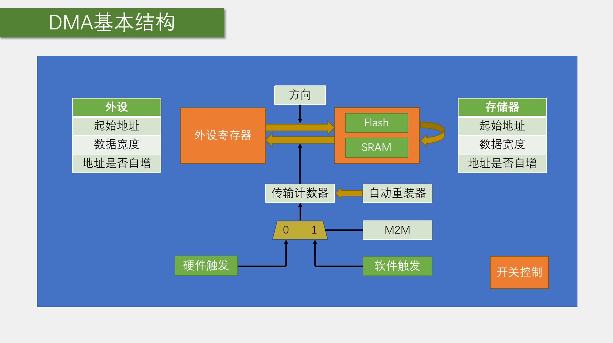


### 一些概念

**PWM**——Pulse Width Modulation脉宽调制，PWM信号由周期固定的脉冲组成，通过改变脉冲的宽度（占空比）来调节输出信号的平均电压。占空比是指高电平时间与整个周期的比值。

**PD协商**——**Power Delivery Negotiation**是一种基于USB Power Delivery（USB PD）协议的电源管理技术，主要用于通过USB Type-C接口实现设备之间的电源协商和功率分配。


#### **STM32一些缩写**

**NVIC**——嵌套向量中断控制器

**GPIO**——通用IO口

**AFIO**——复用IO口

**EXTI**——外部中断

**TIM**——定时器

**RCC**——复位和时钟控制

**ADC**——模数转换器

**USART**——同步/异步串口通信

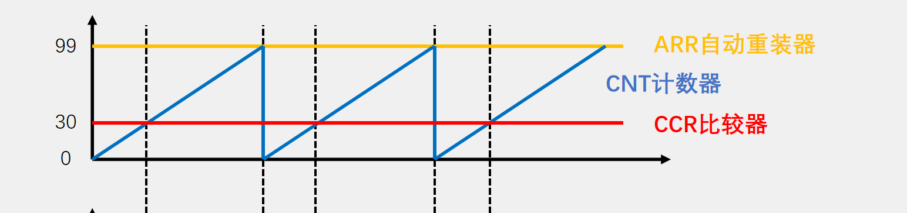

**CNT**——计数器寄存器Counter Register，用于存储定时器当前的计数值

**CCR**——捕获 / 比较寄存器Capture/Compare Register，主要用于定时器的输入捕获和输出比较功能。

**ARR**——自动重装寄存器Auto-Reload Registe。

**波特率**——指的是信号被调制以后在单位时间内的变化次数，也就是单位时间内载波参数变化的次数，单位是波特（Baud），简称为 “B”。

> STM32波特率计算：
>
> 波特率=$f_{PCLK2}/(16×DIV)$
>
> - $f_{PCLK2}$是 USART 所使用的时钟源频率，通常是 **APB2 总线的时钟频率**
>
> - 分频系数`DIV` 是一个整数除数（可以是小数部分的组合），它是由寄存器 `USART_BRR` 控制的。高12位是整数部分，低12位是小数部分。

**比特率**——单位时间内传输的二进制位数，单位是比特每秒（bps）。

**ODR**——是GPIO端口的输出数据寄存器（Output Data Register）。如果某一位为 `1`，对应的引脚输出高电平。

**外围设备**

**DHT** ——"Digital Humidity and Temperature"（数字湿度和温度） 的缩写，通常用于指代一种集成的数字温湿度传感器系列。


### HAL库

HAL 库封装了 STM32 微控制器的各种外设驱动程序，提供了高级的 API 接口，使得开发者可以通过简单的函数调用来完成复杂的硬件操作。

使用STM32CubeMX软件

#### [基本函数](https://blog.csdn.net/qq_38531460/article/details/106115070)

##### 延时函数

```c
void HAL_Delay(uint32_t Delay);//延时函数
```

HAL_Delay()函数会阻塞程序的执行,在延时期间无法执行其他任务。

实例：HAL_Delay(1000)		//延迟1000ms

##### **GPIO函数**

```c
void HAL_GPIO_Init(GPIO_TypeDef *GPIOx, GPIO_InitTypeDef *GPIO_Init);
```

功能： GPIO初始化

实例：HAL_GPIO_Init(GPIOC, &GPIO_InitStruct);

```c
void HAL_GPIO_DeInit(GPIO_TypeDef *GPIOx, uint32_t GPIO_Pin);
```

功能：在函数初始化之后的引脚恢复成默认的状态，即各个寄存器复位时的值

实例：HAL_GPIO_Init(GPIOC, GPIO_PIN_4);

```c
GPIO_PinState HAL_GPIO_ReadPin(GPIO_TypeDef* GPIOx, uint16_t GPIO_Pin);
```

功能：读取引脚的电平状态、函数返回值为0或1

实例：HAL_GPIO_ReadPin(GPIOC, GPIO_PIN_4);

```c
void HAL_GPIO_WritePin(GPIO_TypeDef* GPIOx, uint16_t GPIO_Pin, GPIO_PinState PinState);
```

功能：引脚写0或1

实例：HAL_GPIO_WritePin(GPIOC, GPIO_PIN_4,0);

```c
void HAL_GPIO_TogglePin(GPIO_TypeDef* GPIOx, uint16_t GPIO_Pin);
```

翻转引脚的电平状态   

实例：HAL_GPIO_TogglePin(GPIOC, GPIO_PIN_4);    常用在LED上

```c
HAL_StatusTypeDef HAL_GPIO_LockPin(GPIO_TypeDef* GPIOx, uint16_t GPIO_Pin);
```

功能：锁住引脚电平，比如说一个管脚的当前状态是1，当这个管脚电平变化时保持锁定时的值。

实例：HAL_GPIO_LockPin(GPIOC, GPIO_PIN_4);    

```c
void HAL_GPIO_EXTI_IRQHandler(uint16_t GPIO_Pin);
```

功能：  外部中断服务函数，清除中断标志位

实例：HAL_GPIO_EXTI_IRQHandler(GPIO_PIN_4);    

```c
void HAL_GPIO_EXTI_Callback(uint16_t GPIO_Pin);
```

功能：  中断回调函数，可以理解为中断函数具体要响应的动作。

实例：HAL_GPIO_EXTI_Callback(GPIO_PIN_4);   


##### uart的发送接收函数

 UART结构体定义

```c
UART_HandleTypeDef huart1;
```

UART的名称定义，这个结构体中存放了UART所有用到的功能，后面的别名就是我们所用的uart串口的别名，默认为huart1

**1、串口发送/接收函数**

```c
HAL_UART_Transmit();		//串口发送数据，使用超时管理机制 
HAL_UART_Receive();			//串口接收数据，使用超时管理机制
```

**2、串口中断函数**

```c
HAL_UART_IRQHandler(UART_HandleTypeDef \*huart); //串口中断处理函数
HAL_UART_TxCpltCallback(UART_HandleTypeDef \*huart); //串口发送中断回调函数
```


##### fputc函数

fputc函数用于将一个字符写入到输出流中，比如将字符发送到串口或其他外设上。

函数原型:

```c
int fputc(int ch, FILE *f);
```

> 当STM32想要使用串口进行输出时，需要重写fputc将输出更改到对应串口的位置，在重写前需要定义头女件#include <stdio.h>

##### printf函数

printf是一个格式化输出函数，可以将文本输出到各种设备中，但使用前需要重写fputc，这样才能将文本输出到对应的位置。

实例：

```c
printf("Hello World!")
```

#### 一些概念

##### uwTick

- **`uwTick`** 是 HAL 库中的一个全局变量，用于记录系统的时间基准（通常以毫秒为单位）。
- 它由 HAL 库的内部定时器（SysTick）定期更新，每经过 1 毫秒，`uwTick` 的值就会增加 1。

- `uwTick` 是一个 32 位无符号整数（`uint32_t`），最大值为 `0xFFFFFFFF`（约 4294967295 毫秒，即 49.7 天）。
- 当 `uwTick` 达到最大值后会溢出并重新从 0 开始计数。


### 程序占用内存

在 STM32 项目中，查看内存占用情况是一个重要的步骤，尤其是在资源受限的嵌入式系统中。STM32 的内存主要分为两类：**Flash 闪存和 RAM 内存**。

#### **使用 Keil MDK**

- 编译完成后，Keil 会在输出窗口显示类似以下内容：

  ```c
  Program Size: Code=26096 RO-data=33360 RW-data=1360 ZI-data=14560
  ```

  - **Code** : 存储在 Flash 中的代码大小。程序代码段的大小
  - **RO-data** : 只读数据（如常量）占用的 Flash 大小。
  - **RW-data** : 可读写数据（已初始化的全局变量和静态变量）占用的 Flash 和 RAM 大小。
  - **ZI-data** : 未初始化的全局变量和静态变量占用的 RAM 大小。

计算FLash占用：

​					$Flash 占用=Code+RO$-$data+RW$-$data = 26096+33360+1360=60816字节$

计算 RAM 占用：

​					$RAM 占用=RW$-$data+ZI$-$data=1360+14560=15920字节$

> 上述计算中不包含堆栈的使用量。如果项目使用了动态内存分配（如 `malloc` 或 FreeRTOS 的任务堆栈），还需要额外考虑堆栈的大小。


#### **分析 `.map` 文件**

`.map` 文件是由链接器生成的详细符号表文件，包含了每个段（section）的内存分配信息。一般在文件的末尾

```c
      Code (inc. data)   RO Data    RW Data    ZI Data      Debug   

     26096       1788      33360       1360      14560    1365418   Grand Totals
     26096       1788      33360        648      14560    1365418   ELF Image Totals (compressed)
     26096       1788      33360        648          0          0   ROM Totals

==============================================================================

    Total RO  Size (Code + RO Data)                59456 (  58.06kB)
    Total RW  Size (RW Data + ZI Data)             15920 (  15.55kB)
    Total ROM Size (Code + RO Data + RW Data)      60104 (  58.70kB)
```

- **Total RO Size**：只读数据（Code 和 RO Data）的总大小。
- **Total RW Size**：RAM 中存储的数据总大小。
- **Total ROM Size**：整个程序在 Flash 中占用的空间大小。


# ESP32

[官方文档](https://docs.espressif.com/projects/esp-idf/zh_CN/stable/esp32/index.html)

esp32s3原理图

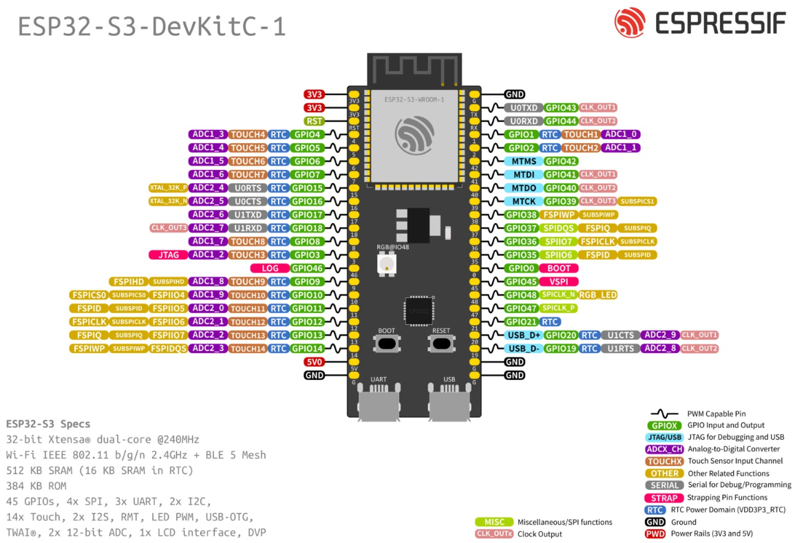

## 基础操作

### 环境搭建

[**乐鑫ESP32 SDK环境搭建**](https://x509p6c8to.feishu.cn/docx/doxcniDDyYcFo6BCkjUCnkO2aUb)

进入乐鑫esp环境

```python
. ~/esp/esp-idf/export.sh
#快捷键（需要设置）
get_idf
```


判断是否搭建成功

```python
idf.py --version
```

常用操作

**linux**

```python
//设置目标板卡相关
idf.py set-target esp32

//可视化配置工程属性
idf.py menuconfig

//编译工程
idf.py fullclean
idf.py clean
idf.py build

//查看新增的设备号
ls /dev/ttyU*
//下载运行		
idf.py -p /dev/ttyUSB0 flash monitor
```

您可使用快捷键 `Ctrl+]`，退出 IDF 监视器。

**windows**		ESP-IDF 5.3 CMD

```python
//拉取工具链
install.bat
esport.bat

//设置目标板卡相关
idf.py set-target esp32s3

//可视化配置工程属性
idf.py menuconfig

//编译工程
idf.py fullclean	#清空构建目录
idf.py clean
idf.py build

//烧录和串口监视
idf.py -p COM3 flash mointor
```

> ●　idf.py --help：可显示命令列表和使用说明。
> ●　idf.py set-target esp32c3：设置编译目标，如替换为esp32c3。
> ●　idf.py menuconfig：运行 menuconfig 终端图像化配置工具，可以选择或修改配置选项，配置结果将保存在sdkconfig文件中。
> ●　idf.py build：开始编译代码，编译产生的中间文件和最终的可执行程序将默认保存在项目的build目录。编译过程是增量式的，如果仅对一个源文件进行修改，在下次编译时将只编译已修改的文件。
> ●　idf.pyclean：清理项目编译产生的中间文件，下次编译时会强制编译整个项目。需要注意，清理时不会删除CMake配置和使用menuconfig修改的配置。
> ●　idf.py fullclean：删除整个build目录下的内容，包括所有CMake的配置输出文件。在下次构建项目时，CMake会从头开始配置项目。请注意，该命令会递归删除构建目录下的所有文件，请谨慎使用，项目配置文件不会被删除。
> ●　idf.py flash：将 build 生成的可执行程序二进制文件烧录到目标 ESP32-C3 中。选项-p <port_name>和-b <baud_rate>分别用于设置串口的设备名和烧录时的波特率，如果不指定这两个选项，将自动搜索串口并使用默认的波特率。
> ●　idf.py monitor：用于显示目标ESP32-C3的串口输出。选项-p可用于设置主机端串口的设备名，在串口打印期间，可按下组合键Ctrl+] 退出监视器。
>


### 使用select函数来监听串口数据

select被广泛应用于需要同时处理多个 I/O 操作的场景，例如：监控多个网络套接字。监控串口、管道、文件等文件描述符。实现非阻塞 I/O 操作。

`select` 的核心原理是通过 **阻塞等待** 的方式监控一组文件描述符，直到以下任一条件满足：

1. **有文件描述符可读**（数据可读取）。
2. **有文件描述符可写**（可以写入数据）。
3. **有文件描述符发生异常**（如带外数据到达）。
4. **超时**（如果设置了超时时间）。

```python
#include <sys/select.h>

int select(int nfds, fd_set *readfds, fd_set *writefds, fd_set *exceptfds, struct timeval *timeout);
```

**参数说明**

> - nfds: 需要监控的文件描述符的最大值加 1（即 max_fd + 1）。
> - readfds: 指向 fd_set 的指针，表示需要监控可读的文件描述符集合。
> - writefds: 指向 fd_set 的指针，表示需要监控可写的文件描述符集合。
> - exceptfds: 指向 fd_set 的指针，表示需要监控异常的文件描述符集合。
> - timeout: 超时时间。如果为 NULL，select 会一直阻塞，直到有文件描述符准备好；如果为 0，select 会立即返回；否则，select 会在指定时间内等待。
> - 返回值
>   - **> 0**: 准备好的文件描述符的数量。
>   - **= 0**: 超时，没有文件描述符准备好。
>   - **-1**: 出错，可以通过 `errno` 获取错误码。

相关宏：

- FD_ZERO(fd_set *set): 清空文件描述符集合。
- FD_SET(int fd, fd_set *set): 将文件描述符 fd 添加到集合中。
- FD_CLR(int fd, fd_set *set): 将文件描述符 fd 从集合中移除。
- FD_ISSET(int fd, fd_set *set): 检查文件描述符 fd 是否在集合中。


**使用步骤**

3.1 初始化文件描述符集合

- 使用 FD_ZERO 清空集合。
- 使用 FD_SET 将需要监控的文件描述符添加到集合中。

3.2 调用 select

- 调用 select 函数，传入文件描述符集合和超时时间。

3.3 检查返回值

- 如果返回值大于 0，表示有文件描述符准备好。
- 使用 FD_ISSET 检查具体是哪个文件描述符准备好。

3.4 处理 I/O 操作

- 根据准备好的文件描述符进行读写或异常处理。


## 基础知识

分区表（partition table ）是 ESP-IDF 框架中实现的一种分配 flash 的方式。只建议存储不会频繁更改的数据

分区表将一块完整的 flash 根据模块进行划分，规定了每个模块使用的 flash 区域和大小。分区表本身也占用存储在 flash 中（默认为地址 0x8000）。系统初始化时，首先读取分区表，拿到其他模块对应的地址，然后根据这些地址初始化不同的模块。

分区表中的每一列都有名字，类型（app，data或者其他），子类型，在 flash 中的偏移量（分区的加载地址）和对应的大小。

**Name**：Name 字段可以是任何有意义的名称，但不能超过 16 个字符（之后的内容将被截断）。该字段对 ESP32 并不是特别重要。

**Type**：Type 字段可以指定为 app (0) 或者 data (1)，也可以直接使用数字 0-254（或者十六进制 0x00-0xFE）。注意，0x00-0x3F 是预留给 esp-idf 的核心功能，如果应用程序需要保存数据，需要在 0x40-0xFE 内添加一个自定义分区类型。

**SubType**：SubType 字段长度为 8 bit，内容与具体 Type 有关，具体可以参考 ESP-IDF SubType。

**offset & size**：分区若为指定偏移地址，则会紧跟着前一个分区之后开始。若此分区为首个分区，则将紧跟着分区表开始。

> 对于 ESP32， app 分区的偏移地址必须 64K(0x10000) 对齐，对于 ESP8266，app 分区的偏移地址必须要与 0x1000 (4K) 对齐。
>
> app 分区的大小和偏移地址可以采用十进制数、以 0x 为前缀的十六进制数，且支持 K 或 M 的倍数单位（分别代表 1024 和 1024*1024 字节）。

**三种分区表类型**

- “Single factory app, no OTA” 即没有OTA功能的工厂app
- “Factory app, two OTA definitions”即有两个OTA功能区的工厂app

- “custom partition table csv”即客户自定义的分区

没有OTA功能的工厂程序分区定义：

```c
// ESP-IDF Partition Table
// Name,   Type, SubType, Offset,  Size,   Flags
nvs,      data, nvs,     0x9000,  0x6000,			//非易失性存储
phy_init, data, phy,     0xf000,  0x1000,			//物理层初始化数据
factory,  app,  factory, 0x10000, 0x100000,			//出厂固件：存储出厂时的默认应用程序固件。
storage,  data, spiffs,  0x110000,0x4D000,			//文件系统：存储用户文件或数据
```

> - flash 的 0x10000 (64 KB) 偏移地址处存放一个标记为 “factory” 的二进制应用程序，且启动加载器将默认加载这个应用程序。
> - 分区表中还定义了两个数据区域，分别用于存储 NVS 库专用分区和 PHY 初始化数据。`nvs` 和 `phy_init` 是系统必需的分区，不可随意修改。

## 外设

#### [定时器API](https://docs.espressif.com/projects/esp-idf/zh_CN/release-v4.1/api-reference/peripherals/timer.html#timer-api-timer-initialization)

**ESP32 提供了多个硬件定时器组（Timer Group 0 和 Timer Group 1），每个组包含两个定时器（Timer 0 和 Timer 1）。**

```c
#include <stdio.h>
#include "esp_types.h"
#include "freertos/FreeRTOS.h"
#include "freertos/task.h"
#include "freertos/queue.h"
#include "driver/periph_ctrl.h"
#include "driver/timer.h"

#include "ds_timer.h"

#define TIMER_DIVIDER         16  			//  分频系数，用于降低定时器的时钟频率。
#define TIMER_SCALE           (TIMER_BASE_CLK / TIMER_DIVIDER/1000)  // 将定时器计数值转换为毫秒单位。
#define TIMER_INTERVAL0_SEC   (10) 		// 定时器的触发间隔（以秒为单位）。
#define TEST_WITH_RELOAD      1        //是否启用自动重载模式（Auto Reload）

/*
 * A sample structure to pass events
 * from the timer interrupt handler to the main program.
 */
typedef struct {
    uint64_t timer_minute_count;
    uint64_t timer_second_count;
} timer_event_t;

timer_event_t g_timer_event;

xQueueHandle timer_queue;

/*
 * Timer group0 ISR handler
	ISR（中断服务程序）是定时器触发时执行的函数
 */
void IRAM_ATTR timer_group0_isr(void *para)
{
    timer_spinlock_take(TIMER_GROUP_0);  // 获取定时器的自旋锁，防止竞争条件

    int timer_idx = (int) para;

    timer_event_t evt;

    timer_group_clr_intr_status_in_isr(TIMER_GROUP_0, TIMER_0);  // 清除中断标志
    timer_group_enable_alarm_in_isr(TIMER_GROUP_0, timer_idx);  // 重新启用定时器报警
    xQueueSendFromISR(timer_queue, &evt, NULL);  // 将事件发送到队列

    timer_spinlock_give(TIMER_GROUP_0);  // 释放自旋锁
}

/*
 * 初始化定时器组0中选中的定时器
 */
static void example_tg0_timer_init(int timer_idx,
                                   bool auto_reload, double timer_interval_sec)
{
    //定时器配置和初始化
    timer_config_t config = {
        .divider = TIMER_DIVIDER,
    	.counter_dir = TIMER_COUNT_UP,  // 计数方向：向上计数
    	.counter_en = TIMER_PAUSE,      // 初始状态：暂停计数
    	.alarm_en = TIMER_ALARM_EN,     // 启用报警功能
    	.auto_reload = auto_reload,     // 是否自动重载
    }; // default clock source is APB
    timer_init(TIMER_GROUP_0, timer_idx, &config);
	//设置定时器的初始计数值。
    timer_set_counter_value(TIMER_GROUP_0, timer_idx, 0x00000000ULL);	
    //设置定时器的报警值（即触发中断的时间间隔）。
    timer_set_alarm_value(TIMER_GROUP_0, timer_idx, timer_interval_sec * TIMER_SCALE);
    //启用定时器的中断。
    timer_enable_intr(TIMER_GROUP_0, timer_idx);
    //注册定时器的中断服务程序（ISR）。
    timer_isr_register(TIMER_GROUP_0, timer_idx, timer_group0_isr,
                       (void *) timer_idx, ESP_INTR_FLAG_IRAM, NULL);

    timer_start(TIMER_GROUP_0, timer_idx);
}

/*
 *主任务
 */
static void timer_example_evt_task(void *arg)
{
    while (1) {
        timer_event_t evt;
        xQueueReceive(timer_queue, &evt, portMAX_DELAY);	// 从队列中接收事件
        g_timer_event.timer_minute_count ++;
        //60s 计算一次 刷新时间,每100次触发表示1秒
        if(g_timer_event.timer_minute_count >= 6000){
            g_timer_event.timer_minute_count = 0;
        }
        g_timer_event.timer_second_count ++;
        //1s计算一次 
        if(g_timer_event.timer_second_count >= 100){
            g_timer_event.timer_second_count = 0;
        }
    }
}

/*
 * In this example, we will test hardware timer0 and timer1 of timer group0.
 */
void ds_timer_init(void)
{
    g_timer_event.timer_minute_count = 0;
    g_timer_event.timer_second_count = 0;
    timer_queue = xQueueCreate(10, sizeof(timer_event_t));
    example_tg0_timer_init(TIMER_0, TEST_WITH_RELOAD, TIMER_INTERVAL0_SEC);
    xTaskCreate(timer_example_evt_task, "timer_evt_task", 2048, NULL, 5, NULL);
}

```


#### [GPIO](https://docs.espressif.com/projects/esp-idf/zh_CN/release-v4.1/api-reference/peripherals/gpio.html)

GPIO（General Purpose Input/Output，通用输入输出接口），支持数字输入/输出、模拟信号采集、PWM输出、中断触发等多种模式。

###### **关键区别总结**

| **模式**                       | **输出电平**              | **是否需要上拉电阻** | **驱动能力**   | **典型应用**    |
| ------------------------------ | ------------------------- | -------------------- | -------------- | --------------- |
| **推挽输出 Push-Pull Output**  | 高/低电平                 | 不需要               | 强             | 直接驱动负载    |
| **开漏输出 Open-Drain Output** | 低电平/高阻态             | 需要                 | 弱（依赖上拉） | 总线通信（I²C） |
| 复用推挽输出                   | 高/低电平（外设控制）     | 不需要               | 强             | 高速外设（SPI） |
| 复用开漏输出                   | 低电平/高阻态（外设控制） | 需要                 | 弱（依赖上拉） | 双向总线（I²C） |

ESP32 芯片具有 40 个物理 GPIO 引脚。

- GPIO6-11 通常用于 SPI 闪存。
- GPIO34-39 只能设置为输入模式，并且没有软件上拉或下拉功能。

```c
//配置 ESP32 芯片的 GPIO 引脚，实现对外设（如触摸模块、屏幕）的输入输出控制及中断处理。
#include <stdio.h>
#include <string.h>
#include <stdlib.h>
#include "freertos/FreeRTOS.h"
#include "freertos/task.h"
#include "freertos/queue.h"
#include "driver/gpio.h"

#include "ds_gpio.h"
#include "ds_system_data.h"

//定义输出引脚（控制屏幕片选、数据 / 指令选择、复位等）和输入引脚（检测触摸信号、屏幕忙状态）。
#define GPIO_OUTPUT_IO_0    5
#define GPIO_OUTPUT_PIN_SEL  ((1ULL<<GPIO_OUTPUT_IO_0))		#生成一个位掩码（Bit Mask）
#define GPIO_INPUT_IO_0     34
#define GPIO_INPUT_PIN_SEL  ((1ULL<<GPIO_INPUT_IO_0))
#define ESP_INTR_FLAG_DEFAULT 0

//屏幕片选 0-有效
#define SCREEN_GPIO_OUTPUT_CS 27
#define SCREEN_GPIO_OUTPUT_CS_SEL ((1ULL<<SCREEN_GPIO_OUTPUT_CS))
//屏幕数据/指令选择 1-data 0-cmd
#define SCREEN_GPIO_OUTPUT_DC 14
#define SCREEN_GPIO_OUTPUT_DC_SEL ((1ULL<<SCREEN_GPIO_OUTPUT_DC))
//屏幕复位 0-reset
#define SCREEN_GPIO_OUTPUT_RES 12
#define SCREEN_GPIO_OUTPUT_RES_SEL ((1ULL<<SCREEN_GPIO_OUTPUT_RES))
//屏幕状态 1-busy 
#define SCREEN_GPIO_INTPUT_BUSY 13
#define SCREEN_GPIO_INTPUT_BUSY_SEL ((1ULL<<SCREEN_GPIO_INTPUT_BUSY))

static xQueueHandle gpio_evt_queue = NULL;		// 中断事件队列，存储触发中断的 GPIO 引脚号

static void IRAM_ATTR gpio_isr_handler(void* arg)	//中断服务程序(ISR)。IRAM_ATTR：将 ISR 代码放在 IRAM 中，确保快速执行，减少中断延迟。
{
    uint32_t gpio_num = (uint32_t) arg;
    xQueueSendFromISR(gpio_evt_queue, &gpio_num, NULL);
}

static void gpio_task_example(void* arg)
{
    uint32_t io_num;
    for(;;) {
        if(xQueueReceive(gpio_evt_queue, &io_num, portMAX_DELAY)) {
            printf("GPIO[%d] intr, val: %d\n", io_num, gpio_get_level(io_num));	//从队列中获取中断事件，打印触发中断的引脚号及其当前电平。
            
        }
    }
}

//触摸模块 GPIO 初始化
void ds_touch_gpio_init(){
     gpio_config_t io_conf;

    // 配置输出引脚（触摸复位）
    io_conf.intr_type = GPIO_PIN_INTR_DISABLE;       // 禁用中断
    io_conf.mode = GPIO_MODE_OUTPUT;                 // 输出模式
    io_conf.pin_bit_mask = GPIO_OUTPUT_PIN_SEL;      // 引脚 5
    io_conf.pull_down_en = 0;                        // 禁用下拉
    io_conf.pull_up_en = 0;                         // 禁用上拉
    gpio_config(&io_conf);                           // 应用配置

    // 配置输入引脚（触摸信号）
    io_conf.intr_type = GPIO_INTR_ANYEDGE;           // 任意边沿触发（上升/下降沿）
    io_conf.mode = GPIO_MODE_INPUT;                  // 输入模式
    io_conf.pin_bit_mask = GPIO_INPUT_PIN_SEL;       // 引脚 34
    io_conf.pull_up_en = 1;                          // 使能上拉（输入引脚需上拉/下拉确保稳定）
    gpio_config(&io_conf);

    // 创建中断事件队列并启动处理任务
    gpio_evt_queue = xQueueCreate(10, sizeof(uint32_t));
    xTaskCreate(gpio_task_example, "gpio_task", 2048, NULL, 10, NULL);

    // 安装 ISR 服务并绑定中断处理函数
    gpio_install_isr_service(ESP_INTR_FLAG_DEFAULT);
    gpio_isr_handler_add(GPIO_INPUT_IO_0, gpio_isr_handler, (void*)GPIO_INPUT_IO_0);

}

//屏幕模块 GPIO 初始化
void ds_screen_gpio_init(){
    gpio_config_t io_conf;

    // 配置屏幕输出引脚（CS/DC/RES）
    io_conf.intr_type = GPIO_PIN_INTR_DISABLE;
    io_conf.mode = GPIO_MODE_OUTPUT;
    io_conf.pin_bit_mask = SCREEN_GPIO_OUTPUT_CS_SEL | SCREEN_GPIO_OUTPUT_DC_SEL | SCREEN_GPIO_OUTPUT_RES_SEL;
    io_conf.pull_down_en = 0;
    io_conf.pull_up_en = 0;
    gpio_config(&io_conf);

    // 配置屏幕输入引脚（BUSY，检测屏幕忙状态）
    io_conf.intr_type = GPIO_INTR_NEGEDGE;          // 下降沿触发（忙状态从高→低时触发）
    io_conf.mode = GPIO_MODE_INPUT;
    io_conf.pin_bit_mask = SCREEN_GPIO_INTPUT_BUSY_SEL;
    io_conf.pull_up_en = 0;                         // 外设可能已上拉，此处禁用内部上拉
    gpio_config(&io_conf);

    // 安装 ISR 服务并绑定中断处理函数（复用触摸模块的中断处理函数）
    gpio_install_isr_service(ESP_INTR_FLAG_DEFAULT);
    gpio_isr_handler_add(SCREEN_GPIO_INTPUT_BUSY, gpio_isr_handler, (void*)SCREEN_GPIO_INTPUT_BUSY);
}

void ds_gpio_init(){
    ds_touch_gpio_init();
}
// 屏幕控制接口
void ds_gpio_set_screen_cs(uint32_t level){
    gpio_set_level(SCREEN_GPIO_OUTPUT_CS, level);	// 片选
}
void ds_gpio_set_screen_dc(uint32_t level){
    gpio_set_level(SCREEN_GPIO_OUTPUT_DC, level);	// 数据/指令选择
}
void ds_gpio_set_screen_rst(uint32_t level){
    gpio_set_level(SCREEN_GPIO_OUTPUT_RES, level);	// 复位
}
int ds_gpio_get_screen_busy(){
    return gpio_get_level(SCREEN_GPIO_INTPUT_BUSY);
}
// 触摸模块控制接口
void ds_gpio_set_touch_rst(uint32_t level){
    gpio_set_level(GPIO_OUTPUT_IO_0, level);	//// 触摸复位信号
}

```

#### I2C

I2C总线是一种简单、双向二线制同步串行总线。它只需要两根线即可在连接于总线上的器件之间传送信息。

IIC一共有只有两个总线： 一条是双向的串行数据线**SDA**，一条是串行时钟线**SCL**。

```c
// i2c - Example
//基于 ESP-IDF 框架实现的 I2C 主设备驱动，用于控制 I2C 从设备（如传感器、EEPROM 等），实现寄存器地址设置、数据读写等功能。
#include <stdio.h>
#include "driver/i2c.h"
#include "esp_log.h"
#include "sdkconfig.h"
#include "ds_i2c.h"

//设置读寄存器地址。u8Cmd 是目标寄存器的地址。
static esp_err_t i2c_master_set_addr(uint8_t u8Cmd){
    i2c_cmd_handle_t cmd = i2c_cmd_link_create();		//创建命令句柄，生成 I2C 命令链
    //起始信号
    i2c_master_start(cmd);
    //设置从设备地址。//I2C 协议规定地址占 7 位，最后 1 位为读写标志，0为要写入从机。ACK_CHECK_EN 开启 ACK 应答检查。
    i2c_master_write_byte(cmd, (ESP_SLAVE_ADDR << 1) | WRITE_BIT, ACK_CHECK_EN);	
    //写从机指定地址		//发送寄存器地址：u8Cmd 是目标寄存器的地址
    i2c_master_write_byte(cmd, u8Cmd, ACK_CHECK_EN);
    //停止信号
    i2c_master_stop(cmd);
    esp_err_t ret = i2c_master_cmd_begin(I2C_MASTER_NUM, cmd, 1000 / portTICK_RATE_MS);		//发送命令链，超时时间为 1000ms
    i2c_cmd_link_delete(cmd);			//释放命令句柄内存。
    if (ret != ESP_OK) {
        printf("i2c_master_set_addr error\n");
    }
    return ret;
}

//读取数据
esp_err_t i2c_master_read_slave(uint8_t u8Cmd, uint8_t *data_rd, size_t size)
{
    if (size == 0) {
        return ESP_OK;
    }
    //设置读寄存器地址
    i2c_master_set_addr(u8Cmd);
    i2c_cmd_handle_t cmd = i2c_cmd_link_create();
    //起始信号
    i2c_master_start(cmd);
    //设置从设备地址
    i2c_master_write_byte(cmd, (ESP_SLAVE_ADDR << 1) | READ_BIT, ACK_CHECK_EN);
    for(int index=0;index<(size-1);index++)
    {   
        //读数据   
        i2c_master_read_byte(cmd, data_rd+index, ACK_VAL);		//前 size-1 个字节：接收数据后发送 ACK（ACK_VAL），表示继续传输。
    }
    i2c_master_read_byte(cmd, data_rd+size-1, NACK_VAL);		//最后 1 个字节：接收数据后发送 NACK（NACK_VAL），表示数据传输结束。
    //停止信号
    i2c_master_stop(cmd);
    esp_err_t ret = i2c_master_cmd_begin(I2C_MASTER_NUM, cmd, 1000 / portTICK_RATE_MS);
    i2c_cmd_link_delete(cmd);
    if (ret != ESP_OK) {
        printf("i2c_master_read_slave error\n");
    }
    return ret;
}

//写入数据
esp_err_t i2c_master_write_slave(uint8_t u8Cmd, uint8_t *data_wr, size_t size)
{
    i2c_cmd_handle_t cmd = i2c_cmd_link_create();
    //起始信号
    i2c_master_start(cmd);
    //写设备地址
    i2c_master_write_byte(cmd, (ESP_SLAVE_ADDR << 1) | WRITE_BIT, ACK_CHECK_EN);
    //写CMD
    i2c_master_write_byte(cmd, u8Cmd, ACK_CHECK_EN);
    //写数据
    i2c_master_write(cmd, data_wr, size, ACK_CHECK_EN);
    //停止信号
    i2c_master_stop(cmd);

    esp_err_t ret = i2c_master_cmd_begin(I2C_MASTER_NUM, cmd, 1000 / portTICK_RATE_MS);
    i2c_cmd_link_delete(cmd);
    if (ret != ESP_OK) {
        printf("i2c_master_write_slave error\n");
    }
    return ret;
}

// I2C 主设备初始化
esp_err_t i2c_master_init(void) {
    int i2c_master_port = I2C_MASTER_NUM;
    i2c_config_t conf = {
        .mode = I2C_MODE_MASTER,          		// 主设备模式
        .sda_io_num = I2C_MASTER_SDA_IO,   		// SDA 引脚
        .sda_pullup_en = GPIO_PULLUP_ENABLE,	 // 使能 SDA 上拉电阻
        .scl_io_num = I2C_MASTER_SCL_IO,   		// SCL 引脚
        .scl_pullup_en = GPIO_PULLUP_ENABLE, 	// 使能 SCL 上拉电阻
        .master.clk_speed = I2C_MASTER_FREQ_HZ // 时钟频率（400kHz）
    };
    i2c_param_config(i2c_master_port, &conf);       // 应用参数配置,初始化 I2C 控制器，分配底层资源。
    return i2c_driver_install(                      // 安装 I2C 驱动
        i2c_master_port, 
        conf.mode, 
        I2C_MASTER_RX_BUF_DISABLE,  // 禁用接收缓冲区（简单场景）
        I2C_MASTER_TX_BUF_DISABLE   // 禁用发送缓冲区（简单场景）
    );
}

```

#### SPI

SPI（Serial Peripheral Interface，串行外设接口）是一种高速、全双工、同步的串行通信协议，由主设备（Master）控制，常用于短距离内主设备与一个或多个从设备（Slave）之间的通信。

**四根主要信号线**：

- **SCK（Serial Clock）**：时钟线，由主设备生成，控制数据传输的时序。
- **MOSI（Master Out, Slave In）**：主设备输出、从设备输入，主设备向从设备发送数据。
- **MISO（Master In, Slave Out）**：主设备输入、从设备输出，从设备向主设备发送数据。
- **CS（Chip Select，片选）**：从设备使能信号（低有效），主设备通过拉低对应从设备的 CS 线选中目标从设备（多从设备时必选）。

**特点**

- SPI 协议无 ACK/NACK 机制，主设备无法确认从设备是否正确接收数据，可靠性依赖硬件设计和时序匹配。

- **单次传输流程**：

  - 主设备拉低目标从设备的 CS 线。
  - 主设备通过 MOSI 发送数据，同时通过 MISO 接收从设备的数据（全双工）。
  - 数据传输完成后，主设备拉高 CS 线，释放从设备。

  

###### **通信模式（时钟极性与相位）**

SPI 通过 **时钟极性（CPOL）** 和 **时钟相位（CPHA）** 定义四种通信模式，确保主从设备时序匹配

**四种模式组合**：

| 模式 | CPOL | CPHA | 时钟空闲状态 | 数据采样边沿 |
| ---- | ---- | ---- | ------------ | ------------ |
| 0    | 0    | 0    | 低           | 上升沿       |
| 1    | 0    | 1    | 低           | 下降沿       |
| 2    | 1    | 0    | 高           | 下降沿       |
| 3    | 1    | 1    | 高           | 上升沿       |


| 特性     | SPI                           | I2C                              |
| -------- | ----------------------------- | -------------------------------- |
| 总线类型 | 同步、全双工                  | 同步、半双工                     |
| 寻址方式 | CS 引脚硬件选择从设备         | 7/10 位从设备地址（软件寻址）    |
| 引脚数量 | 3~4 根（SCK、MOSI、MISO、CS） | 2 根（SCL、SDA）                 |
| 仲裁机制 | 无（主设备独占）              | 有（冲突时总线仲裁）             |
| 最大速率 | 通常更高（百 MHz 级）         | 标准模式 100kHz，高速模式 3.4MHz |


```c
//SPI Master example
//基于 ESP-IDF 框架实现的 SPI 主设备驱动程序，用于控制屏幕类 SPI 从设备（如 LCD）。
#include <stdio.h>
#include <stdlib.h>
#include <string.h>
#include "freertos/FreeRTOS.h"
#include "freertos/task.h"
#include "esp_system.h"
#include "driver/spi_master.h"
#include "driver/gpio.h"

#include "ds_gpio.h"

//#define PIN_NUM_MISO 1  //屏幕只写不读，此引脚不用
#define PIN_NUM_MOSI 26   // 主出从入信号线（屏幕只写不读，MISO未使用）
#define PIN_NUM_CLK  25
#define PIN_NUM_CS   27	  // 片选信号线（低有效）

spi_device_handle_t spi;	// SPI设备句柄，用于标识和操作具体的从设备

//发送命令
void spi_send_cmd(const uint8_t cmd)
{
    esp_err_t ret;
    spi_transaction_t t;
    //设置发送指令
    ds_gpio_set_screen_dc(0);		//设置 DC 引脚。DC=0发送命令，DC=1发送数据
    //设置片选模块
    ds_gpio_set_screen_cs(0);
    memset(&t, 0, sizeof(t));       //Zero out the transaction
    // t.flags=SPI_TRANS_USE_TXDATA;
    t.length=8;                     //Command is 8 bits
    t.tx_buffer=&cmd;               //The data is the cmd itself
    t.user=(void*)0;                //D/C needs to be set to 0
    //发送指令
    ret=spi_device_polling_transmit(spi, &t);  //Transmit!阻塞式发送数据，传输完成后才返回
    //取消片选模块
    ds_gpio_set_screen_cs(1);
    assert(ret==ESP_OK);            //Should have had no issues.
}

//发送数据
void spi_send_data(const uint8_t data)
{
    esp_err_t ret;
    spi_transaction_t t;
    //设置发送数据
    ds_gpio_set_screen_dc(1);
    //设置片选模块
    ds_gpio_set_screen_cs(0);
    memset(&t, 0, sizeof(t));       //Zero out the transaction
    t.length=8;                 //Len is in bytes, transaction length is in bits.
    t.tx_buffer=&data;               //Data
    t.user=(void*)1;                //D/C needs to be set to 1
    //发送数据
    ret=spi_device_polling_transmit(spi, &t);  //Transmit!
    //取消片选模块
    ds_gpio_set_screen_cs(1);
    assert(ret==ESP_OK);            //Should have had no issues.
}


//预传输回调函数:从user字段获取DC状态（0或1）,在传输前自动设置DC引脚。当前未使用
void spi_pre_transfer_callback(spi_transaction_t *t)
{
    int dc=(int)t->user;
    printf("dc callback\n");
    ds_gpio_set_screen_dc(dc);
}

void screen_spi_init(void)
{
    esp_err_t ret;
    //IO设置
    spi_bus_config_t buscfg={
        .miso_io_num = PIN_NUM_MISO,                // MISO信号线
        .mosi_io_num = PIN_NUM_MOSI,                // MOSI信号线
        .sclk_io_num = PIN_NUM_CLK,                 // SCLK信号线
        .quadwp_io_num = -1,                        // WP信号线，专用于QSPI的D2
        .quadhd_io_num = -1,                        // HD信号线，专用于QSPI的D3
        .max_transfer_sz = 64*8,                    // 最大传输数据大小

    };
    //速率 模式设置
    spi_device_interface_config_t devcfg={
       	.clock_speed_hz = 15*1000*1000,  // 时钟频率15MHz（根据屏幕支持的最大速率设置）
    	.mode = 0,                       // SPI模式0（CPOL=0，CPHA=0，时钟空闲低，上升沿采样）
    	.queue_size = 7,                 // 传输队列大小（可同时排队7个事务，提高效率）
    // .pre_cb = spi_pre_transfer_callback,  // 若启用回调，取消注释
    };
    //初始化HSPI主机（ESP32的硬件SPI接口之一）
    ret=spi_bus_initialize(HSPI_HOST, &buscfg, 0);
    ESP_ERROR_CHECK(ret);
    //将屏幕设备绑定到SPI总线上
    ret=spi_bus_add_device(HSPI_HOST, &devcfg, &spi);
    ESP_ERROR_CHECK(ret);
    
}

//测试
void screen_spi_test(){
    spi_send_cmd(0x55);
    vTaskDelay(10 / portTICK_PERIOD_MS);
    spi_send_data(0x55);
}
```

#### WIFI

- 基站模式（即 **STA 模式**或 Wi-Fi 客户端模式），此时 ESP32 连接到接入点 (AP)。**Station** 模式。
- **AP 模式**（即 Soft-AP 模式或接入点模式），此时基站连接到 ESP32。**Access Point** 模式。
- AP-STA 共存模式（ESP32 既是接入点，同时又作为基站连接到另外一个接入点）。

**AP模式代码参考**

```C
//  WiFi softAP Example
#include <string.h>
#include "freertos/FreeRTOS.h"
#include "freertos/task.h"
#include "esp_system.h"
#include "esp_wifi.h"
#include "esp_event.h"
#include "esp_log.h"
#include "nvs_flash.h"

#include "lwip/err.h"
#include "lwip/sys.h"

#define EXAMPLE_ESP_WIFI_SSID      CONFIG_ESP_AP_WIFI_SSID
#define EXAMPLE_ESP_WIFI_PASS      CONFIG_ESP_AP_WIFI_PASSWORD
#define EXAMPLE_ESP_WIFI_CHANNEL   CONFIG_ESP_AP_WIFI_CHANNEL		//信道
#define EXAMPLE_MAX_STA_CONN       CONFIG_ESP_AP_MAX_STA_CONN		//最大连接数

static const char *TAG = "wifi softAP";

static uint8_t start_status = 0;

//事件回调
static void wifi_event_handler(void* arg, esp_event_base_t event_base,
                                    int32_t event_id, void* event_data)
{
    if (event_id == WIFI_EVENT_AP_STACONNECTED) {		//当有设备连接到SoftAP时触发该事件，记录设备的MAC地址和AID
        wifi_event_ap_staconnected_t* event = (wifi_event_ap_staconnected_t*) event_data;
        ESP_LOGI(TAG, "station "MACSTR" join, AID=%d",
                 MAC2STR(event->mac), event->aid);
    } else if (event_id == WIFI_EVENT_AP_STADISCONNECTED) {		//当设备断开连接时触发该事件
        wifi_event_ap_stadisconnected_t* event = (wifi_event_ap_stadisconnected_t*) event_data;
        ESP_LOGI(TAG, "station "MACSTR" leave, AID=%d",
                 MAC2STR(event->mac), event->aid);
    }
}

void wifi_init_softap(void)
{
    //初始化netif网络接口 事件处理模块
    ESP_ERROR_CHECK(esp_netif_init());
    ESP_ERROR_CHECK(esp_event_loop_create_default());
    esp_netif_create_default_wifi_ap();

    wifi_init_config_t cfg = WIFI_INIT_CONFIG_DEFAULT();
    //初始化wifi模块
    ESP_ERROR_CHECK(esp_wifi_init(&cfg));
    //注册回调
    ESP_ERROR_CHECK(esp_event_handler_register(WIFI_EVENT, ESP_EVENT_ANY_ID, &wifi_event_handler, NULL));
    //设置AP参数
    wifi_config_t wifi_config = {
        .ap = {
            .ssid = EXAMPLE_ESP_WIFI_SSID,
            .ssid_len = strlen(EXAMPLE_ESP_WIFI_SSID),
            .channel = EXAMPLE_ESP_WIFI_CHANNEL,
            .password = EXAMPLE_ESP_WIFI_PASS,
            .max_connection = EXAMPLE_MAX_STA_CONN,
            .authmode = WIFI_AUTH_WPA_WPA2_PSK
        },
    };
    if (strlen(EXAMPLE_ESP_WIFI_PASS) == 0) {
        wifi_config.ap.authmode = WIFI_AUTH_OPEN;
    }
    //设置AP模式
    ESP_ERROR_CHECK(esp_wifi_set_mode(WIFI_MODE_AP));
    ESP_ERROR_CHECK(esp_wifi_set_config(WIFI_IF_AP, &wifi_config));
    //开启wifi
    ESP_ERROR_CHECK(esp_wifi_start());

    ESP_LOGI(TAG, "wifi_init_softap finished. SSID:%s password:%s channel:%d",
             EXAMPLE_ESP_WIFI_SSID, EXAMPLE_ESP_WIFI_PASS, EXAMPLE_ESP_WIFI_CHANNEL);
}

void ds_wifi_ap_start(void)
{
    if(start_status == 0){
        start_status = 1;
        ESP_LOGI(TAG, "ESP_WIFI_MODE_AP");
        wifi_init_softap();
    }else{
        ESP_LOGI(TAG, "ESP_WIFI_MODE_AP IS STARTING");
    }
}

void ds_wifi_ap_stop(){
    if(start_status == 1){
        start_status = 0;
        ESP_LOGI(TAG, "ESP_WIFI_MODE_AP STOP");
        ESP_ERROR_CHECK(esp_wifi_stop() );
        ESP_ERROR_CHECK(esp_wifi_deinit() );
    }else{
        ESP_LOGI(TAG, "ESP_WIFI_MODE_AP IS STOPING");
    }
}
```


## 存储

### 文件系统

##### [SPIFFS 文件系统](https://docs.espressif.com/projects/esp-idf/zh_CN/release-v4.1/api-reference/storage/spiffs.html)

**SPIFFS** (SPI Flash File System)SPIFFS 是为 **SPI Flash 芯片设计的轻量级文件系统**，专用于资源受限的嵌入式系统（如ESP8266/ESP32）。它直接通过 SPI 协议操作外部的 Flash 存储器，实现文件的创建、读写、删除等管理功能。是一个用于 SPI NOR flash 设备的嵌入式文件系统，支持磨损均衡、文件系统一致性检查等功能。

[SPIFFS食用指南](https://www.cnblogs.com/mcwhirr/articles/18710815)

更具体地说，它是一种在你的 ESP32 关机后**不会擦除的内存存储**。你可以使用它进行数据记录，保存访问代码，存储文件，以及记住用户输入的设置。

注：SPI—Serial Peripheral Interface（串行外设接口）

**特性**

- 在指定的地址保存的数据不会因为重新更新而删除（如用户配置好的用户设置）
- 不用外置的SD卡，节约硬件资源
- 保存HTML和CSS文件以及建立Web服务器

**SPIFFS 与 NVS 的区别**

> - NVS 在 SPI NOR flash 上实现了一个有容错性，和磨损均衡功能的键值对存储。
> - NVS 可以存储一些 PHY 初始化数据，也可以存储其他数据，一些断电存储的数据建议放在这里。
> - 总的来说，**SPIFFS 更适合用于存储文件，而 NVS 更适合用于存储键值对数据**。具体使用哪种存储系统，取决于应用需求。

**配置**

> 复制分区表/home/kemp/work/esp/DesktopScreen/partitions.csv
>
> idf.py menuconfig设置以下参数
>
> CONFIG_PARTITION_TABLE_CUSTOM=y
>
> CONFIG_PARTITION_TABLE_CUSTOM_FILENAME="partitions.csv"
>
> CONFIG_PARTITION_TABLE_FILENAME="partitions.csv"

```c
// HTTP File Server Example
//文件系统初始化及操作演示，主要用于在 ESP32 等嵌入式设备上管理闪存文件系统。
//演示创建、写入、删除、重命名、读取文件等基本文件操作，验证 SPIFFS 的功能是否正常。
#include <sys/param.h>
#include <stdio.h>
#include <string.h>
#include <sys/unistd.h>
#include <sys/stat.h>

#include "esp_wifi.h"
#include "esp_event.h"
#include "esp_log.h"
#include "esp_spiffs.h"
#include "esp_err.h"

#include "ds_spiffs.h"

/* This example demonstrates how to create file server
 * using esp_http_server. This file has only startup code.
 * Look in file_server.c for the implementation */

static const char *TAG="spiffs";

//文件系统配置
esp_vfs_spiffs_conf_t conf = {
      .base_path = "/spiffs",		//文件系统的根目录路径（在设备中表现为虚拟路径）
      .partition_label = NULL,		//使用默认的SPIFFS分区
      .max_files = 5,   			//最多允许同时打开5个文件
      .format_if_mount_failed = true	//若挂载失败，自动格式化分区
};

//SPIFFS初始化函数
esp_err_t init_spiffs(void)
{
    ESP_LOGI(TAG, "Initializing SPIFFS");

    esp_err_t ret = esp_vfs_spiffs_register(&conf);		//注册文件系统。
    if (ret != ESP_OK) {
        if (ret == ESP_FAIL) {
            ESP_LOGE(TAG, "Failed to mount or format filesystem");
        } else if (ret == ESP_ERR_NOT_FOUND) {
            ESP_LOGE(TAG, "Failed to find SPIFFS partition");
        } else {
            ESP_LOGE(TAG, "Failed to initialize SPIFFS (%s)", esp_err_to_name(ret));
        }
        return ESP_FAIL;
    }

    size_t total = 0, used = 0;
    ret = esp_spiffs_info(NULL, &total, &used);		//获取分区容量信息并打印日志
    if (ret != ESP_OK) {
        ESP_LOGE(TAG, "Failed to get SPIFFS partition information (%s)", esp_err_to_name(ret));
        return ESP_FAIL;
    }

    ESP_LOGI(TAG, "Partition size: total: %d, used: %d", total, used);
    return ESP_OK;
}

//卸载SPIFFS分区，释放资源
void ds_spiffs_deinit(){
    // All done, unmount partition and disable SPIFFS
    esp_vfs_spiffs_unregister(conf.partition_label);
    ESP_LOGI(TAG, "SPIFFS unmounted");
}

//测试函数
void ds_spiffs_test(){
    // Use POSIX and C standard library functions to work with files.
    // First create a file.
    ESP_LOGI(TAG, "Opening file");
    FILE* f = fopen("/spiffs/hello.txt", "w");
    if (f == NULL) {
        ESP_LOGE(TAG, "Failed to open file for writing");
        return;
    }
    fprintf(f, "Hello World!\n");
    fclose(f);
    ESP_LOGI(TAG, "File written");

    // 删除旧文件foo.txt（若存在）
    struct stat st;
    if (stat("/spiffs/foo.txt", &st) == 0) {
        // Delete it if it exists
        unlink("/spiffs/foo.txt");
    }

    // 重命名
    ESP_LOGI(TAG, "Renaming file");
    if (rename("/spiffs/hello.txt", "/spiffs/foo.txt") != 0) {
        ESP_LOGE(TAG, "Rename failed");
        return;
    }

    // 打开foo.txt，读取内容并打印日
    ESP_LOGI(TAG, "Reading file");
    f = fopen("/spiffs/foo.txt", "r");
    if (f == NULL) {
        ESP_LOGE(TAG, "Failed to open file for reading");
        return;
    }
    char line[64];
    fgets(line, sizeof(line), f);
    fclose(f);
    // strip newline
    char* pos = strchr(line, '\n');
    if (pos) {
        *pos = '\0';
    }
    ESP_LOGI(TAG, "Read from file: '%s'", line);
}

```

### NVS

**NVS（Non-Volatile Storage，非易失性存储库）** 是ESP-IDF框架提供的一个组件，主要用于在Flash中以**键值对（Key-Value）格式** 存储数据，确保设备掉电后数据仍能保留。

**功能**

- 键值对存储 

  支持多种数据类型（如int32、string、binary等），通过键名（Key）快速读写。

- 分区管理 

  依赖于Flash的分区表（Partition Table），需在分区表中定义NVS专用分区（如nvs类型），存储位置和大小可配置。

- 自动容错 

  采用日志结构（Log-structured）设计，支持写入时的断电保护，避免数据损坏。

```c
// Non-Volatile Storage (NVS) Read and Write a Value - Example
//非易失性存储（NVS）操作示例，主要用于在 ESP32 等嵌入式设备上读写 Wi-Fi 配置信息（如 SSID、密码），确保设备重启后配置不丢失。

#include <stdio.h>
#include "freertos/FreeRTOS.h"
#include "freertos/task.h"
#include "esp_system.h"
#include "nvs_flash.h"		// NVS 分区初始化接口
#include "nvs.h"			// NVS 读写操作接口
#include "esp_log.h"

#include "ds_nvs.h"
#include "ds_system_data.h"

static const char *TAG = "ds_nvs";

NVS_WIFI_INFO_E wifi_config_flag = NVS_WIFI_INFO_NULL;		//记录当前配置状态，避免重复读取或写入。

//保存 Wi-Fi 配置函数
void ds_nvs_save_wifi_info(){
    esp_err_t err;
    nvs_handle_t nvs_handle;
    err = nvs_open("wificonfig", NVS_READWRITE, &nvs_handle);		// 打开名为 "wificonfig" 的存储区域
    if (err != ESP_OK) {
        ESP_LOGI(TAG,"Error (%s) opening NVS handle!\n", esp_err_to_name(err));
        return ;
    }
    wifi_config_flag = NVS_WIFI_INFO_SAVE;
    ESP_ERROR_CHECK(nvs_set_u8(nvs_handle, "wifi_flag", wifi_config_flag));
    // 保存 SSID 和密码（从系统数据中获取）
    ESP_ERROR_CHECK(nvs_set_str(nvs_handle, "ssid", get_system_data().setting_ssid));
    ESP_ERROR_CHECK(nvs_set_str(nvs_handle, "psw",  get_system_data().setting_psw));
    //将数据从缓冲区写入 Flash，否则断电后数据丢失。
    ESP_ERROR_CHECK(nvs_commit(nvs_handle));
    nvs_close(nvs_handle);
}

//读取 Wi-Fi 配置函数
NVS_WIFI_INFO_E ds_nvs_read_wifi_info(){
    esp_err_t err;
    nvs_handle_t nvs_handle;
    err = nvs_open("wificonfig", NVS_READWRITE, &nvs_handle);
    if (err != ESP_OK) {
        ESP_LOGI(TAG,"Error (%s) opening NVS handle!\n", esp_err_to_name(err));
        return NVS_WIFI_INFO_ERROR;
    }
    uint8_t wifi_config = 0;
    ESP_ERROR_CHECK(nvs_get_u8(nvs_handle, "wifi_flag", &wifi_config));		// 读取配置状态
    wifi_config_flag = wifi_config;
    if(wifi_config_flag == NVS_WIFI_INFO_SAVE){
        ESP_LOGI(TAG,"has wifi config info");
        char ssid[32];
        char psw[64];
        size_t ssid_len = sizeof(ssid);
        size_t psw_len = sizeof(psw);
        // 读取 SSID 和密码（需指定缓冲区大小，避免溢出）
        ESP_ERROR_CHECK(nvs_get_str(nvs_handle, "ssid", ssid, &ssid_len));
        ESP_ERROR_CHECK(nvs_get_str(nvs_handle, "psw", psw, &psw_len));
        set_system_data_wifi_info(ssid,ssid_len,psw,psw_len);
        print_system_data_wifi_info();
    }else{
        ESP_LOGI(TAG,"wifi config info null");
    }
    nvs_close(nvs_handle);
    return wifi_config_flag;
}

// NVS 初始化函数
void ds_nvs_init(){
    esp_err_t err = nvs_flash_init();
    if (err == ESP_ERR_NVS_NO_FREE_PAGES || err == ESP_ERR_NVS_NEW_VERSION_FOUND) {
        // 分区异常：空间不足或版本不匹配，擦除后重新初始化
        ESP_ERROR_CHECK(nvs_flash_erase());
        err = nvs_flash_init();
    }
    ESP_ERROR_CHECK( err );
}
```


## 常用库

#### logging库

```c
#include "esp_log.h"

static const char* TAG = "MyModule";
ESP_LOGW(TAG, "Baud rate error %.1f%%. Requestd: %d baud, actual: %d", error * 100, baud_req, baud_real);
```

下是一些不同复杂度的日志宏：

> ESP_LOGE		 - error(lowest)
>
> ESP_LOGW		 - warning
>
> ESP_LOGI		  -info
>
> ESP_LOGD		 -debug
>
> ESP_LOGV 		-verbose(highest)

#### cJSON库

cJSON是一个轻量级的JSON解析库。

```c
#include <stdio.h>
#include <stdlib.h>
#include "cJSON.h"

int main()
{
    char *json_str = "{\"name\":\"Tom\",\"age\":20,\"hobby\":[\"reading\",\"traveling\"]}";

    cJSON *root = cJSON_Parse(json_str);		//将一个JSON格式的字符串解析为一个cJSON对象
    if (!root) {
        printf("parse error\n");
        exit(1);
    }

    cJSON *name = cJSON_GetObjectItem(root, "name");	//获取JSON对象中的某个成员的值。
    if (name) {
        printf("name: %s\n", name->valuestring);
    }

    cJSON *age = cJSON_GetObjectItem(root, "age");
    if (age) {
        printf("age: %d\n", age->valueint);
    }

    cJSON *hobby = cJSON_GetObjectItem(root, "hobby");
    if (hobby && cJSON_IsArray(hobby)) {
        int i;
        for (i = 0; i < cJSON_GetArraySize(hobby); i++) {
            cJSON *item = cJSON_GetArrayItem(hobby, i);
            if (item && cJSON_IsString(item)) {
                printf("hobby: %s\n", item->valuestring);
            }
        }
    }

    cJSON_Delete(root);

    return 0;
}

//name: Tom
//age: 20
//hobby: reading
//hobby: traveling
```

```c
root = cJSON_Parse(text); 
if(root!=NULL){
    psub = cJSON_GetObjectItem(root, "results");     //提取 "results" 键对应的子对象。
	arrayItem = cJSON_GetArrayItem(psub,0);       //从 "results" 数组中获取第一个元素
}
cJSON_Delete(root);
```

#### Blinker库

**Blinker** 是一个专为物联网（IoT）开发设计的开源库，旨在帮助开发者快速实现设备与手机 App、云端服务之间的通信和控制。


## 一些概念

**OTA**——Over-The-Air 的缩写，意为“空中升级”或“无线更新”。在嵌入式系统（尤其是物联网设备）中，OTA 是一种通过无线网络（如 Wi-Fi、蓝牙、蜂窝网络等）对设备固件进行远程更新的技术。

**NVS**——Non-Volatile Storage，非易失性存储，在设备断电后仍然能够保存数据。在 ESP32 中，NVS 通常存储在 Flash 存储器中，用于保存应用程序运行时需要持久化的数据。

**PHY**——Physical Layer，物理层，PHY是指无线通信的物理层，负责处理无线信号的发送和接收。在 ESP32 中，PHY 层主要用于 Wi-Fi 和蓝牙的通信。

**RTC**——Real-Time Clock，实时时钟。它是一种硬件模块，用于跟踪当前的时间和日期，即使设备断电也能继续运行。

**EEPROM**——Electrically Erasable Programmable Read-Only Memory，电可擦可编程只读存储器。一种非易失性存储器，即使在断电后也能保留存储的数据。EEPROM 利用电信号来擦除和写入数据。

**IoT**——Internet of Things物联网，是指通过感知设备、网络传输、数据处理等技术手段，实现物与物、人与物之间的互联互通和智能化管理的网络。

ASR——**Automatic Speech Recognition** （自动语音识别），指的是一种将人类语音转换为文本的技术。

**esp_err_t**——是 ESP-IDF 框架中定义的一个 错误码枚举类型，用于统一表示函数的执行状态（成功或失败），并提供具体的错误原因。

> ```c
> typedef enum {ESP_OK = 0,               // 成功    
>               ESP_ERR_INVALID_ARG,      // 无效参数    
>               ESP_ERR_FAILED,           // 操作失败（通用错误）    
>               ESP_ERR_NO_MEM,           // 内存分配失败    
>               ESP_ERR_INVALID_STATE,    // 无效状态（如未初始化）    
>               ESP_ERR_TIMEOUT,          // 操作超时    				  
>               ESP_ERR_I2C_MASTER_TIMEOUT, // I2C 主机超时    
>               // ... 数百个具体错误码 ... 
> } esp_err_t;
> ```


**TCP**——Transmission Control Protocol ，传输控制协议）是一种面向连接的、可靠的传输层通信协议。

**三次握手**

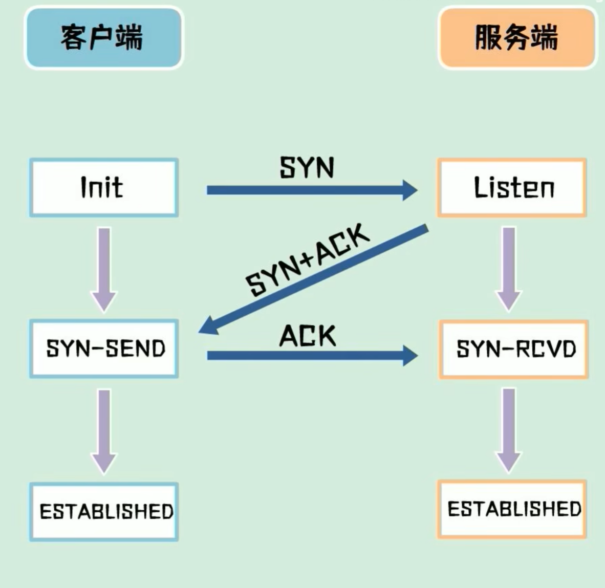

**传输确认**

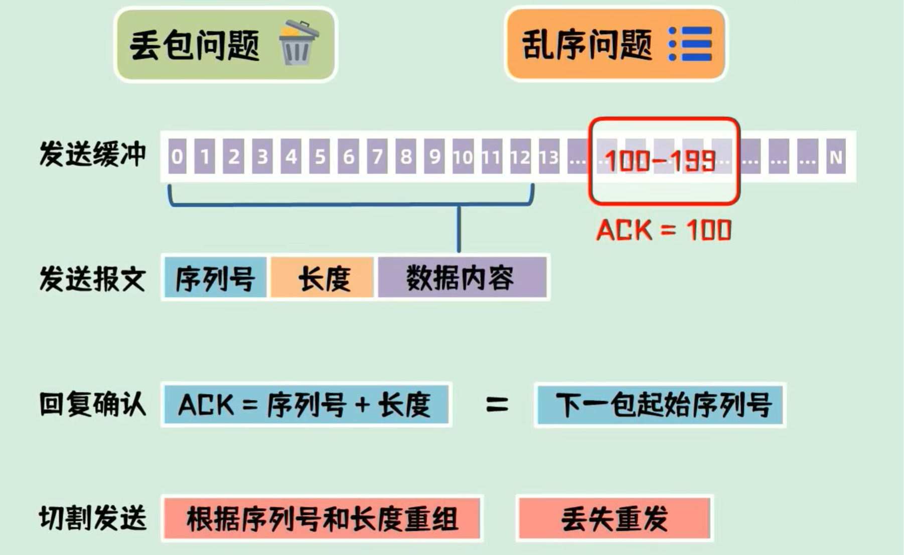

**四次挥手**

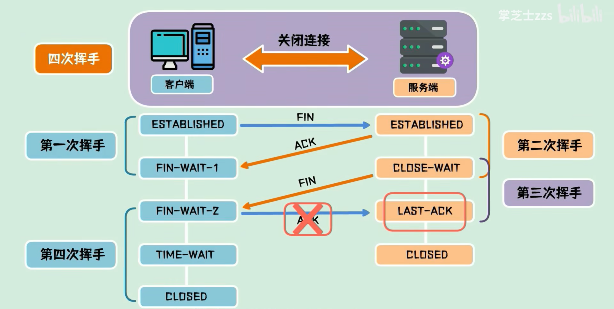

**UDP**——User Datagram Protocol，用户数据报协议。是一种无连接的、不可靠的传输层通信协议。与 TCP 不同，UDP 提供了一种轻量级的数据传输方式，适用于对实时性要求较高、但对可靠性要求较低的应用场景。

## 一些函数操作

```c
1ULL<<SCREEN_GPIO_OUTPUT_CS
//1ULL << 27 表示将无符号长整型 1 左移 27 位，得到二进制数 1000000000000000000000000000（共 32 位，第 27 位为 1，其余为 0）。
//ULL 是 unsigned long long，64 位无符号整数 
```

#### memset

`memset` 是 C 标准库中的一个函数，用于**将一块内存区域的内容设置为指定的值**。它的原型定义在 `<string.h>` 头文件中

```c
void* memset(void* ptr, int value, size_t num);
//ptr:指向要操作的内存区域的指针。  value:要设置的值无符号整形，范围是0到255.   num ：要设置的字节数。
```

`memset` 将从 `ptr` 开始的 `num` 个字节的内存区域填充为指定的值 `value`。它通常用于初始化内存，例如清零数组或设置特定的初始值。

```c
//清零内存
int arr[10];
memset(arr, 0, sizeof(arr)); // 将数组 arr 的所有元素设置为 0
//初始化字符串
char str[20];
memset(str, '\0', sizeof(str)); // 将字符串的所有字节设置为 '\0'（空字符）
//设置特定值
char buffer[10];
memset(buffer, 'A', 10); // 将 buffer 的每个字节设置为字符 'A'
//memset 按字节操作，而复杂数据类型的内部表示可能不兼容。
```

#### memcpy

用于**复制内存块的内容**。它的作用是将源内存区域的数据按字节拷贝到目标内存区域，且不关心内存重叠问题（如果内存重叠，应使用 `memmove` 代替）

```c
void *memcpy(void *dest, const void *src, size_t n);
```

- **`dest`**：目标内存地址（拷贝到的位置）。
- **`src`**：源内存地址（拷贝的来源）。
- **`n`**：要拷贝的**字节数**。

```c
//复制数组-数组传入时只需传入数组名，
char src[] = "Hello, World!";
char dest[20];
memcpy(dest, src, strlen(src) + 1); 	// +1 包含结尾的 '\0'
```

注：数组名在大多数表达式中会自动转换为指向其首元素的指针


#### strchr

用于在一个字符串中查找某个字符第一次出现的位置

```c
#include <string.h>
const char *str = "Hello, World!";
char target = 'o';
char *result = strchr(str, target);		//4
```

#### strcmp

会逐个比较 `str1` 和 `str2` 中的字符，直到遇到不同的字符或者字符串结束符 `'\0'`,根据这两个字符的 ASCII 码值的差值来返回结果。

- 按照字符的 ASCII 值逐个比较。
- 如果两个字符串完全相同，则返回 `0`。
- 如果 `str1` 在字典顺序上小于 `str2`，则返回一个负数。
- 如果 `str1` 在字典顺序上大于 `str2`，则返回一个正数。

```c
#include <string.h>
char str1[] = "hello";
char str2[] = "world";
if (strcmp(str1, str2) == 0) {
   printf("字符串相等\n");
```

#### strlcpy

用于字符串复制的函数，它的设计目的是比传统的 `strcpy` 和 `strncpy` 更安全且更高效。

```c
size_t strlcpy(char *dst, const char *src, size_t size);
//将源字符串 src 复制到目标缓冲区 dst 中，并确保目标缓冲区始终以 \0（空字符）结尾，从而避免缓冲区溢出的问题。
//dst ：目标缓冲区指针。src ：源字符串指针。size ：目标缓冲区的大小（以字节为单位）。

char src[] = "Hello, World!";
char dst[10];
size_t len = strlcpy(dst, src, sizeof(dst));
```


#### calloc

用于动态分配内存，并将分配的内存初始化为零。

```c
#include <stdlib.h>
int n = 5;
int *arr = (int *)calloc(n, sizeof(int)); 	// 分配 5 个整数的内存，并初始化为 0

if (arr == NULL) {
    printf("内存分配失败\n");
```

适用于以下场景：

- 动态分配数组或结构体，并希望初始值为零。
- 确保分配的内存内容是安全的（全为零），避免未初始化导致的错误。
- `calloc` 需要将内存清零，其性能可能略低于 `malloc`，但在需要初始化为零的场景中更为方便。

#### sprintf

把格式化的数据写入到指定的字符串中

```c
int sprintf(char *str, const char *format, ...);
//str：指向用于存储格式化后字符串的字符数组的指针。
//format：格式化字符串，用于指定输出的格式。
sprintf(weathe.city,"%s",psub->valuestring);
//将 psub->valuestring 所指向的字符串内容复制到 weathe.city 所指向的字符数组中。
```

#### stat

一个用于**获取文件状态信息**的系统调用（或函数），它返回一个文件的元数据，如文件大小、权限、所有者、最后访问/修改时间等。

```c
#include <sys/stat.h>
int stat(const char *pathname, struct stat *statbuf);
//pathname：文件路径（字符串）。statbuf：指向 struct stat 的指针，用于存储文件状态信息。
//返回值：0：成功。-1：失败，并设置 errno（如 ENOENT 表示文件不存在）。
struct stat file_stat;
int a = file_stat.st_size		
//获取文件大小（信息）
```

结构体

```c
struct stat {
    dev_t     st_dev;     // 文件所在设备的 ID
    ino_t     st_ino;     // inode 编号（唯一标识文件）
    mode_t    st_mode;    // 文件类型和权限
    nlink_t   st_nlink;   // 硬链接数量
    uid_t     st_uid;     // 所有者用户 ID
    gid_t     st_gid;     // 所有者组 ID
    dev_t     st_rdev;    // 设备文件的主/次设备号
    off_t     st_size;    // 文件大小（字节）
    blksize_t st_blksize; // 文件系统 I/O 块大小
    blkcnt_t  st_blocks;  // 分配的磁盘块数量
    time_t    st_atime;   // 最后访问时间
    time_t    st_mtime;   // 最后修改时间
    time_t    st_ctime;   // 最后状态变更时间（如权限修改）
};
```

#### std::mutex和std::lock_guard

`std::mutex` 和 `std::lock_guard` 是 C++ 标准库中用于多线程同步的工具，主要用于防止多个线程同时访问共享资源，导致数据竞争问题。

```c++
#include <iostream>
#include <thread>
#include <mutex>

std::mutex mtx;

void printMessage(const std::string& message) {
    mtx.lock();    // 锁定互斥量
    std::cout << message << std::endl;
    mtx.unlock();  // 解锁互斥量
}

int main() {
    std::thread t1(printMessage, "Hello from thread 1");
    std::thread t2(printMessage, "Hello from thread 2");

    t1.join();
    t2.join();
    return 0;
}
```

注意，如果 `lock()` 和 `unlock()` 之间的代码抛出了异常，`unlock()` 可能不会被调用，从而导致死锁。因此，**推荐使用** `std::lock_guard` 进行更安全的锁管理。

`std::lock_guard` 是一个 RAII（Resource Acquisition Is Initialization）类，自动管理互斥量的锁定和解锁，**确保在作用域结束时（无论是正常结束还是异常退出）互斥量被正确解锁**。

```c++
#include <iostream>
#include <thread>
#include <mutex>

std::mutex mtx;

void printMessage(const std::string& message) {
    std::lock_guard<std::mutex> lock(mtx); // 自动锁定
    std::cout << message << std::endl;
    // 作用域结束时，lock_guard 自动解锁互斥量
}

int main() {
    std::thread t1(printMessage, "Hello from thread 1");
    std::thread t2(printMessage, "Hello from thread 2");

    t1.join();
    t2.join();
    return 0;
}
```

#### 解释：

- **`std::lock_guard<std::mutex> lock(mtx);`**：创建一个 `std::lock_guard` 对象 `lock`，并传入互斥量 `mtx`。
- 在创建 `lock` 对象时，互斥量 `mtx` 被锁定，当 `lock` 对象被销毁时（例如当函数退出或异常抛出时），互斥量自动解锁。


# FreeRTOS

## 编程风格

### 数据类型

| 新定义的数据类型实际的 | 实际的数据类型（C 标准类型 |                                                              |
| ---------------------- | -------------------------- | ------------------------------------------------------------ |
| **portCHAR**           | **char**                   | 一般需要指明char是有符号的还是无符号的。在keil中，默认char是无符号的 |
| **portSHORT**          | **short**                  | 16位                                                         |
| **portLONG**           | **long**                   | 32位                                                         |
| **portTickType**       | **unsigned short int**     | 用于定义系统时基计数器的值和阻塞时间的值。当 FreeRTOSConfig.h 头文件中的宏 configUSE_16_BIT_TICKS 为1时则为16位。 |
|                        | **unsigned** **int**       | 用于定义系统时基计数器的值和阻塞时间的值。FreeRTOSConfig.h 头文件中的宏 configUSE_16_BIT_TICKS 为1时则为32位。 |
| **portBASE_TYPE**      | **long**                   | 根据处理器的架构来决定是多少位的，如果是 32/16/8bit 的处器则是32/16/8bit 的数据类型。 一般用于定义函数的返回值或者布尔类型。 |

### 变量名

在 FreeRTOS 中，定义变量的时候往往会把变量的类型当作前缀加在变量上

> 如 char 型变量的前缀是 c，short 型变量的前缀是 s，long 型变量的前缀是 l， portBASE_TYPE 类型变量的前缀是 x。还有其他的数据类型，比如数据结构，任务句柄，队列句柄等定义的变量名的前缀也是 x。
>
> 如果一个变量是无符号型的那么会有一个前缀 u，如果是一个指针变量则会有一个前缀 p。因此，当我们定义一个无符号的 char 型变量的时候会加一个 uc 前缀，当定义一个char 型的指针变量的时候会有一个 pc 前缀。

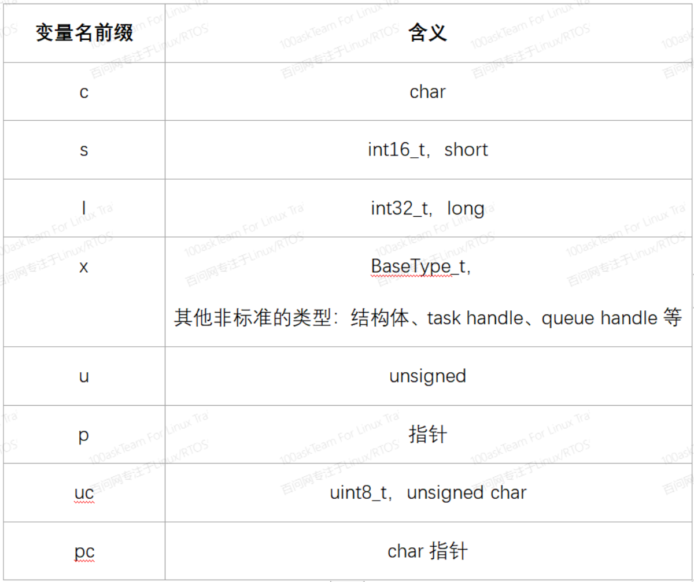

### 函数名

函数名包含了函数返回值的类型、函数所在的文件名和函数的功能，如果是私有的函数则会加一个 prv（private）的前缀。

> vTaskPrioritySet()函数的返回值为 void 型，在task.c 这个文件中定义。
>
> xQueueReceive()函数的返回值为 portBASE_TYPE 型，在 queue.c 这个文件中定义。
>
> vSemaphoreCreateBinary()函数的返回值为 void 型，在 semphr.h 这个文件中定义。

### 宏

宏均是由大写字母表示，并配有小写字母的前缀，前缀用于表示该宏在哪个头文件定义

| 前缀                               | 宏定义的头文件   |
| ---------------------------------- | ---------------- |
| port (举例, portMAX_DELAY)         | portable.h       |
| task (举例, taskENTER_CRITICAL())  | task.h           |
| pd (举例, pdTRUE)                  | projdefs.h       |
| config(举例, configUSE_PREEMPTION) | FreeRTOSConfig.h |
| err (举例, errQUEUE_FULL)          | projdefs.h       |

通用的宏定义，都是表示0和1的宏

| 宏      | 实际的值 |
| ------- | -------- |
| pdTRUE  | 1        |
| pdFALSE | 0        |
| pdPASS  | 1        |
| pdFAIL  | 0        |

## FreeRTOS中的链表

链表各种定义都在list.h中

#### 链表节点数据结构的定义

节点 **ListItem_t**

```c
1 struct xLIST_ITEM
2 {
3 		TickType_t xItemValue; /* 辅助值，用于帮助节点做顺序排列 */ (1)
4 		struct xLIST_ITEM * pxNext; /* 指向链表下一个节点 */ (2)
5 		struct xLIST_ITEM * pxPrevious; /* 指向链表前一个节点 */ (3)
6 		void * pvOwner; /* 指向拥有该节点的内核对象，通常是 TCB */(4)
7 		void * pvContainer; /* 指向该节点所在的链表 */ (5)
8 };
9 typedef struct xLIST_ITEM ListItem_t; /* 节点数据类型重定义 */ (6)
```

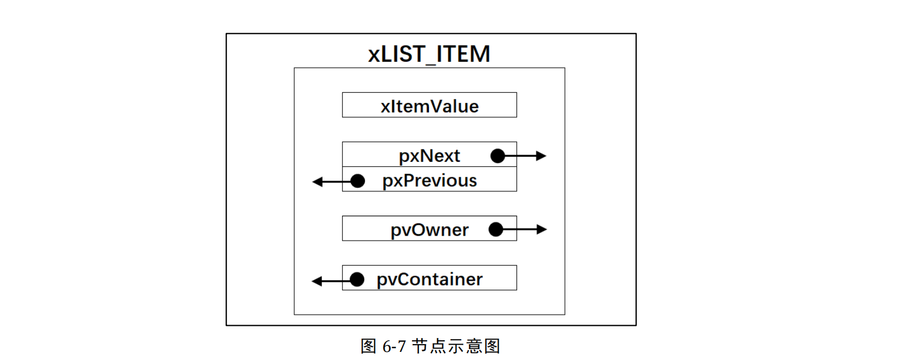

#### 链表节点的初始化

```c
1 void vListInitialiseItem( ListItem_t * const pxItem )
2 {
3 		/* 初始化该节点所在的链表为空，表示节点还没有插入任何链表 */
4 		pxItem->pvContainer = NULL;
5 }
```

#### 定义链表根节点数据结构

链表 **List_t**

```c
1 typedef struct xLIST
2 {
3 		UBaseType_t uxNumberOfItems; /* 链表节点计数器		——链表节点计数器，用于表示该链表下有多少个节点，根节点除外 */ 
4 		ListItem_t * pxIndex; 		/* 链表节点索引指针		——链表节点索引指针，用于遍历节点。 */
5 		MiniListItem_t xListEnd; 	/* 链表最后一个节点		——链表是首尾相连的 */
6} List_t
```

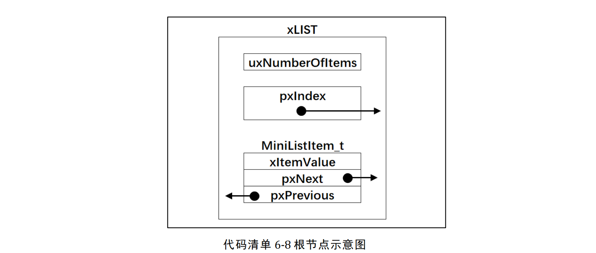

## 任务

freertos是多任务系统，在多任务系统中，我们根据功能的不同，把整个系统分割成一个个独立的且无法返回的函数，这个函数我们称为**任务**。

> 在多任务系统中，每个任务都是独立的，互不干扰的，所以要为每个任务都分配**独立的栈空间**，这个栈空间通常是一个预先定义好的全局数组，也可以是动态分配的一段内存空间，但它们都存在于 RAM 中。
>
> 同一个函数，可以创建多个任务，换句话来说，多个任务可以运行同一个函数
>
> - 每个任务运行这个函数时，taskA的局部变量存放在taskA的栈中，taskB的局部变量存放在taskB的栈中
> - 函数使用全局变量、静态变量的话。多个任务使用的是同一个副本。要防止冲突

#### 任务状态

1. Running状态 **运行**
   正在运行的Task，成为Running状态，即运行状态，即任务3正在运行
2. Ready状态 **就绪**
   任务3正在运行，任务1和任务2 处于Ready状态
3. blocked状态 **阻塞**
   等待某事完成后，再运行suspended 
4. 暂停状态 **挂起**
   主动休息，被命令去休息
   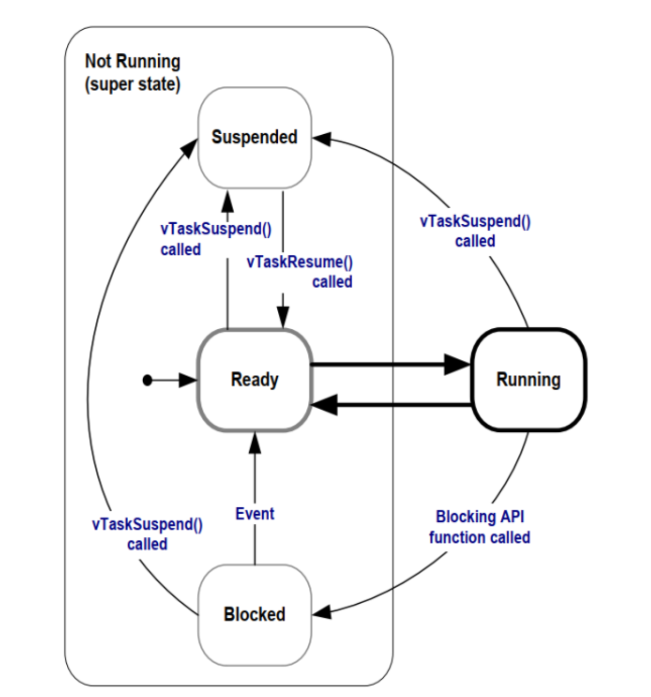


### 创建任务的流程

#### 定义任务栈

> 在多任务系统中，有多少个任务就需要定义多少个任务栈。
>
> **任务栈其实就是一个预先定义好的全局数据，数据类型为StackType_t**，大小由 TASK1_STACK_SIZE 这个宏来定义，默认为128，单位为字(硬件架构定义的最小数据单位)，即512字节(32位处理器下)，这也是 FreeRTOS 推荐的最小的任务栈。

```c
#define TASK1_STACK_SIZE 128
StackType_t Task1Stack[TASK1_STACK_SIZE];
#define TASK2_STACK_SIZE 128
StackType_t Task2Stack[TASK2_STACK_SIZE];
```

在 $FreeRTOS$ 中，凡是涉及到数据类型的地方，$FreeRTOS$ 都会将标准的 C 数据类型用 typedef 重新取一个类型名。

```c
typedef portSTACK_TYPE StackType_t;				//portmacro.h文件中定义
```

#### 定义任务函数

> 任务是一个独立的函数，函数主体无限循环且不能返回。

#### 定义任务控制块

> 在裸机系统中，程序的主体是 CPU 按照顺序执行的。而在多任务系统中，任务的执行是由系统调度的。系统为了顺利的调度任务，为**每个任务都额外定义了一个任务控制块。**
>
> 任务控制块就相当于任务的身份证，里面存有任务的所有信息，比如任务的栈指针，任务名称，任务的形参等。有了这个任务控制块之后，以后系统对任务的全部操作都可以通过这个任务控制块来实现。

任务控制块类型声明

```c
1 typedef struct tskTaskControlBlock
2 {
3 		volatile StackType_t *pxTopOfStack; /* 栈顶 */
4 		ListItem_t xStateListItem; 			/* 任务节点 */
5 		StackType_t *pxStack; 				/* 任务栈起始地址 */ 
6 											/* 任务名称，字符串形式 */
7 		char pcTaskName[ configMAX_TASK_NAME_LEN ];
8 } tskTCB;

9 typedef tskTCB TCB_t;			//task control block
```

#### 实现任务创建函数 p47

> 任务的栈，任务的函数实体，任务的控制块最终需要联系起来才能由系统进行统一调度。这个联系的工作就由任务创建函数 xTaskCreateStatic()来实现，该函数在 task.c中。
>
> 调用 prvInitialiseNewTask()函数，创建新任务。
>
> 调用 pxPortInitialiseStack()函数初始化任务栈，并更新栈顶指针，任务第一次运行的环境参数就存在任务栈中。


### 创建单任务——SRAM静态内存

任务使用的栈和任务控制块都使用静态内存，即预先定义好的全局变量，这些预先定义好的全局变量都存在内部的 SRAM 中。

> FreeRTOS 里面的延时是阻塞延时，即调用 vTaskDelay()函数的时候，当前任务会被挂起，调度器会切换到其它就绪的任务，从而实现多任务。
>
> 使用了静态创建任务的时候，configSUPPORT_STATIC_ALLOCATION 这个宏定义**必须为 1** （在 FreeRTOSConfig.h 文件中 ）

#### 定义任务函数

#### 空闲任务与定时器任务堆栈函数实现

必须由用户自己分配，而不能是动态分配

```c
vApplicationGetIdleTaskMemory()				//空闲（Idle）任务的堆栈大小
vApplicationGetTimerTaskMemory()			//定时器（Timer）任务的堆栈大小
```

#### 定义任务栈

当任务进入延时的时候，因为没有另外就绪的用户任务，那么系统就会进入空闲任务，空闲任务是 FreeRTOS 系统自己启动的一个任务，优先级最低。

在 FreeRTOS 系统中，每一个任务都是独立的，他们的运行环境都单独的保存在他们的**栈空间**当中。那么在定义好任务函数之后，我们还要为任务定义一个栈

```c
/* AppTaskCreate 任务任务堆栈 */
static StackType_t AppTaskCreate_Stack[128];
/* LED 任务堆栈 */
static StackType_t LED_Task_Stack[128];
```

#### 定义任务控制块

定义好任务函数和任务栈之后，我们还需要为任务定义一个任务控制块，通常我们称这个任务控制块为任务的身份证。

```c
/* AppTaskCreate 任务控制块 */
static StaticTask_t AppTaskCreate_TCB;
/* AppTaskCreate 任务控制块 */
static StaticTask_t LED_Task_TCB;
```

#### 静态创建任务

静态任务创建函数 xTaskCreateStatic()，将任务主体函数，任务栈（静态的）和任务控制块（静态的）这三者联系在一起

```c
1 /* 创建 AppTaskCreate 任务 */
2 AppTaskCreate_Handle = xTaskCreateStatic((TaskFunction_t)AppTaskCreate, //任务函数
3 							(const char* )"AppTaskCreate",		//任务名称
4							(uint32_t )128, 						//任务堆栈大小
5 							(void* )NULL, 						//传递给任务函数的参数
6 							(UBaseType_t )3, 						//任务优先级
7 							(StackType_t* )AppTaskCreate_Stack, 	//任务堆栈,静态分配的栈，就是一个buffer
8 							(StaticTask_t* )&AppTaskCreate_TCB);	 //任务控制块
9 
10 if (NULL != AppTaskCreate_Handle) 	/* 创建成功 */
11 		vTaskStartScheduler(); 				/* 启动任务，开启调度 */
```

注:**栈中的 buffer** 是指存储在程序栈（Stack）区域的一段连续内存空间


### 空闲任务

空闲任务(Idle任务)的作用：释放被删除的任务的内存。

> 对于自杀的任务，由空闲task进行清理
> 对于被杀的任务，由vTaskDelete这个函数内部清理(凶手调用这个函数，由凶手清理)

**在启动任务调度器时，会帮助我们创建空闲task**

- **空闲任务的任务优先级为0，它不能阻碍用户的任务运行**
- **空闲任务要么处于就绪Ready状态，要么处于运行状态，永远不会阻塞**


### 任务调度算法

- 是否允许抢占


> - [ ] 允许，高优先级task，优先执行
>
> - [ ] 不允许，谁先执行，就一直占用CPU资源，除非主动放弃CPU资源或者进入阻塞状态，高优先级的task也无法继续抢占

- 允许抢占的情况下，是否允许时间片轮转

> - [ ] 允许，同优先级task交替执行
> - [ ] 不允许，先到先得CPU资源，谁先执行，就一直占用CPU资源，task1执行了很久很久，应该是task1，idle task，task2，交替轮流执行一个tick,何时放弃的CPU资源，被task3抢占后放弃，被任务调度器调度后task2继续执行

- 允许抢占，允许时间片轮转的情况下，空闲task是否让步用户task

> - [ ] 让步，每次运行空闲task时，将会调用yield函数，让出CPU资源
> - [ ] 不让步，将会抢占CPU资源，和用户task抢占，波形宽度差不多


### 任务同步/互斥

#### 实现同步或互斥的方法

- 队列(queue)
- 事件组(event group)
- 信号量(semaphoe)
- 互斥量(mutex)
- 任务通知(task notification)

> 循环检测某个变量来实现同步的方法，有很大的缺陷，会很大的占用CPU资源


## 队列

**队列 Queue**是任务间通信的主要形式。 它们可以用于在**任务之间**以及**中断和任务之间**发送消息。

队列是线程安全的数据结构，任务可以通过队列在彼此之间传递数据。有以下关键特点：

> - FIFO顺序：队列采用先进先出 (FIFO) 的顺序，即先发送的消息会被先接收。
> - 线程安全：队列操作是原子的，确保在多任务环境中的数据完整性。
> - 阻塞和非阻塞操作：任务可以通过阻塞或非阻塞的方式发送和接收消息。如果队列满了或者为空，任务可以选择等待直到有空间或者数据可用，或者立即返回。
> - 优先级继承：FreeRTOS 支持基于优先级的消息传递，确保高优先级任务在队列操作期间不会被低优先级任务阻塞。
> - 可变长度项：队列中的项可以是不同长度的数据块，而不是固定大小。

**头文件**

```c
#include "queue.h"
```


### 创建队列

| **函数**                 | **描述**         |
| ------------------------ | ---------------- |
| **xQueueCreate()**       | 动态方式创建队列 |
| **xQueueCreateStatic()** | 静态方式创建队列 |

```c
QueueHandle_t xQueuecreate( uBaseType_t uxoueueLength, uBaseType_t uxItemsize );		
//uxQueueLength:队列长度，最多能存放多少个数据(item)
//uxltemSize:每个数据(item)的大小:以字节为单位
//返回值:非0:成功，返回句柄，以后使用句柄来操作队列.NULL:失败，因为内存不足
eg:
xQueueCalHandle = xQueueCreate(2,sizeof(int));
if(xQueueCalHandle == NULL)
	printf("can not create the Queue!\r\n");
```

**队列的结构体**

```c
typedef xQUEUE Queue_t;
```

### 队列操作

#### 往队列写入消息

| **函数**                   | **描述**                                          |
| -------------------------- | ------------------------------------------------- |
| xQueueSend()               | 往队列的尾部写入消息                              |
| xQueueSendToBack()         | 同 xQueueSend()                                   |
| xQueueSendToFront()        | 往队列的头部写入消息                              |
| xQueueOverwrite()          | 覆写队列消息（只用于队列长度为 1 的情况）         |
| xQueueSendFromISR()        | 在中断中往队列的尾部写入消息                      |
| xQueueSendToBackFromISR()  | 同 xQueueSendFromISR()                            |
| xQueueSendToFrontFromISR() | 在中断中往队列的头部写入消息                      |
| xQueueOverwriteFromISR()   | 在中断中覆写队列消息（只用于队列长度为 1 的情况） |

#### 从队列读取消息

| **函数**               | **描述**                               |
| ---------------------- | -------------------------------------- |
| xQueueReceive()        | 从队列头部读取消息，并删除消息         |
| xQueuePeek()           | 从队列头部读取消息                     |
| xQueueReceiveFromISR() | 在中断中从队列头部读取消息，并删除消息 |
| xQueuePeekFromISR()    | 在中断中从队列头部读取消息             |

#### 复位队列

| **函数**      | **描述**                       |
| ------------- | ------------------------------ |
| xQueueReset() | 从队列头部读取消息，并删除消息 |

#### 删除队列

| **函数**       | **描述**                         |
| -------------- | -------------------------------- |
| xQueueDelete() | 删除动态方法创建的队列，释放内存 |


## 队列集

队列集（Queue Set）是 FreeRTOS 中的一种数据结构，用于管理多个队列。它提供了一种有效的方式，通过单个 API 调用来操作和访问一组相关的队列。

在多任务系统中，任务之间可能需要共享数据，而这些数据可能存储在不同的队列中。队列集的作用就是为了更方便地管理这些相关队列，使得任务能够轻松地访问和处理多个队列的数据。

**特性**

> - 单一 API 调用：通过单一的 API 调用，任务可以同时操作多个队列，而无需分别处理每个队列。
> - 队列集中有三个队列A、B、C，队列集的长度应该是：**队列A的长度+队列B的长度+队列C的长度**。
> - 写队列A一次，就会写队列集一次。
> - 读取队列集一次，返回一个队列后，只能读取队列一次。

| **函数**                     | **描述**                             |
| ---------------------------- | ------------------------------------ |
| xQueueCreateSet()            | 创建队列集                           |
| xQueueAddToSet()             | 队列添加到队列集中                   |
| xQueueRemoveFromSet()        | 从队列集中移除队列                   |
| xQueueSelectFromSet()        | 获取队列集中有有效消息的队列         |
| xQueueSelectFromSetFromISR() | 在中断中获取队列集中有有效消息的队列 |

```c
xQueueSetHandle = xQueueCreateSet(4); 			  	//创建队列集
xQueueAddToSet(xQueueHandle1, xQueueSetHandle);		//队列添加到队列集中
```

**头文件**

```c
#include "queue.h"
#include "semphr.h"
```

**FreeRTOSConfig.h配置**

```c
#define configUSE_QUEUE_SETS                            1
```


## 信号量

队列可以传送数据，队列可以传送不同的数据。**有的时候只需要传递状态，并不需要传递具体的信息**。这就是信号量，不去传送数据，而是传送状态,这样至起到了通知的作用，更加节省内存。

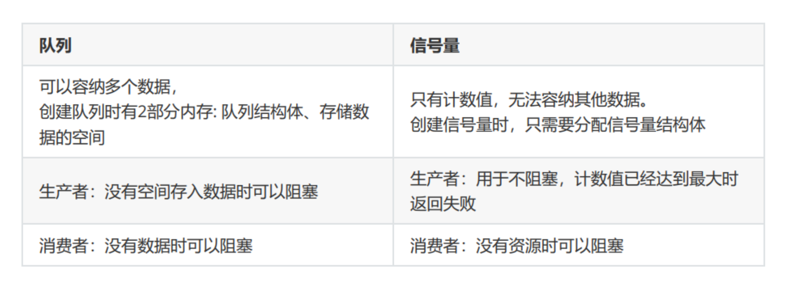

 $FreeRTOS$中的信号量是一种用于**任务间同步和资源管理的机制**。信号量可以是二进制的（只能取0或1）也可以是计数型的（可以是任意正整数）。信号量的基本操作包括“获取”和“释放”。

**头文件**

```c
#include "semphr.h"
```

**FreeRTOSConfig.h配置**

```c
#define configSUPPORT_DYNAMIC_ALLOCATION 1
#define configUSE_COUNTING_SEMAPHORES 1
```

**创建信号量**

初始值为0 信号量计数值 最大值为10

```c
xSemaphoreHandleTest = xSemaphoreCreateCounting(10，0);
```

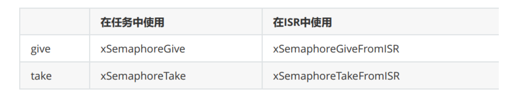

**ISR** 是 Interrupt Service Routine（中断服务程序）。

1. **对于give，信号量加1 解锁**
2. **对于take，信号量减1 上锁**

> **二进制型信号量初始值为0**
> 所以创建二进制信号量时需要，手动give一下，否则take时会一直卡在阻塞状态

**删除信号量**

```c
void vSemaphoreDelete( SemaphoreHandle_t xSemaphore );
```


#### 二值信号量

二值信号量（Binary Semaphore）是一种特殊类型的信号量，它**只有两个**可能的值：0和1。这种信号量主要用于实现对共享资源的**互斥访问**或者任务之间的同步。

| **函数**                       | **描述**                   |
| ------------------------------ | -------------------------- |
| xSemaphoreCreateBinary()       | 使用动态方式创建二值信号量 |
| xSemaphoreCreateBinaryStatic() | 使用静态方式创建二值信号量 |
| xSemaphoreGive()               | 释放信号量                 |
| xSemaphoreGiveFromISR()        | 在中断中释放信号量         |
| xSemaphoreTake()               | 获取信号量                 |
| xSemaphoreTakeFromISR()        | 在中断中获取信号量         |

#### 计数型信号量

二进制信号量可以被认为是长度为 1 的队列，计数信号量也可以被认为是长度大于 1 的队列。一般用于**事件计数**（信号量计数值递增）和**资源管理**（减信号量计数值）。

| **函数**                         | **描述**                       |
| -------------------------------- | ------------------------------ |
| xSemaphoreCreateCounting()       | 使用动态方法创建计数型信号量。 |
| xSemaphoreCreateCountingStatic() | 使用静态方法创建计数型信号量   |
| uxSemaphoreGetCount()            | 获取信号量的计数值             |


## 事件标志组

FreeRTOS中的[事件标志组](https://blog.csdn.net/weixin_45499326/article/details/129079001)（Event Flags Group）提供了一种轻量级的机制，用于在任务之间传递信息和同步操作。

事件标志组就像是一个共享的标志牌集合，每个标志位都代表一种特定的状态或事件。任务可以等待或设置这些标志位，从而实现任务之间的协同工作。

总体来说，事件标志组更侧重于任务间的事件通知和同步，而信号量更侧重于资源的控制和同步。

> 一个事件组可以同时设置8个或24个事件。
>
> 事件“标志”是一个布尔值（1 或 0），用于指示事件是否发生。
> 事件“组”是一组事件标志。
>
> 一个事件标志只能为 1 或 0，允许将一个事件标志的状态存储在一个位中，并将一个事件组中所有事件标志的状态存储在一个变量中；事件组中每个事件标志的状态由 EventBits_t 类型变量中的单个位表示。因此，事件标志也称为事件“位”。
>
> 如果 EventBits_t 变量中的某个位设置为 1，则该位表示的事件已经发生。如果EventBits_t 变量中的某个位设置为0，则该位表示的事件尚未发生。

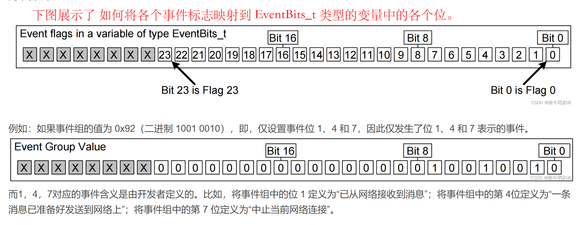

> 事件组中的事件位数取决于 FreeRTOSConfig.h 中的 configUSE_16_BIT_TICKS 编译时间配置的常量：
> 如果 configUSE_16_BIT_TICKS 为 1，则每个事件组包含 8 个可用事件位。
> 如果 configUSE_16_BIT_TICKS 为 0，则每个事件组包含 24 个可用事件位。

事件组本身就是对象，任何知道它们存在的任务或 ISR 都可以访问这些对象。任意数量的任务可以设置同一事件组中的位，任意数量的任务可以从同一事件组中读取位。

| **函数**                      | **描述**                         |
| ----------------------------- | -------------------------------- |
| xEventGroupCreate()           | 使用动态方式创建事件标志组       |
| xEventGroupCreateStatic()     | 使用静态方式创建事件标志组       |
| xEventGroupClearBits()        | 清零事件标志位                   |
| xEventGroupClearBitsFromISR() | 在中断中清零事件标志位           |
| xEventGroupSetBits()          | 设置事件标志位                   |
| xEventGroupSetBitsFromISR()   | 在中断中设置事件标志位           |
| xEventGroupWaitBits()         | 等待事件标志位                   |
| xEventGroupSync()             | 设置事件标志位，并等待事件标志位 |

###### 使用事件组管理事件

```c
#include "FreeRTOS.h"
#include "event_groups.h'
EventGroupHandle_t xEventGroupCreate(void);
```

创建一个新的事件组并返回一个句柄，通过该句柄可以引用所创建的事件组。

**示例**

```c
#define mainFIRST_TASK_BIT	(1UL << 0UL)
#define mainSECOND_TASK_BIT	(1UL << 1UL)
#define mainISR_BIT			(1UL << 2UL)

static void vEventBitSettingTask(void *pvParameters)
{
const TickType_t xDelay200ms = pdMS_TO_TICKS(200UL)，xDontBlock=0;
	for(;;)
    {
		/* Delay for a short while before starting the next loop. */
        vTaskDelay(xDelay200ms);
		/* Print out a message to say event bit 0 is about to be set by the task,then setevent bit0.*/
		vPrintString( "Bit setting task -t about to set bit 0.\r\n" );
        xEventGroupSetBits( xEventGroup, mainFIRST_TASK_BIT);
		/* Delay for a short while before setting the other bit. */
        vTaskDelay(xDelay200ms):
		/* Print out a message to say event bit 1 is about to be set by the task,then set event bit 1.*/
		vPrintstring( "Bit setting task -t about to set bit 1.\r\n" );
        xEventGroupSetBits( xEventGroup, mainSECOND_TASK_BIT );
    }
}

//中断服务程序，用来设置事件组中的某些“事件位”。
//中断服务程序由一个强制软件中断的简单周期性任务触发。在此示例中，每 500 毫秒生成一次中断。
static uint32_t ulEventBitSettingISR( void )
{
	static const char *pcString = "Bit setting ISR -\t about to set bit 2.\r\n";
	BaseType_t xHigherPriorityTaskWoken = pdFALSE;
	//打印消息，因为中断不能直接打印，交给一个特殊的后台任务打印
 	xTimerPendFunctionCallFromISR( vPrintStringFromDaemonTask, 
 									( void * ) pcString, 
 									0, 
 									&xHigherPriorityTaskWoken );
 	/* 在事件组中打开开关 2，mainISR_BIT 表示开关 2。Set bit 2 in the event group. */
 	xEventGroupSetBitsFromISR( xEventGroup, mainISR_BIT, &xHigherPriorityTaskWoken );
    //检查是否需要切换任务
 	portYIELD_FROM_ISR( xHigherPriorityTaskWoken );
}

//读取任务，会等待这些“事件位”被设置，并做出响应。
static void vEventBitReadingTask( void *pvParameters )
{
	EventBits_t xEventGroupValue;
    //三个开关（开关 0、开关 1 和开关 2）
	const EventBits_t xBitsToWaitFor = ( mainFIRST_TASK_BIT | mainSECOND_TASK_BIT | mainISR_BIT );
 	for( ;; )
 	{
 		/* 阻塞以等待事件组中的对应事件位被置位。 */
 		xEventGroupValue = xEventGroupWaitBits( xEventGroup,      //事件组
 												xBitsToWaitFor,   //检测的事件位
 												pdTRUE,    //退出阻塞后，清除对应的事件位。
 												pdFALSE,   // 或操作，只要有一个需要的事件位被置位就退出。
 												portMAX_DELAY   /* 一直等待 */
 											);
 		/* 打印对应事件位的信息. */
 		if( ( xEventGroupValue & mainFIRST_TASK_BIT ) != 0 )
 		{
 			vPrintString( "Bit reading task -\t Event bit 0 was set\r\n" );
 		}
 		if( ( xEventGroupValue & mainSECOND_TASK_BIT ) != 0 )
 		{
 			vPrintString( "Bit reading task -\t Event bit 1 was set\r\n" );
 		}
 		if( ( xEventGroupValue & mainISR_BIT ) != 0 )
 		{
 			vPrintString( "Bit reading task -\t Event bit 2 was set\r\n" );
 		}
 	}
 }

int main( void )
{
 	xEventGroup = xEventGroupCreate();  //创建事件组
 	/* 创建任务，用以设置事件组中的事件位 */
 	xTaskCreate( vEventBitSettingTask, "Bit Setter", 1000, NULL, 1, NULL );
 	/* 创建任务，用以读取事件组中的事件位。 */
 	xTaskCreate( vEventBitReadingTask, "Bit Reader", 1000, NULL, 2, NULL );
 	/* 创建任务用以生成中断 */
 	xTaskCreate( vInterruptGenerator, "Int Gen", 1000, NULL, 3, NULL );
 	/* 设置中断ISR. */
 	vPortSetInterruptHandler( mainINTERRUPT_NUMBER, ulEventBitSettingISR );
 	vTaskStartScheduler();
 	for( ;; );
 	return 0;
}
```

xWaitForAllBits 参数被设置为pdFALSE时的输出。

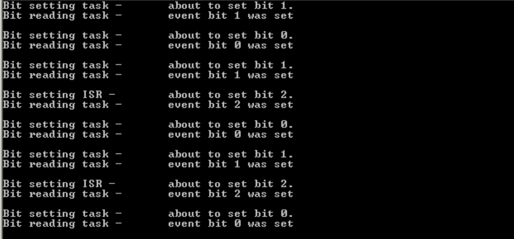


## 软件定时器


## 任务通知

任务通知是 FreeRTOS 中一种用于任务间通信的机制，它允许一个任务向其他任务发送简单的通知或信号，以实现任务间的同步和协作。任务通知通常用于替代二值信号量或事件标志组，提供了更轻量级的任务间通信方式。不借助中间对象。

| **函数**                     | **描述**                                       |
| ---------------------------- | ---------------------------------------------- |
| xTaskNotify()                | 发送通知，带有通知值                           |
| xTaskNotifyAndQuery()        | 发送通知，带有通知值并且保留接收任务的原通知值 |
| xTaskNotifyGive()            | 发送通知，不带通知值                           |
| xTaskNotifyFromISR()         | 在中断中发送任务通知                           |
| xTaskNotifyAndQueryFromISR() |                                                |
| vTaskNotifyGiveFromISR()     |                                                |
| ulTaskNotifyTake()           | 获取任务通知，可选退出函数时对通知值清零或减1  |
| xTaskNotifyWait()            | 获取任务通知，可获取通知值和清除通知值的指定位 |

## 

FreeRTOS 中的软件定时器是一种轻量级的时间管理工具，用于在任务中创建和管理定时器。软件定时器是基于 FreeRTOS 内核提供的时间管理功能实现的，允许开发者创建、启动、停止、删除和管理定时器，从而实现在任务中对时间的灵活控制。

| **函数**                    | **描述**                     |
| --------------------------- | ---------------------------- |
| xTimerCreate()              | 动态方式创建软件定时器       |
| xTimerCreateStatic()        | 静态方式创建软件定时器       |
| xTimerStart()               | 开启软件定时器定时           |
| xTimerStartFromISR()        | 在中断中开启软件定时器定时   |
| xTimerStop()                | 停止软件定时器定时           |
| xTimerStopFromISR()         | 在中断中停止软件定时器定时   |
| xTimerReset()               | 复位软件定时器定时           |
| xTimerResetFromISR()        | 在中断中复位软件定时器定时   |
| xTimerChangePeriod()        | 更改软件定时器的定时超时时间 |
| xTimerChangePeriodFromISR() | 在中断中更改定时超时时间     |

**头文件**

```c
#include "timers.h"
```

**FreeRTOSConfig.h配置**

```c
/* 软件定时器相关定义 */
#define configUSE_TIMERS 1                                          /* 1: 使能软件定时器, 默认: 0。使能后需指定下面3个 */
#define configTIMER_TASK_PRIORITY (configMAX_PRIORITIES - 1)        /* 定义软件定时器任务的优先级 */
#define configTIMER_QUEUE_LENGTH 5                                  /* 定义软件定时器命令队列的长度*/
#define configTIMER_TASK_STACK_DEPTH (configMINIMAL_STACK_SIZE * 2) /* 定义软件定时器任务的栈空间大小*/
```

**实例**：

```c
TimerHandle_t g_Timer;				//g_Timer 是一个全局变量，用来存储定时器的句柄。
g_Timer = xTimerCreate("Timer1",	//创建软件定时器
				1000,				//定时器的周期时间，单位是Tick （系统节拍数）
				pdTRUE,				//定时器的自动重载标志。pdTRUE定时器到期后会自动重新计时;pdFALSE，则定时器是一次性的
				NULL,				//定时器的 ID 参数（可选）。这个值可以传递给回调函数，通常用于区分不同的定时器。
				(TimerCallbackFunction_t)TimerCallBackFun);		//定时器的回调函数。当定时器到期时，FreeRTOS 会调用这个回调函数。
if(g_Timer != NULL)					//如果返回值不为 NULL，表示定时器创建成功。
	{
		xTimerStart(g_Timer, 0);	//启动定时器
	}
```


## Tickless低功耗模式

FreeRTOS 的 Tickless 模式是一种特殊的运行模式，用于最小化系统的时钟中断频率，以降低功耗。在 Tickless 模式下，系统只在有需要时才会启动时钟中断，而在无任务要运行时则完全进入休眠状态，从而降低功耗。

Tickless模式的实现方式通常依赖于微控制器的硬件特性，尤其是低功耗定时器或实时时钟单元。

> - 空闲任务检测：FreeRTOS 会通过空闲任务（Idle Task）来检测系统是否有任务需要执行。如果没有任务需要执行，系统可以进入休眠状态。
> - 时钟中断：当有任务需要执行时，系统会启动时钟中断，唤醒处理器。
> - 时钟中断处理：在时钟中断处理函数中，FreeRTOS 将检查任务的状态并决定是否继续执行。
> - 休眠状态：如果没有任务需要执行，系统可以进入休眠状态，关闭时钟中断。在休眠状态下，处理器可以进入更低功耗的模式。
> - 任务唤醒：当有任务需要执行时，系统会再次启动时钟中断，唤醒处理器，然后执行相应的任务。

STM32F103xC、STM32F103xD和STM32F103xE增强型产品支持三种低功耗模式，可以在要求低功耗、短启动时间和多种唤醒事件之间达到最佳的平衡。

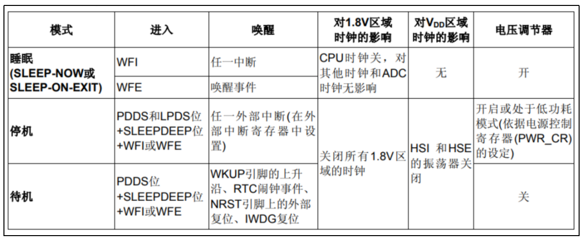

**头文件**

```c
#include "semphr.h"
```

**FreeRTOSConfig.h配置**

```c
#define configUSE_TICKLESS_IDLE                         1
#include "freertos_demo.h"
#define configPRE_SLEEP_PROCESSING( x )         PRE_SLEEP_PROCESSING()
#define configPOST_SLEEP_PROCESSING( x )        POST_SLEEP_PROCESSING()
```


## 内存管理

注意：我们经常"堆栈"混合着说，其实它们不是同一个东西：

> - 堆，heap，就是一块空闲的内存，需要提供管理函数
>   - malloc：从堆里划出一块空间给程序使用
>   - free：用完后，再把它标记为"空闲"的，可以再次使用
> - 栈，stack，函数调用时局部变量保存在栈中，当前程序的环境也是保存在栈中
>   - 可以从堆中分配一块空间用作栈

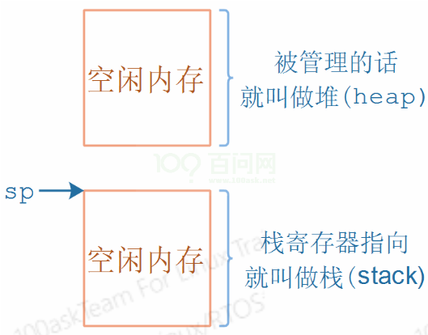

FreeRTOS 将内存分配 API 保留在其可移植层，提供了五种内存管理算法：

> - heap_1：最简单，不允许释放内存。
> - heap_2：允许释放内存，但不会合并相邻的空闲块。
> - heap_3：简单包装了标准 malloc() 和 free()，以保证线程安全。
> - heap_4：合并相邻的空闲块以避免碎片化。包含绝对地址放置选项。
> - heap_5：如同 heap_4，能够跨越多个不相邻内存区域的堆。

| **函数**                                    | **描述**               |
| ------------------------------------------- | ---------------------- |
| void * pvPortMalloc( size_t  xWantedSize ); | 申请内存               |
| void  vPortFree( void * pv );               | 释放内存               |
| size_t  xPortGetFreeHeapSize( void );       | 获取当前空闲内存的大小 |


## 特殊的函数

### SysTick 中断服务函数

SysTick 是一个硬件定时器，通常嵌入在 ARM Cortex-M 系列微控制器中。它的作用就像一个“时钟闹钟”，可以按照设定的时间间隔触发中断。

SysTick 中断服务函数的主要作用是处理定时器触发的事件。**实现延时功能**，**任务调度**，**周期性任务**。

### 延时函数

- **vTaskDelay()**：相对延时，不精确。从执行vTaskDelay()函数开始，直到指定延时的时间结束。eg:干完某个活，定个5min后的闹钟。数tick数量

- **xTaskDelayUntil()**：绝对延时。将整个任务的运行周期视为一个整体，适用于需要以固定频率定期执行的任务。eg:闹钟每5min响一次

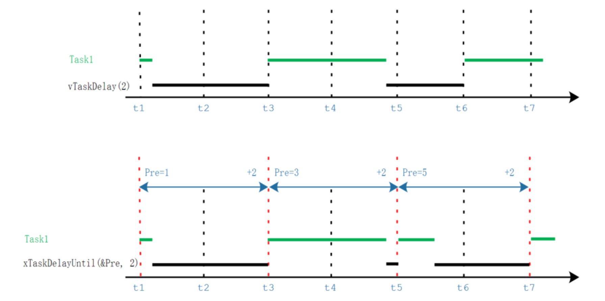

> 单位是tick，每个 Tick 的持续时间由 `configTICK_RATE_HZ` 决定。`configTICK_RATE_HZ` 表示每秒的 Tick 数量，因此：
>
> - 如果 `configTICK_RATE_HZ = 1000`，则每个 Tick 等于 **1 毫秒** 。
> - 延时的时间会根据这个值而改变，如何避免呢？
>
> FreeRTOS 提供了一个宏 `pdMS_TO_TICKS`，用于将毫秒（ms）转换为 Tick 数。
>
> ```c
> #define pdMS_TO_TICKS(ms) ((TickType_t)(((ms) * configTICK_RATE_HZ) / 1000U))
> vTaskDelay(pdMS_TO_TICKS(10));  		// 延迟 10 毫秒，确保至少 1 个 Tick
> 
> const TickType_t xFrequency = pdMS_TO_TICKS(500);  // 周期为 500 毫秒
> xTaskDelayUntil(&xLastWakeTime, xFrequency);
> ```

### 钩子函数

可以让空闲task去执行一些低优先级、后台的、需要连续执行的函数。

我们可以添加一个空闲任务的钩子函数(ldle Task Hook Functions)，空闲任务的循环没执行一次，就会调用一次钩子函数。钩子函数的作用有这些:

- 执行一些低优先级的、后台的、需要连续执行的函数。
- 测量系统的空闲时间:空闲任务能被执行就意味着所有的高优先级任务都停止了，所以测量空闲任务占据的时间，就可以算出处理器占用率。
- 让系统进入省电模式:空闲任务能被执行就意味着没有重要的事情要做，当然可以进入省电模式

钩子函数有限制

- 不能导致空闲任务进入阻塞状态、暂停状态，因为空闲任务要执行一些清理工作，阻塞的话就没法清理
- 空闲任务要么处于Ready状态，要么处于Running状态
- 钩子任务要执行的越快越好，不要占据太多时间

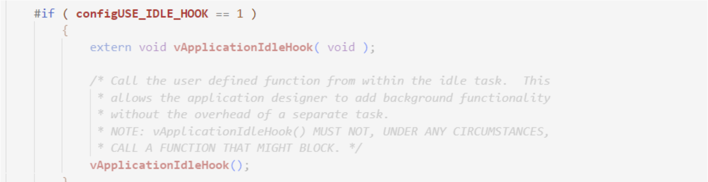


## 常用关键字

#### **volatile**

在嵌入式开发或并发编程中，有些变量的值可能会被外部因素（如硬件中断、其他线程、操作系统等）修改。如果不用 `volatile`，编译器可能会优化这些变量的访问，导致程序行为异常。

使用 `volatile` 会导致每次访问变量时都从内存读取，而不是使用寄存器缓存，这可能会降低程序的性能。

**作用**

> - **禁止编译器优化** ：告诉编译器不要对这个变量进行优化，每次访问时都必须从内存中读取最新值。
> - **确保数据一致性** ：当变量的值可能被外部因素修改时，使用 `volatile` 可以确保程序始终读取到最新的值。


## 一些概念

### **TCB** 

**Task Control Block（任务控制块）** 。它是操作系统中用于管理任务（或线程）的核心数据结构

> TCB 是操作系统用来跟踪和管理任务的关键工具。它的主要作用包括：
>
> - **保存任务的状态** ：记录任务的运行状态（如是否正在运行、等待、挂起等）。
> - **存储任务的上下文** ：保存任务的寄存器值、堆栈指针等信息，以便在任务切换时恢复任务的执行环境。
> - **调度任务** ：操作系统通过 TCB 中的信息决定哪个任务应该获得 CPU 的使用权。
> - **管理资源** ：记录任务的优先级、堆栈空间、任务标识符等信息。

### **Tick**

在RTOS中**Tick** 通常指系统时钟的一个“滴答”或“节拍”，表示固定的时间间隔。Tick 是系统时钟中断的时间单位。

> - 每次系统时钟中断触发时，称为一个 Tick。
> - Tick 的周期由硬件定时器配置决定，例如：
>   - 如果系统时钟频率为 1 kHz，则每个 Tick 表示 **1 毫秒** 。
>   - 如果系统时钟频率为 100 Hz，则每个 Tick 表示 **10 毫秒** 。
> - 基于Tick实现的延时并不精确，比如 vTaskDelay(2)的本意是延迟2个Tick周期，有可能经过1个Tick多一点就返回了
>
> 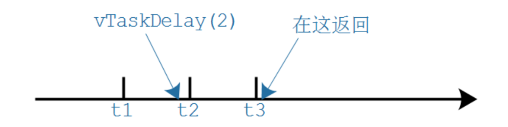

### **Buffer**

**Buffer** 是一块连续的内存空间，用于临时存储数据。

> 在 FreeRTOS 中，buffer 通常用于：
>
> - **任务间通信** ：通过队列、流缓冲区或消息缓冲区传递数据。
> - **外设数据处理** ：例如从串口、I2C 或 SPI 接收的数据存储到 buffer 中。
> - **动态内存管理** ：在堆中分配内存作为 buffer。

队列中的每个元素就是一个 buffer。

# ARM架构简明教程

## **基本概念**

### **CPU**

### **寄存器（Register）**

寄存器是 CPU 内部的存储单元，速度极快；数量非常有限，只能存储少量数据；**寄存器用于存放当前正在处理的数据和指令**

#### **寄存器分配与优化**

在编译过程中，编译器会进行**寄存器分配**：

- 将变量映射到寄存器，减少内存访问。
- 使用**寄存器重命名**避免数据依赖冲突（如超标量 CPU 的动态调度）。
- 实现**循环展开**等优化技术，充分利用寄存器并行执行多条指令。

1. **通用寄存器**

   用于存储临时数据和计算结果，可被程序员直接使用。比如累加器、基址寄存器、变址寄存器、堆栈指针。

2. **专用寄存器**

   用于特定功能，程序员通常无法直接访问。程序计数器、指令寄存器、状态寄存器、内存地址/数据寄存器。

3. **浮点寄存器**

   用于浮点运算。

4. **向量寄存器**

   用于 SIMD（单指令多数据）并行计算。


### **内存（RAM）**

内存用来存放程序运行时的指令、变量、函数调用栈等数据。CPU 从内存中读取指令和数据到寄存器中进行处理。**负责为程序运行提供临时存储。**

#### 内存的类型（按用途分）

##### **1. RAM（Random Access Memory）随机访问存储器**

这是最常见的内存类型，用于临时存储正在运行的程序和数据。

特点：

- **断电后数据丢失** （易失性）
- **速度快** ，比硬盘快很多
- 容量通常较小（如 8GB、16GB、32GB）

常见子类：

- **DRAM** （动态RAM）：常见于电脑主内存
- **SRAM** （静态RAM）：更快，但更贵，常用于 CPU 缓存
- **SDRAM / DDR SDRAM** ：现代电脑使用的主流内存类型（如 DDR4、DDR5）

##### **2. ROM（Read Only Memory）只读存储器**

- 数据**只能读取，不能修改**
- 用于存储固件（如 BIOS）
- **非易失性**

##### **3. Cache（高速缓存）**

- 比普通 RAM 更快的内存，**集成在 CPU 内部或附近**。CPU访问速度大概1~3个周期，内存约为100个周期，寄存器0个周期即同步。

- 分为 L1、L2、L3 等层级，越靠近 CPU 越快也越小

- 目的是减少 CPU 访问内存的等待时间

  ```c
  CPU → L1/L2/L3 Cache → 主存（RAM） → 硬盘/SSD → 外部存储（如网盘）
  ```

  

##### 内存的工作原理（简要）

1. 当你打开一个程序（比如浏览器），操作系统会把程序的一部分加载到内存中。
2. CPU 不直接从硬盘读取数据，而是从内存中读取。
3. 程序运行过程中产生的临时数据也会存在内存里。
4. 当你关闭程序或关机时，这部分数据就会被清除。

当一个程序运行时，操作系统会为它分配一块内存空间，这块空间通常被划分为以下几个区域：

```c
高地址
+----------------------+
|     栈区（Stack）    |	//向下增长，地址高到低
+----------------------+
|     堆区（Heap）     |	//向上增长，地址低到高
+------------------------------------------+
| 已初始化数据段（.data）|
+----------------------+ |全局（静态）存储区|
| 未初始化数据段（.bss）|
+------------------------------------------+
|     代码段（.text）   |		
+----------------------+	
低地址
```

**代码段**

- 存放程序的机器指令（即编译后的二进制代码）是只读的，防止程序意外修改自己的指令属于共享区域 。
- 多个进程可以共用同一个代码段（例如多个终端同时运行 bash）。

**数据段**

- **存放已初始化的全局变量和静态变量**
- 程序启动时，这些变量已经有确定的值

**BSS段**

- **存放未初始化的全局变量和静态变量**
- 这些变量在程序开始运行时会被自动初始化为 0

**堆区**

- **动态分配的内存区域**
- 由程序员手动申请和释放（如 C 中的 `malloc` / `free`，C++ 中的 `new` / `delete`）
- 容量较大，但管理不当容易造成**内存泄漏**

**栈区**

- **用于函数调用时的局部变量和参数传递**
- 自动分配和释放，不需要程序员手动管理
- 容量有限，不能放太大的数据


### **闪存（Flash）**

闪存用来存放程序代码和需要长期保存的数据。用于长期存储程序和重要数据。

### 工作流程

> **启动阶段** ：
>
> - **Flash** ：设备上电后，CPU 会从 Flash 中加载程序代码到内存（RAM）中。
>
> **运行阶段** ：
>
> - **内存** ：程序运行时，相关代码和数据会被加载到内存中。
>
> - **寄存器** ：CPU 从内存中读取数据到寄存器中进行处理，并将结果写回内存。
>
> **保存数据** ：如果需要保存某些数据，这些数据会被写回到 Flash 中。

### 存储单位

#### **B：表示字节（Byte）**

字节是计算机存储数据的基本单位。字节是计算机存储数据的基本单位。一个英文字母通常占用 1 字节，一个汉字通常占用 2 或更多字节（取决于编码方式）。

#### **b：表示比特（bit）**

比特是计算机中最小的数据单位。1 比特（b） = 1 位二进制数（0 或 1）。

| 单位名称 | 符号 | 换算关系       | 示例用途             |
| -------- | ---- | -------------- | -------------------- |
| 字节     | B    | 1 B = 8 b      | 文件大小、内存容量   |
| 千字节   | KB   | 1 KB = 1024 B  | 文档大小             |
| 兆字节   | MB   | 1 MB = 1024 KB | 图片、音乐文件       |
| 千兆字节 | GB   | 1 GB = 1024 MB | 视频文件、硬盘分区   |
| 太字节   | TB   | 1 TB = 1024 GB | 硬盘容量、大数据存储 |
| 拍字节   | PB   | 1 PB = 1024 TB | 数据中心存储         |
| 艾字节   | EB   | 1 EB = 1024 PB | 全球互联网流量       |
| 泽字节   | ZB   | 1 ZB = 1024 EB | 国家级数据规模       |
| 尧字节   | YB   | 1 YB = 1024 ZB | 极大规模数据存储     |

## 1. ARM架构

### 1.1 RISC

ARM芯片属于精简指令集计算机(RISC：Reduced Instruction Set Computing)，它所用的指令比较简单，有如下特点：

① 对内存只有读、写指令

② 对于数据的运算是在CPU内部实现

③ 使用RISC指令的CPU复杂度小一点，易于设计

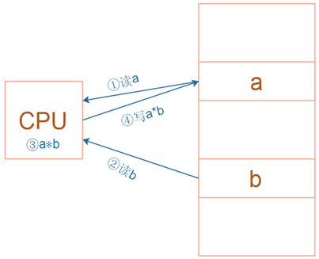

对于上图所示的乘法运算a = a * b，

在RISC中要使用4条汇编指令：

① 读内存a

② 读内存b

③ 计算a*b

④ 把结果写入内存


### 1.2 提出问题

问题：在CPU内部，用什么来保存a、b、a*b ？


### 1.3 CPU内部寄存器

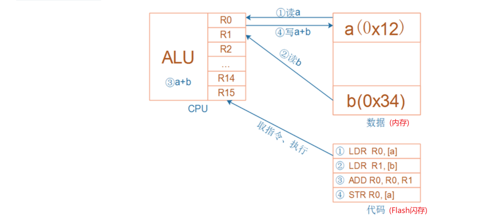

无论是cortex-M3/M4，

还是cortex-A7，

CPU内部都有R0、R1、……、R15寄存器；

它们可以用来“暂存”数据。

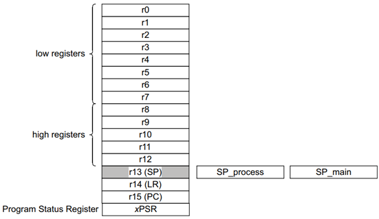

对于R13、R14、R15，还另有用途：

R13：别名SP(Stack Pointer)，栈指针

R14：别名LR(Link Register)，用来保存返回地址

R15：别名PC(Program Counter)，程序计数器，表示当前指令地址，写入新值即可跳转


### 1.4 汇编指令

* 读内存：**LDR (Load Register)** ：从内存加载数据到寄存器

  ```shell
  # 示例
  LDR  R0, [R1, #4]  ; 读地址"R1+4", 得到的4字节数据存入R0
  ```

* 写内存：**STR (Store Register)**：将寄存器中的数据存储到内存。

  ```shell
  # 示例
  STR  R0, [R1, #4]  ; 把R0的4字节数据写入地址"R1+4"
  ```

* 加减

  ```shell
  ADD R0, R1, R2  ; R0=R1+R2
  ADD R0, R0, #1  ; R0=R0+1
  SUB R0, R1, R2  ; R0=R1-R2
  SUB R0, R0, #1  ; R0=R0-1
  ```

* 移动：**MOV (Move)**：将一个值移动到寄存器。

  ```python
  MOV R0, #10         ; 将立即数 10 移动到 R0
  MOV R1, R0          ; 将 R0 的值复制到 R1
  ```

* 比较：**CMP (Compare)**：比较两个值（实际上是减法，但不保存结果）。

  ```shell
  CMP R0, R1  ; 结果保存在PSR(程序状态寄存器)
  ```

* 按位与、或、异或

  ```python
  AND R0, R1, R2      ; R0 = R1 & R2
  ORR R0, R1, R2      ; R0 = R1 | R2
  EOR R0, R1, R2      ; R0 = R1 ^ R2
  ```

* 跳转：**B (Branch)**：无条件跳转到指定地址。 、**BL (Branch with Link)**：跳转到指定地址，并将返回地址保存到链接寄存器（LR，即 R14）。

  ```
  B label             ; 跳转到标号 label
  BL function         ; 调用函数 function，返回地址保存到 LR
  ```


- 堆栈操作：**PUSH/POP**：将寄存器压入或弹出堆栈。

  ```
  PUSH {R0-R3}        ; 将 R0-R3 压入堆栈
  POP {R0-R3}         ; 从堆栈弹出 R0-R3
  ```

  注：**SP**：Stack Pointer（栈指针）,是 CPU 中的一个特殊寄存器

## 2. C函数的反汇编

C函数：

```c
int add(volatile int a, volatile int b)
{
	volatile int sum;
    sum = a + b;
    return sum;
}
```


让Keil生成反汇编：

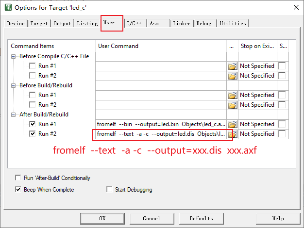

为例方便复制，制作反汇编的指令如下：

```shell
fromelf  --text  -a -c  --output=xxx.dis  xxx.axf
```


C函数add的反汇编代码如下：

```shell
    i.add
    add
        0x08002f34:    b503        ..      PUSH     {r0,r1,lr}
        0x08002f36:    b081        ..      SUB      sp,sp,#4
        0x08002f38:    e9dd0101    ....    LDRD     r0,r1,[sp,#4]
        0x08002f3c:    4408        .D      ADD      r0,r0,r1
        0x08002f3e:    9000        ..      STR      r0,[sp,#0]
        0x08002f40:    bd0e        ..      POP      {r1-r3,pc}
        #地址			 机械码				汇编码
```


## 其他知识

Shell和Bash的区别

**Shell** 是 用户与操作系统内核进行交互的接口程序。它接收用户输入的命令，解释这些命令（或执行脚本），然后让内核执行相应的操作（管理文件、运行程序、控制硬件等），最后将结果返回给用户。包含 Bash、sh、zsh、csh、ksh、fish 等

**Bash**是 sh的扩展和兼容的超集,几乎完全兼容传统的 `sh` 脚本。是绝大多数 Linux 发行版的默认交互式 Shell。


# c语言

### 关键字

#### extern

`extern` 是 C 语言中的一个关键字，用于声明**外部变量或函数** 。          

- 它告诉编译器：这个函数或变量是在其他文件中定义的，而不是在当前文件中定义的。
- 在链接阶段，编译器会找到该函数或变量的实际定义并将其链接到当前文件。


#### typedef

```c
typedef 已有数据类型 新的类型名;
```

实例：

```c
//为结构体类型创建别名
typedef struct {
    int x;
    int y;
} Point;
//为指针类型创建别名
typedef int* IntPtr;
```


### 其他知识

#### 句柄（Handle）

**句柄是一个抽象的标识符，用来唯一标识某种资源或对象。**

- **资源** ：可以是内存块、文件、线程、定时器、窗口、设备等。
- **句柄的作用** ：通过句柄，程序可以间接访问这些资源，而无需直接操作底层实现细节。

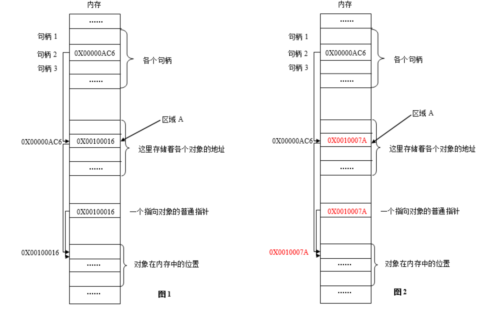

> ​		 Windows是一个以虚拟内存为基础的操作系统，很多时候，进程的代码和数据并不全部装入内存，进程的某一段装入内存后，还可能被换出到外存，当再次需要时，再装入内存。两次装入的地址绝大多数情况下是不一样的。那么，程序怎么才能准确地访问到对象呢？为了解决这个问题，Windows引入了句柄。
>
> ​		系统为每个进程在内存中分配一定的区域，用来存放各个句柄，即一个个32位无符号整型值（32位操作系统中）。每个32位无符号整型值相当于一个指针，指向内存中的另一个区域（我们不妨称之为区域A）。而区域A中存放的正是对象在内存中的地址。当对象在内存中的位置发生变化时，区域A的值被更新，变为当前时刻对象在内存中的地址，而在这个过程中，区域A的位置以及对应句柄的值是不发生变化的。这种机制，用一种形象的说法可以表述为：有一个固定的地址（**句柄），指向一个固定的位置（区域A）**，而**区域A中的值**可以动态地变化，它时刻**记录着当前时刻对象在内存中的地址**。这样，无论对象的位置在内存中如何变化，只要我们掌握了句柄的值，就可以找到区域A，进而找到该对象。

数值上：是一个32位无符号整型值（32位系统下）；

逻辑上：相当于指针的指针；

形象理解上：是Windows中各个对象的一个唯一的、固定不变的ID；

作用上：Windows使用句柄来标识诸如窗口、位图、画笔等对象，并通过句柄找到这些对象。

#### (void*)

`(void*)` 是一种**强制类型转换**，用于将一个指针类型转换为 `void*` 类型。

- **通用指针**：`void*` 是一种特殊的指针类型，它可以指向任何类型的数据，但不能直接解引用

- **隐式转换**：在 C 语言中，其他类型的指针可以隐式转换为 `void*`，反之亦然。但在 C++ 中，这种转换需要显式进行。

```c
int *a；
void *p；
//p=a；					//可以用任意类型的指针对 void 指针对 void 指针赋值
a=（int *）p			//将 void 指针 p 赋给其他类型的指针，则需要强制类型转换
```

常用于函数参数（如 `memcpy`、`malloc`），以支持处理任意类型的数据。

##### **为什么不直接用 `&arr`？**

虽然 `&arr` 和 `arr` 的数值相同，但它们的类型不同：

- **`arr`**：类型为 `int*`，指向数组的首元素。
- **`&arr`**：类型为 `int(*)[5]`（指向包含 5 个 `int` 的数组的指针）。


# 接口标准

### MIPI

Mobile Industry Processor Interface 移动行业处理器接口，是一种**低功耗、高带宽、模块化接口标准**，专为移动设备设计。

#### **物理接口分类**

| 接口类型                                                     | 协议层           | 物理层      | 信号定义                                                     |
| ------------------------------------------------------------ | ---------------- | ----------- | ------------------------------------------------------------ |
| [CSI-2](https://zhida.zhihu.com/search?content_id=255745975&content_type=Article&match_order=1&q=CSI-2&zhida_source=entity) | 摄像头接口协议   | D-PHY/C-PHY | - D-PHY：1对时钟（CLK+/CLK-）+ 1~4对数据（D0±~D3±） - C-PHY：3线制（A/B/C），无独立时钟，嵌入时钟编码 |
| [DSI](https://zhida.zhihu.com/search?content_id=255745975&content_type=Article&match_order=1&q=DSI&zhida_source=entity) | 显示接口协议     | D-PHY/C-PHY | 与CSI-2类似，但协议层包含视频数据包格式（如RGB/Command模式） |
| [I3C](https://zhida.zhihu.com/search?content_id=255745975&content_type=Article&match_order=1&q=I3C&zhida_source=entity) | 传感器总线协议   | I3C         | 兼容I2C引脚（SDA/SCL），支持混合模式（传统I2C设备与I3C设备共存） |
| [RFFE](https://zhida.zhihu.com/search?content_id=255745975&content_type=Article&match_order=1&q=RFFE&zhida_source=entity) | 射频前端控制接口 | RFFE        | 2线制（SCLK/SDATA），控制射频器件（如PA、LNA）               |
| [SLIMbus](https://zhida.zhihu.com/search?content_id=255745975&content_type=Article&match_order=1&q=SLIMbus&zhida_source=entity) | 音频接口协议     | SLIMbus     | 2线制（CLK/DATA），支持多音频设备级联                        |

# 通信

 OSI 七层模型（物理层→数据链路层→网络层→传输层→会话层→表示层→应用层）


通信接口

| **名称**                    |                           **引脚**                           | **双工** | **时钟** | **电平** | **设备** |
| --------------------------- | :----------------------------------------------------------: | -------- | -------- | -------- | -------- |
| USART（通用异步收发传输器） |                      TX(发送)、RX(接受)                      | 全双工   | 异步     | 单端     | 点对点   |
| I2C（集成电路总线）         |               SCL(串行时钟线)、SDA(串行数据线)               | 半双工   | 同步     | 单端     | 多设备   |
| SPI（串行外设接口）         | SCLK(串行时钟线)、MOSI(主设备输出 / 从设备输入)、<br />MISO(主设备输入 / 从设备输出)、CS(从设备选择线) | 全双工   | 同步     | 单端     | 多设备   |
| CAN（控制器局域网）         |        CAN_H、CAN_L(一对差分信号线，电压差来传输数据)        | 半双工   | 异步     | 差分     | 多设备   |
| USB（通用串行总线）         |                    DP、DM(一对差分信号线)                    | 半双工   | 异步     | 差分     | 点对点   |

**双工**：描述了通信双方数据传输的方向和方式，分为全双工和半双工。全双工表示通信双方可以同时进行数据的发送和接收；半双工则表示通信双方不能同时进行数据的发送和接收

**时钟**：分为同步和异步两种方式。同步通信需要一个时钟信号来同步发送方和接收方的数据传输，确保双方在相同的时间节拍上进行数据的发送和接收；异步通信则不需要专门的时钟信号，而是通过约定好的波特率等参数来实现数据的正确传输。

**电平**：单端电平指的是信号的传输是相对于一个公共的地电平进行的；差分电平则是通过两根信号线之间的电压差来表示信号，具有更好的抗干扰能力。

**设备**：说明该通信接口支持的设备连接方式，点对点表示只能连接两个设备进行通信；多设备表示可以同时连接多个设备，实现多个设备之间的通信。


**并行和串行的概念**

按数据传送的方式，通讯可分为串行通讯与并行通讯。

- **串行通讯**是指设备之间通过少量数据信号线(一般是 8 根以下)，地线以及控制信号线，按数据位形式一位一位地传输数据的通讯方式。串行通讯就像单个车道的公路，同一时刻只能传输一个数据位的数据。
- **并行通讯**一般是指使用 8、 16、 32 及 64 根或更多的数据线进行传输的通讯方式，并行通讯就像多个车道的公路，可以同时传输多个数据位的数据。


### **USART**

Universal Synchronous/Asynchronous Receiver/Transmitter，通用同步/异步收发器，一般用于异步。

UART 通道有两条数据线。每个设备上都有一个 RX 引脚和一个 TX 引脚（RX 用于接收，TX 用于发送）。每个设备的 RX 引脚都连接到另一个设备的 TX 引脚。

UART作为一种异步串行通信协议，其工作原理是逐位传输传输数据的每个二进制位。跟USART的区别是USART支持同步和异步通信，异步通信同UART，同步通信用USART_CK做时钟。


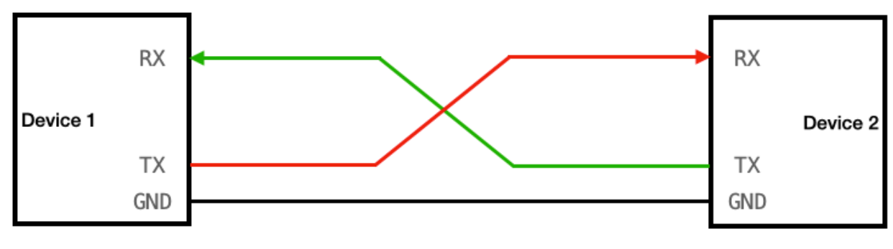


**数据格式**

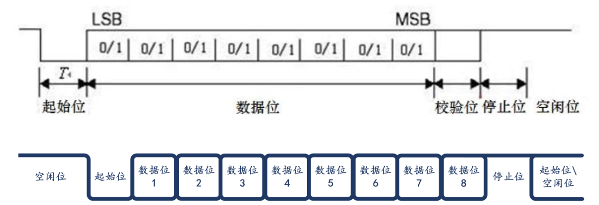

- 起始位

  开始进行数据传输时发送方要先发出一个低电平 $0$ 来表示传输字符的开始。因为空闲位一直是高电平。

- 校验位

  奇校验（odd parity）：让传输的数据（包含校验位）中1的个数为奇数。

  偶校验（even parity）：让传输的数据（包含校验位）中1的个数为偶数。

  

> **Q1：那我们真实的传输user数据速率是多少呢？**
>
> A1：这个要取决于数据位/校验位/停止位各自配置了多少，比如我们数据位配置为8，校验位无，停止位位1，那么速率应该是115200/(1+8+1)=11520 Byte/S
>
> **Q2：为什么UART没有时钟，是怎么采集数据的，为什么双方可以互相识别？**
>
> A2：也是取决于波特率的，假设波特率是115200，那么传输1个bit的时间是1/115200,双方各自维护一个时钟，在开始位的时候每隔1/11520时间点内采集一个数据，这样大家就互相认识对方发送的数据了！
>
> 注：波特率即每秒传输的位数。
>
> **Q3：CTS和RTS的作用**
>
> A3： RTS → Request To Send 请求发送，CTS ← Clear To Send 允许发送。


**缺点**

- 接口不统一，协议只是规定的线的名称，但是没有一个接口标准，比如USB的type A/B/C，Mini/Micro接口等。
- 电平不固定，协议只是用逻辑0,1代表低电平，高电平，但是并没有说高低电平应该是多少伏。他是采用TTL电平(Transistor-Transistor Logic)，也就是板子自己的电平，一般是3.3V或者5V。
- 通信距离短，抗干扰能力差，这两个是互相关系的，抗干扰能力差决定了通信距离短。


### I2C

I2C（Inter-Integrated Circuit），即集成电路总线，是一种由飞利浦公司开发的串行通信协议。

I2C总线通常由两条信号线组成：

- **串行数据线**（SDA(Serial data)）
- **串行时钟线**（SCL(Serial clock line))

所有连接到 I2C 总线上的设备都通过这两根线进行通信。通信过程由主设备（通常是微控制器）发起，它负责产生时钟信号并控制数据传输的开始、停止和方向。从设备（如传感器、存储器等）则根据主设备的指令进行响应。

**特性：**

> IIC是半双工，而不是全双工 ，**同一时间只可以单向通信**
>
> 所有I2C设备的SCL连在一起，SDA连在一起设备的
>
> SCL和SDA均要配置成开漏输出模式
>
> SCL和SDA都需要接上拉电阻 (大小由速度和容性负载决定一般在3.3K-10K之间) 保证数据的稳定性，减少干扰。

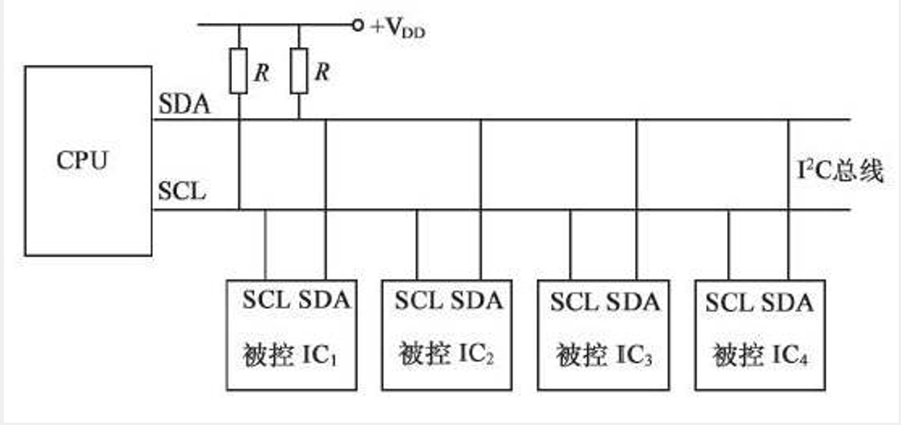


##### 通信过程

- **起始和停止条件**
  - 起始条件：当 SCL 线为高电平时，SDA 线由高电平变为低电平，标志着一次通信的开始。
  - 停止条件：当 SCL 线为高电平时，SDA 线由低电平变为高电平，标志着一次通信的结束。
- **数据传输**
  - 在 SCL 线的高电平期间，SDA 线上的数据必须保持稳定，因为此时从设备会读取 SDA 线上的数据。
- 应答机制
  - 每传输 8 位数据后，接收方会在第 9 个时钟周期拉低 SDA 线，表示已经成功接收到数据，这称为应答信号（ACK）。
  - 如果接收方不拉低 SDA 线，则表示没有成功接收到数据，这称为非应答信号（NACK）。

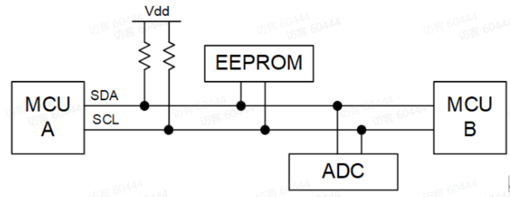

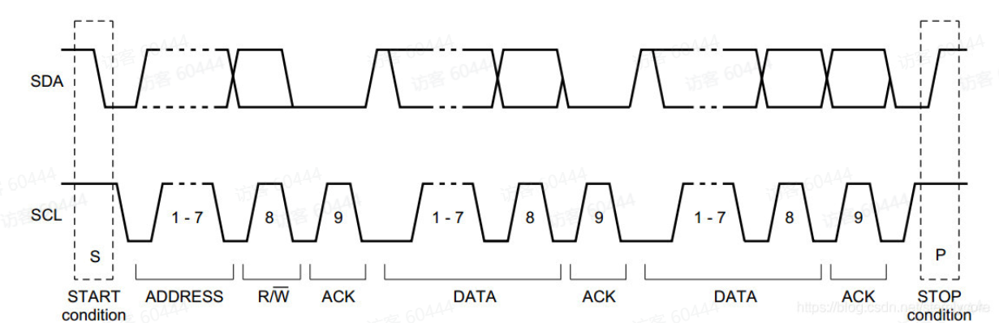

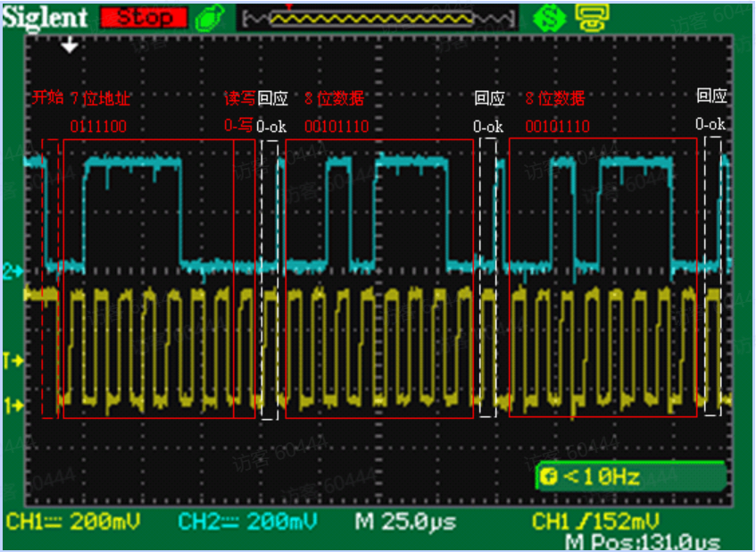

指定地址写

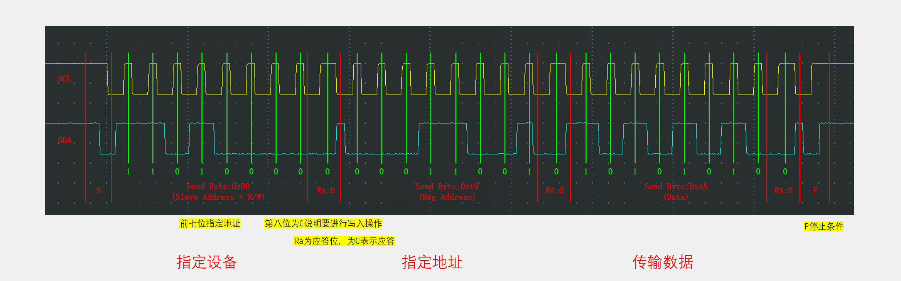

- **前七位为从机地址，第八位用来判断写或者读。**


### SPI

SPI是[串行外设接口](https://baike.baidu.com/item/串行外设接口/2845092)（Serial Peripheral Interface）的缩写，是一种高速的，全双工，同步的通信总线，并且在芯片的管脚上占用四根线。

SPI 总线通常由四条信号线组成：

- **串行时钟线（SCK）**：Serial Clock，由主设备产生的时钟信号，用于同步主设备和从设备之间的数据传输。时钟信号的频率决定了数据传输的速度。
- **主设备输出 / 从设备输入线（MOSI）**：Master Output Slave Input，主设备通过这条线向从设备发送数据。
- **主设备输入 / 从设备输出线（MISO）**：Master Input Slave Output，从设备通过这条线向主设备发送数据。
- **从设备选择线（SS 或 CS）**：Slave Select，主设备通过拉低特定从设备的 SS 线来选择与之通信的从设备。每个从设备都有独立的 SS 线，主设备可以通过控制不同的 SS 线来选择不同的从设备进行通信。

**特点：**

> 所有SPI设备的SCK、MOSI、MISO分别连在一起
>
> 主机另外引出多条SS控制线，分别接到各从机的SS引脚
>
> 输出引脚配置为推挽输出，输入引脚配置为浮空或上拉输入

##### 通信过程

- **起始和停止条件**
  - 起始条件：SS从高电平切换到低电平
  - 停止条件：SS从低电平切换到高电平
- **数据传输**

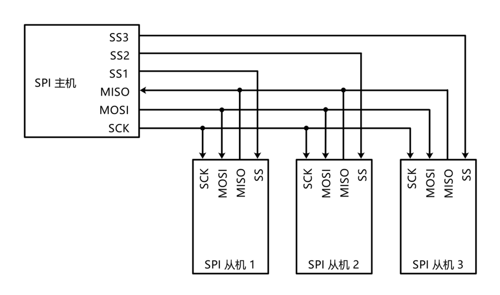

主机跟从机的通信就是交换数据，MISO和MOSI并行推进。移位示意图如下：移出，采样，移入

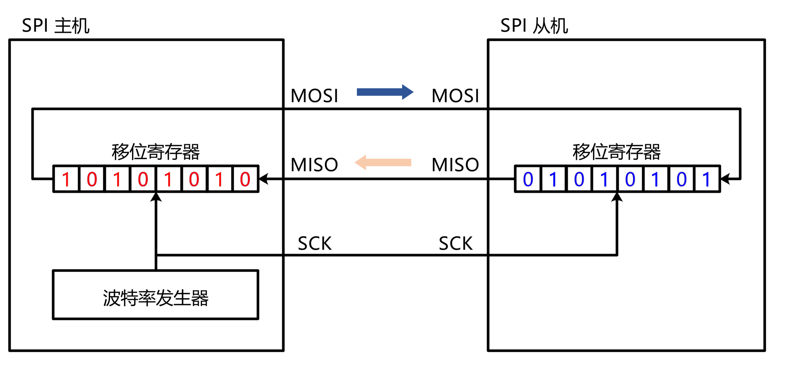

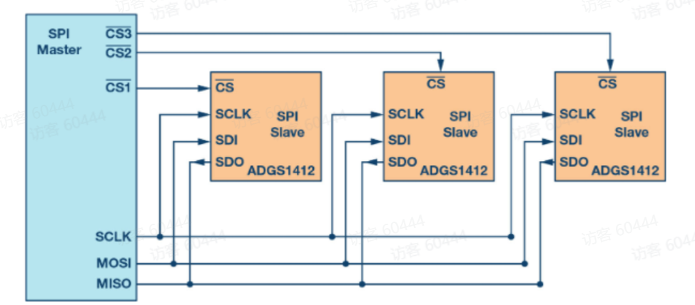

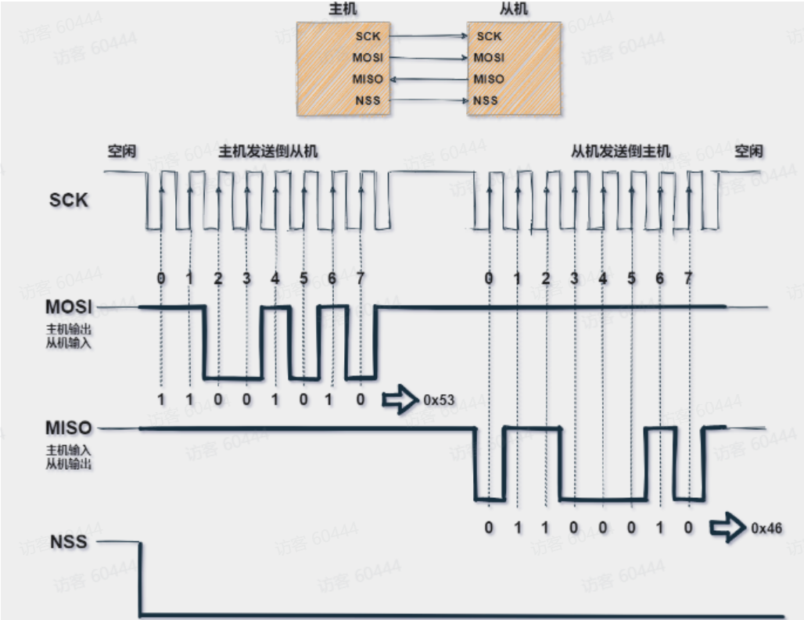


**外设的写操作和读操作是同步完成的**，你发一个数据必然会收到一个数据，反之亦然。

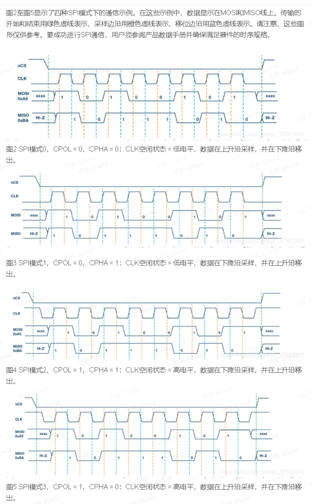

### [WebSocket](https://www.cnblogs.com/chyingp/p/websocket-deep-in.html#!comments)

WebSocket 是一种网络传输协议，可在单个 TCP 连接上进行全双工通信，位于 OSI 模型的应用层。允许客户端与服务器之间建立持久连接并进行双向数据传输。它解决了传统 HTTP 协议在实时通信中的局限性（如长轮询的高延迟和资源浪费），适用于需要实时交互的场景（如聊天、游戏、实时数据监控等）

在 WebSocket API 中，浏览器和服务器只需要完成一次握手，两者之间就可以创建持久性的连接，并进行双向数据传输。

##### 握手过程

1. **客户端发起请求** ：通过 HTTP 请求头携带 `Upgrade: websocket` 和 `Connection: Upgrade` 字段，请求协议升级。
2. **服务器响应** ：若支持 WebSocket，返回 `101 Switching Protocols` 状态码，完成协议切换。

**数据帧格式**

WebSocket客户端、服务端通信的最小单位是帧（frame），由1个或多个帧组成一条完整的消息（message）。

1. 发送端：将消息切割成多个帧，并发送给服务端；
2. 接收端：接收消息帧，并将关联的帧重新组装成完整的消息；

```lua
  0                   1                   2                   3
  0 1 2 3 4 5 6 7 8 9 0 1 2 3 4 5 6 7 8 9 0 1 2 3 4 5 6 7 8 9 0 1
 +-+-+-+-+-------+-+-------------+-------------------------------+
 |F|R|R|R| opcode|M| Payload len |    Extended payload length    |
 |I|S|S|S|  (4)  |A|     (7)     |             (16/64)           |
 |N|V|V|V|       |S|             |   (if payload len==126/127)   |
 | |1|2|3|       |K|             |                               |
 +-+-+-+-+-------+-+-------------+ - - - - - - - - - - - - - - - +
 |     Extended payload length continued, if payload len == 127  |
 + - - - - - - - - - - - - - - - +-------------------------------+
 |                               |Masking-key, if MASK set to 1  |
 +-------------------------------+-------------------------------+
 | Masking-key (continued)       |          Payload Data         |
 +-------------------------------- - - - - - - - - - - - - - - - +
 :                     Payload Data continued ...                :
 + - - - - - - - - - - - - - - - - - - - - - - - - - - - - - - - +
 |                     Payload Data continued ...                |
 +---------------------------------------------------------------+

```

详解：

**FIN**：1个比特。

如果是1，表示这是消息（message）的最后一个分片（fragment），如果是0，表示不是是消息（message）的最后一个分片（fragment）。

**RSV1, RSV2, RSV3**：各占1个比特。

一般情况下全为0。当客户端、服务端协商采用WebSocket扩展时，这三个标志位可以非0，且值的含义由扩展进行定义。如果出现非零的值，且并没有采用WebSocket扩展，连接出错。

**Opcode**: 4个比特。

操作代码，Opcode的值决定了应该如何解析后续的数据载荷（data payload）。如果操作代码是不认识的，那么接收端应该断开连接（fail the connection）。可选的操作代码如下：

- %x0：表示一个延续帧。当Opcode为0时，表示本次数据传输采用了数据分片，当前收到的数据帧为其中一个数据分片。
- %x1：表示这是一个文本帧（frame）
- %x2：表示这是一个二进制帧（frame）
- %x3-7：保留的操作代码，用于后续定义的非控制帧。
- %x8：表示连接断开。
- %x9：表示这是一个ping操作。
- %xA：表示这是一个pong操作。
- %xB-F：保留的操作代码，用于后续定义的控制帧。

**Mask**: 1个比特。

表示是否要对数据载荷进行掩码操作。从客户端向服务端发送数据时，需要对数据进行掩码操作；从服务端向客户端发送数据时，不需要对数据进行掩码操作。

如果服务端接收到的数据没有进行过掩码操作，服务端需要断开连接。

如果Mask是1，那么在Masking-key中会定义一个掩码键（masking key），并用这个掩码键来对数据载荷进行反掩码。所有客户端发送到服务端的数据帧，Mask都是1。

掩码的算法、用途在下一小节讲解。

**Payload length**：数据载荷的长度，单位是字节。为7位，或7+16位，或1+64位。

假设数Payload length === x，如果

- x为0~126：数据的长度为x字节。
- x为126：后续2个字节代表一个16位的无符号整数，该无符号整数的值为数据的长度。
- x为127：后续8个字节代表一个64位的无符号整数（最高位为0），该无符号整数的值为数据的长度。

此外，如果payload length占用了多个字节的话，payload length的二进制表达采用网络序（big endian，重要的位在前）。

**Masking-key**：0或4字节（32位）

所有从客户端传送到服务端的数据帧，数据载荷都进行了掩码操作，Mask为1，且携带了4字节的Masking-key。如果Mask为0，则没有Masking-key。

备注：载荷数据的长度，不包括mask key的长度。

**Payload data**：(x+y) 字节

载荷数据：包括了扩展数据、应用数据。其中，扩展数据x字节，应用数据y字节。

扩展数据：如果没有协商使用扩展的话，扩展数据数据为0字节。所有的扩展都必须声明扩展数据的长度，或者可以如何计算出扩展数据的长度。此外，扩展如何使用必须在握手阶段就协商好。如果扩展数据存在，那么载荷数据长度必须将扩展数据的长度包含在内。

应用数据：任意的应用数据，在扩展数据之后（如果存在扩展数据），占据了数据帧剩余的位置。载荷数据长度 减去 扩展数据长度，就得到应用数据的长度。

**对比 HTTP 长轮询**

| **特性**     | **WebSocket**      | **HTTP 长轮询**         |
| ------------ | ------------------ | ----------------------- |
| **连接方式** | 单次连接，持久化   | 多次短连接，频繁重建    |
| **延迟**     | 低（实时传输）     | 高（需等待服务器响应）  |
| **资源消耗** | 低（减少握手开销） | 高（频繁建立/断开连接） |
| **适用场景** | 实时性要求高的场景 | 实时性要求较低的场景    |

### 


### RS485

**RS485** 是一种工业控制环境中常用的通讯协议，其中**RS** 是 **Recommended Standard** 的缩写。RS485 是 **半双工异步** 串行通信。

**特点**

- 支持多节点：一般最大支持 32 个节点。
- 传输距离远：最远通讯距离可达1200米。
- 抗干扰能力强：差分信号传输。
- 连接简单：只需要两根信号线（A+和B-）就可以进行正常的通信。

RS485 通信采用**差分信号传**输，通常情况下只需要两根信号线就可以进行正常的通信。在差分信号中，逻辑0和逻辑1是用两根信号线（A+和B-）的**电压差来表示**。

- 逻辑 1：两根信号线（A+和B-）的电压差在 +2V～+6V 之间。

- 逻辑 0：两根信号线（A+和B-）的电压差在 -2V～-6V 之间。

**连接方式**

> 在 RS485 通信网络中，通常会使用 485 收发器来转换 TTL 电平和 RS485 电平。
> 节点中的串口控制器使用 RX 与 TX 信号线连接到 485 收发器上，而收发器通过差分线连接到网络总线。
> 串口控制器与收发器之间一般使用 TTL 信号传输，收发器与总线则使用差分信号来传输。
> **发送数据时**，串口控制器的 TX 信号经过收发器转换成差分信号传输到总线上。
> **接收数据时**，收发器把总线上的差分信号转化成 TTL 信号通过 RX 引脚传输到串口控制器中。
> 通常在这些节点中只能有一个主机，剩下的全为从机。
> 在总线的起止端分别加了一个 120 欧的匹配电阻。

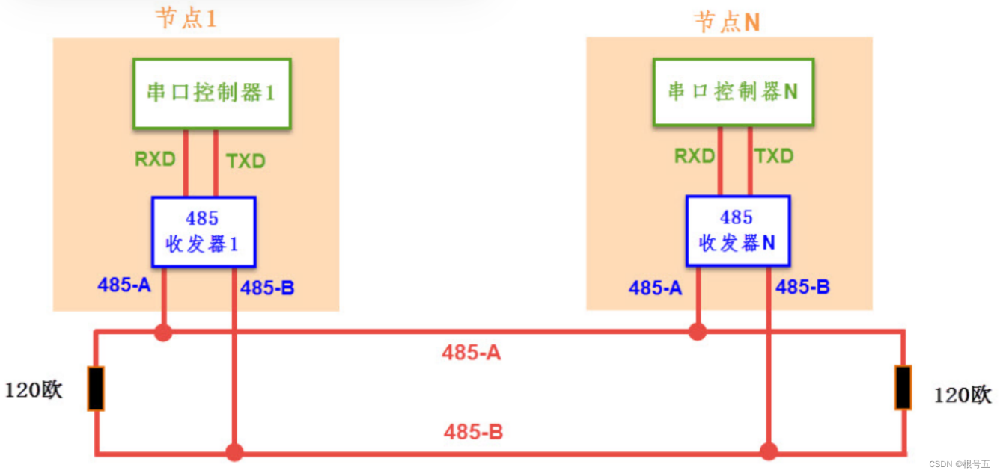

**RS485 电路图----普通收发**

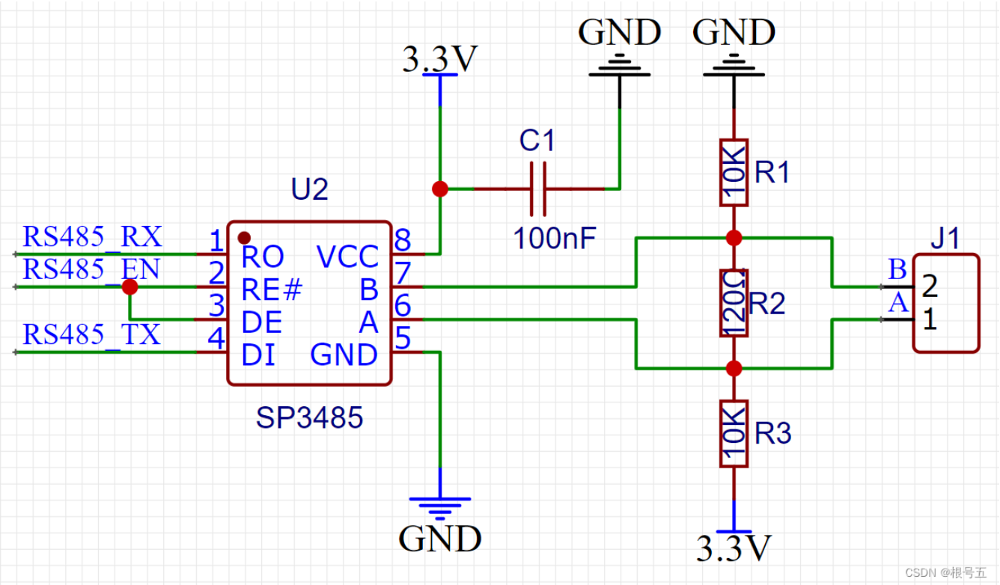

RS485 普通收发电路图原理：

- **RS485_EN 为高电平**，逻辑为1，发送使能，接收禁止。
- **RS485_EN 为低电平**，逻辑为0，发送禁止，接收使能

#### Modbus

Modbus是**主从方式通信**，也就是说，不能同步进行通信，总线上每次只有一个数据进行传输，即主机发送，从机应答，主机不发送，总线上就没有数据通信。

**分类**

- Modbus-RTU
- Modbus-ASCII
- Modbus-TCP
- 

##### Modbus-RTU

**设备必须要有RTU协议！**

> **帧结构 = 地址 + 功能码+ 数据 + 校验**
>
> - **地址**: 占用一个字节，范围0-255，其中有效范围是1-247，其他有特殊用途，比如255是广播地址(广播地址就是应答所有地址，正常的需要两个设备的地址一样才能进行查询和回复)。
> - **功能码**：占用一个字节，功能码的意义就是，知道这个指令是干啥的，比如你可以查询从机的数据，也可以修改数据，所以不同功能码对应不同功能。
> - **数据**：根据功能码不同，有不同结构，在下面的实例中有说明。
> - **校验**：为了保证数据不错误，增加这个，然后再把前面的数据进行计算看数据是否一致，如果一致，就说明这帧数据是正确的，我再回复；如果不一样，说明你这个数据在传输的时候出了问题，数据不对的，所以就抛弃了。

查询功能码0x03、修改功能码0x06、修改多个寄存器功能码0x10


### RTSP

RTSP(Real-Time Stream Protocol 实时流传输协议)是一种基于文本的应用层协议，是TCP/IP协议体系中的一个应用层协议。

该协议定义了一对多应用程序如何有效地通过IP网络传送多媒体数据. **RTSP在体系结构上位于RTP和RTCP之上, 它使用TCP或RTP完成数据传输**. RTSP被用于建立的控制媒体流的传输，它为多媒体服务扮演“网络远程控制”的角色。


- RTSP协议：负责服务器与客户端之间的请求与响应
- RTP协议：负责传输媒体数据
- RTCP协议：在RTP传输过程中提供传输信息

**rtsp承载与rtp和rtcp之上，rtsp并不会发送媒体数据，而是使用rtp协议传输**

**rtp并没有规定发送方式，可以选择udp发送或者tcp发送**


# 项目

### yolo小相机

[烧写指南](https://hexchip.com/archives/ikR54GRjj6)			[编译源码教程](https://hexchip.com/archives/7adjR3ydd)

连接设备，使用`adb shell`与设备进行交互

```c
adb shell
```

将类别文件（classes.txt）和模型文件（network_binary.nb）通过adb上传到小相机。（已上传）

```c
adb push .\classes.txt .
adb push .\network_binary.nb .    
```

执行运行命令

```bash
yolov8 network_binary.nb classes.txt
```

进入环境

```bash
code ~/workspace/nori
```


#### v851s芯片


**边缘部署**的流程包括**模型转换**、**量化压缩**、**打包封装**。

全志公司的V853芯片的模型格式转换流程为：**pt->onnx->nbg**。

**openWrt编译**

```c++
(1) source build/envsetup.sh  # 获取 Tina 环境变量
(2) lunch                     # 载入方案列表，选择方案
(3) mp                        # 编译打包
    分为make和pack两部分
```

**buildroot编译**

```c++
(1) ./build.sh config  # 配置编译模式和项目文件
(2) ./build.sh         # 编译
(3) ./build.sh pack    # 打包
```


该Makefile的功能是**软件源码的准备，编译和安装的过程，提供给Tina Linux识别和管理软件包的接口**


**读取按键按下状态**

创建

```c++
/root/key_detector.sh
```

赋予执行权限

```c++
chmod +x /root/key_detector.sh
```

运行脚本

```c++
/root/key_detector.sh
```

key_detector.sh

```bash
#!/bin/sh

# 定义 GPIO 编号
K1_GPIO=237  # PH13
K2_GPIO=238  # PH14

# 导出 GPIO 并设置为输入模式
echo $K1_GPIO > /sys/class/gpio/export
echo $K2_GPIO > /sys/class/gpio/export
echo in > /sys/class/gpio/gpio$K1_GPIO/direction
echo in > /sys/class/gpio/gpio$K2_GPIO/direction

# 去抖动延时（单位：微秒）
DEBOUNCE_US=20000

# 主循环
while true; do
    # 读取当前按键状态（0=按下，1=释放）
    k1_value=$(cat /sys/class/gpio/gpio$K1_GPIO/value 2>/dev/null)
    k2_value=$(cat /sys/class/gpio/gpio$K2_GPIO/value 2>/dev/null)

    # 优先检测组合按键
    if [ "$k1_value" -eq 0 ] && [ "$k2_value" -eq 0 ]; then
        echo "3"  # K1+K2 同时按返回 3
        # 等待释放避免重复触发
        while [ "$(cat /sys/class/gpio/gpio$K1_GPIO/value 2>/dev/null)" -eq 0 ] || \
              [ "$(cat /sys/class/gpio/gpio$K2_GPIO/value 2>/dev/null)" -eq 0 ]; do
            usleep $DEBOUNCE_US
        done
        continue
    fi

    # 检测 K1 短按
    if [ "$k1_value" -eq 0 ]; then
        echo "1"  # K1 短按返回 1
        # 等待释放
        while [ "$(cat /sys/class/gpio/gpio$K1_GPIO/value 2>/dev/null)" -eq 0 ]; do
            usleep $DEBOUNCE_US
        done
        continue
    fi

    # 检测 K2 短按
    if [ "$k2_value" -eq 0 ]; then
        echo "2"  # K2 短按返回 2
        # 等待释放
        while [ "$(cat /sys/class/gpio/gpio$K2_GPIO/value 2>/dev/null)" -eq 0 ]; do
            usleep $DEBOUNCE_US
        done
        continue
    fi

    # 降低 CPU 占用率
    usleep $DEBOUNCE_US
done
```


设置自启动

```c++
# Start yolo_example ....
#

start() {
      printf "Start yolo_example .... "
      yolov8 network_binary.nb classes.txt
      # cam
}

stop() {
    printf "Stopping yolo_example .... "
}

case "$1" in
    start)
    start
    ;;
    stop)
    stop
    ;;
    restart|reload)
    stop
    start
    ;;
  *)
    echo "Usage: $0 {start|stop|restart}"
    exit 1
esac

exit $?
```


**注意**

- 编译前歹设置否则传文件的时候会出现remote Read-only file system的报错

```bash
source build/envsetup.sh  # 获取 Tina 环境变量
make kernel_menuconfig
```


- [运行startx命令后出现登陆密码正确但无法进入桌面问题](https://blog.csdn.net/ww_bin/article/details/46461675)

  ```bash
  ctrl+alt+f3  	#切换到控制台
  cd ~        	#根目录
  rm -rf .Xaut*
  ctrl+alt+f7  	#返回登陆页面，可以正常登陆
  ```

#### 其他汇总

[V853开发板成果](https://bbs.aw-ol.com/topic/1871/%E8%B5%84%E6%BA%90%E6%B1%87%E6%80%BB-v853%E5%BC%80%E5%8F%91%E6%9D%BF%E6%88%90%E6%9E%9C%E6%B1%87%E6%8A%A5?_=1749887598415)


#### **补充知识**

##### 缩写

**VIP**: Vision Image Processing 视觉图像处理


##### [linux设置自启动]()


##### 屏幕显示

```c++
int fd = open("/dev/fb0", O_RDWR);
```

**Linux 系统中用于打开帧缓冲设备（framebuffer）的系统调用** ，它在嵌入式 Linux 或裸机开发中常用于直接操作屏幕显示。

> - `/dev/fb0` 是 Linux 中的 **第一个帧缓冲设备文件** 。
> - 它代表系统的主显示器（通常是 HDMI、LCD 屏等）。
>
> - `pathname`: 要打开的文件路径，`flags`: 打开方式标志。
> - `O_RDWR`：以**可读可写** 的方式打开设备

##### ioctl函数

```c++
ioctl(fd, FBIOGET_VSCREENINFO, &screen_info)
```

- **头文件**：`#include <sys/ioctl.h>`
- **功能**：对设备文件描述符`fd`执行特定的控制操作，这里用于获取帧缓冲设备的可变屏幕信息

##### while (!done.load())

`done`通常是一个**原子布尔变量**（`std::atomic<bool>`类型），用于多线程编程中实现线程间的同步和通信。

- 对`done`的读取（`load`）和写入（`store`）操作具有原子性，避免多线程环境下的竞态条件。

```c++
std::atomic<bool> done{false};  // 初始化为false

// 工作线程
void workerThread() {
    while (!done.load()) {  // 循环条件：当done为false时持续执行
        // 执行工作任务
        doWork();
    }
}

// 控制线程
void controlThread() {
    // 其他操作...
    done.store(true);  // 标记为完成，通知工作线程退出
}
```

