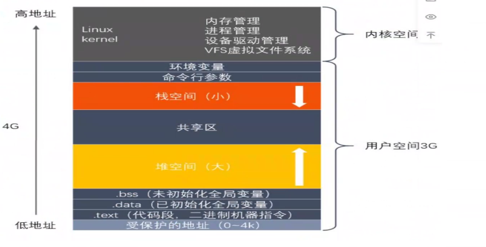
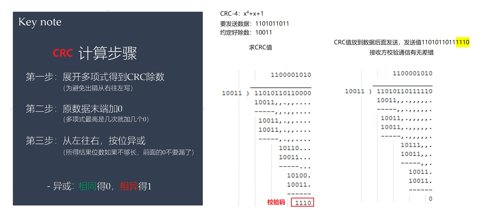
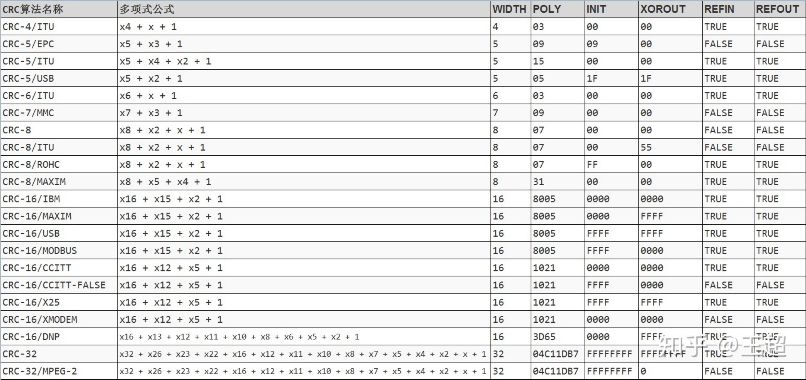
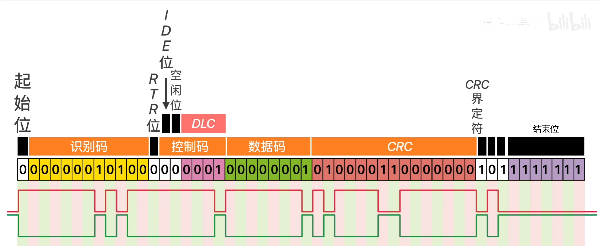
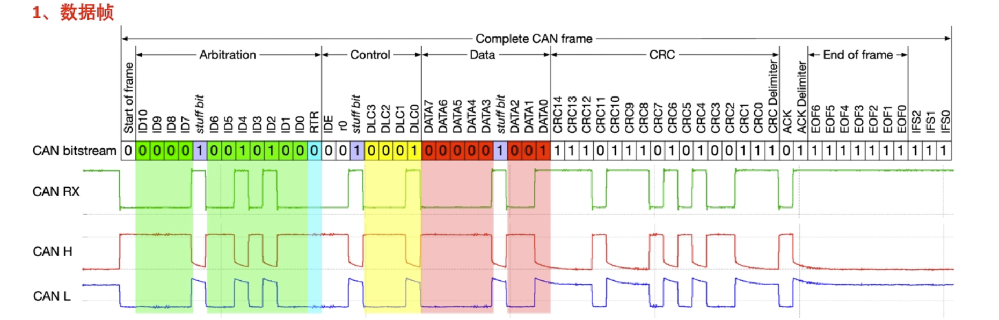
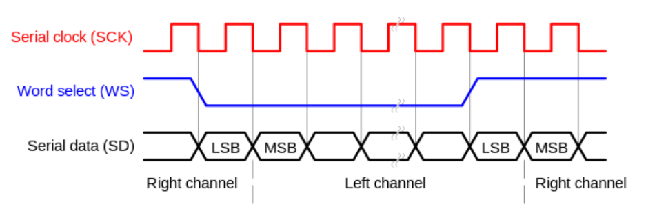
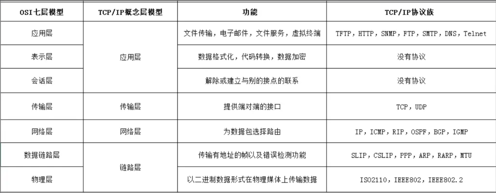

# 嵌入式笔记

# RTOS

### **内核态，用户态的区别**

内核态（Kernel Mode）和用户态（User Mode）是操作系统中两种不同的 CPU 执行状态，它们的核心区别在于 **权限级别** 和 **能访问的资源范围** 。

| 项目     | 用户态（User Mode）                    | 内核态（Kernel Mode）                    |
| -------- | -------------------------------------- | ---------------------------------------- |
| 权限     | 低权限                                 | 高权限                                   |
| 能做什么 | 只能访问受限的资源，不能直接操作硬件   | 可以访问所有资源，包括硬件、内存、中断等 |
| 安全性   | 更安全：防止用户程序破坏系统           | 不那么安全：需要谨慎处理                 |
| 常见场景 | 应用程序运行时（如浏览器、QQ、微信等） | 系统调用、中断、异常发生时               |

操作系统为了保护自己不被应用程序破坏，引入了“特权分级”机制：

- **用户态** ：应用程序只能使用有限的资源，不能直接访问硬件或修改关键寄存器。
- **内核态** ：操作系统内核运行在这个模式下，可以执行任何指令，管理整个系统的资源。

### 进程、线程

#### 进程 Process

- **进程 = 一个正在运行的程序**
- 它是操作系统进行资源分配的基本单位。
- 每个进程都有自己独立的内存空间、文件描述符、全局变量等。
- 进程之间**不能直接访问彼此的内存**，通信需要特殊手段（如管道、Socket、共享内存等）。

##### 进程间通信方式

- **管道**：内核缓冲区 + 文件描述符
  - 匿名管道（Pipe）：仅用于有亲缘关系的进程（如父子进程），单向通信
  - 命名管道（FIFO）：可跨无亲缘关系的进程，双向通信（需手动实现）

- 消息队列：内核维护的消息链表，进程按消息类型收发数据
  - 支持多进程异步通信，消息有优先级。
- 共享内存：将同一块物理内存映射到多个进程的虚拟地址空间。
  - 最快，直接内存操作。必须配合同步机制（如信号量），否则易导致数据竞争
- 套接字：跨网络、本地进程通信（TCP/UDP）。
- 信号量：同步，非数据传输。
  - 控制共享资源、进程同步

> 速度：共享内存>本地socket>消息队列>管道>TCPsocket


#### 线程 Thread

- **线程 = 进程中的执行单元**，**程序执行的最小单位**。
- 一个进程可以有多个线程，这些线程共享进程的资源（比如内存、变量、文件句柄等），但各自有自己的执行路径。

> **概述区别**
>
> 1. 地址
>
> - **进程是资源分配的最小单位，线程是CPU调度的最小单位**，进程有独立分配的内存空间，线程共享进程空间
>
> - 真正在cpu上运行的是线程
>
> 2. 开销
>
> - 进程切换开销大，线程轻量级
>
> 3. 并发性
>
> - 进程并发性差
>
> 4. 崩溃
>
> - 线程的崩溃不一定导致进程的崩溃

##### 线程间的通信方式

- 锁机制
  - 互斥锁：保护共享数据，确保同一时间仅一个线程访问。（Mutex）
  - 读写锁：读多写少的共享数据——多个线程同时读，写操作独占锁。（Read-Write Lock）

- 条件变量：线程间事件通知（如“数据已就绪”）

- 信号量：控制资源数量，线程间同步。

  


### **什么时候使用进程与线程**

多进程：

- 优点：进程独立，不影响主程序稳定性，可多CPU运行
- 缺点：逻辑复杂，IPC通信困难，调度开销大

多线程：

- 优点：线程间通信方便，资源开销小，程序逻辑简单
- 缺点：线程间独立互斥困难，线程崩溃影响进程

选择：频繁创建的用线程，CPU密集用进程，IO密集用线程

**总结：安全稳定选进程，快速频繁选线程**

比如freertos、Java Web 服务器、GUI 程序（如 Qt、Android App）用的多线程。

浏览器一般多进程，新建标签页就是新建进程，放置崩溃互相影响，在任务管理器可以看到多个进程。


### 死锁

**死锁是由于多个线程/进程在请求和持有资源时形成了“循环等待”，导致彼此都无法继续执行。**

条件：

（1） **互斥条件**：一个资源每次只能被一个进程使用。

（2） **不剥夺条件**：进程已获得的资源，在末释放前，不能强行剥夺。

（3） **请求与保持条件**：一个进程因请求资源而阻塞时，对已获得的资源保持不放。

（4） **循环等待条件**：若干进程之间形成一种头尾相接的循环等待资源关系。

解除与预防：打破上述一个条件即可

**避免死锁**

| 方法                                                  | 对应条件             | 说明                                   |
| ----------------------------------------------------- | -------------------- | -------------------------------------- |
| **按顺序加锁**                                        | 破坏循环等待         | 给所有锁编号，每次按照统一顺序申请资源 |
| **一次性申请所有资源**                                | 破坏“持有并等待”     | 避免中途等待资源                       |
| **设置超时机制**                                      | 破坏“不可抢占”       | 如果拿不到资源就放弃当前操作，稍后再试 |
| **使用资源分配图检测算法**                            | 破坏循环等待         | 系统定期检测是否形成资源循环依赖       |
| **使用 `std::lock()` 或 `std::scoped_lock`（C++17）** | 安全地锁定多个互斥量 | 自动处理死锁风险                       |

### 堆和栈

- 堆（Heap）由程序员手动申请和释放的内存区域，用于动态分配数据（如链表、对象等）。
- 栈（Stack）由编译器自动分配和释放的内存区域，用于存储函数调用过程中的局部变量、函数参数、返回地址等。



| 特性           | 堆（Heap）                                     | 栈（Stack）                            |
| -------------- | ---------------------------------------------- | -------------------------------------- |
| **分配方式**   | 手动分配（如`malloc`/`new`）                   | 自动分配（函数调用时局部变量压栈）     |
| **释放方式**   | 手动释放（如`free`/`delete`）                  | 自动释放（函数返回后弹出栈帧）         |
| **生命周期**   | 显式控制，可跨函数使用                         | 仅在当前函数作用域内有效               |
| **访问速度**   | 较慢（需要遍历链表或内存管理结构）             | 极快（CPU 直接支持，连续内存）         |
| **内存碎片**   | 容易产生（频繁 malloc/free）                   | 不会产生（先进后出结构）               |
| **大小限制**   | 大（受限于系统内存）                           | 小（通常 KB 级别，受编译器或系统限制） |
| **线程安全性** | 需要同步机制保护（多线程）                     | 每个线程有独立栈，天然线程安全         |
| **典型用途**   | 动态数据结构（链表、树）、大对象、全局共享数据 | 函数参数、局部变量、函数调用现场保存   |

**✅栈的注意事项：**

- 嵌入式系统中栈空间小，避免定义大数组或递归函数，防止**栈溢出（Stack Overflow）**
- 使用 RTOS 时，每个任务都有自己的栈，需合理配置栈大小

**✅堆的注意事项：**

- 尽量避免频繁使用 `malloc`/`free`，容易导致内存碎片
- 有些嵌入式系统禁用动态内存分配，改用静态内存池或内存块管理
- 若使用堆，务必注意**内存泄漏** 和**悬空指针**

**常见的一些问题**

**`new` 和 `malloc` 的区别？**

| 特性     | `new`                       | `malloc`             |
| -------- | --------------------------- | -------------------- |
| 语言     | C++ 运算符                  | C 库函数             |
| 构造函数 | 会调用构造函数              | 不会调用构造函数     |
| 类型安全 | 是                          | 否（需强制类型转换） |
| 内存不足 | 抛出异常（可指定`nothrow`） | 返回 NULL            |
| 释放方式 | `delete`                    | `free`               |

**什么是内存泄漏？如何避免？**

- **内存泄漏（Memory Leak）** ：堆内存申请后未释放，导致内存浪费。
- 原因 
  - 忘记 `free` / `delete`；
  - 指针被覆盖（丢失引用）；
- 解决方法 
  - 使用智能指针（C++11 起）；
  - RAII 技术（资源获取即初始化）；
  - 静态分析工具（如 Valgrind、AddressSanitizer）。

**什么是栈溢出？如何预防？**

- 栈溢出（Stack Overflow） 

  栈空间被耗尽，通常由以下原因导致：

  - 递归调用过深；
  - 定义超大局部变量；
  - 多线程栈大小设置不合理。

- 预防措施 

  - 避免递归；
  - 使用动态分配（堆）处理大数据；
  - 设置线程栈大小（如 pthread_attr_setstacksize）；
  - 使用静态分析工具检测潜在问题。


### Freertos基础概念

FreeRTOS 的优先级数值范围是可配置的，在 FreeRTOSConfig.h 文件中通过 configMAX_PRIORITIES 宏来定义。数值越大，优先级越高。

空闲任务


### freertos任务间通信

#### **消息队列**

这是一种用于在任务与任务之间、中断与任务之间传递信息的数据结构。消息队列支持超时机制，允许任务等待特定消息的到来或者在规定时间内尝试读取消息。


#### **信号量**

信号量只需要维护一个数值，使用信号量效率更高、更节省内存。信号量是操作系统中重要的一部分，信号量一般用来进行资源管理和任务同步。

- 二值信号量
- 计数信号量


#### **互斥锁**

互斥信号量其实就是一个拥有优先级继承的二值信号量， 在同步的应用中(任务与任务或中断与任务之间的同步)二值信号量最适合。能够解决优先级反正问题。不能用于中断ISR函数

#### **事件标志组**

一个 32 位的事件集合（EventBits_t 类型的变量，实际可用与表示事件的只有 24 位），其中的每一位都可以表示一个事件，每一位事件的含义由程序员决定。事件标志组主要用于一个任务与多个事件的同步，或者一个任务与多个任务之间的同步。它们允许任务等待多个事件中的任何一个发生。

#### **任务通知**

任务通知具有32位的消息通知值，可以减少RAM的使用，并且运行效率较高。当一个任务完成了某项工作或者发生了某个事件时，它可以通知另一个或多个等待该通知的任务。


### 其他

#### 死锁

死锁（Deadlock）是指在并发系统中，两个或多个任务（或进程、线程）因竞争资源而造成的一种**相互等待、无法继续执行**的永久阻塞状态。如果没有外部干预，这些任务将永远无法继续运行。

导致死锁的四个必要条件：

- 互斥条件：资源一次只能被一个任务独占使用。
- 请求与保持条件：任务已经持有了至少一个资源，但又请求新的资源，而该资源被其他任务占用，不释放已持有的。
- 不可抢占条件：任务已获得的资源只能任务本身主动释放
- 循环等待条件：T₁ 等待 T₂ 持有的资源...闭环等待

**预防措施**

- 按照指定顺序申请资源（需要申请多个资源的时候）
- 使用带超时机制的资源获取函数（ FreeRTOS 中的 `xSemaphoreTake`）
- 尽量减少持有锁的时间，避免在临界区内调用可能阻塞的函数。

#### 临界区

在 FreeRTOS 实时操作系统中，**临界区（Critical Section）** 是指一段不允许被中断或任务切换打断的代码片段，主要用于保护共享资源（如全局变量、硬件寄存器等）的安全访问，防止因多任务并发或中断触发导致的数据竞争、不一致或逻辑错误。

在多任务系统中，多个任务或中断服务程序（ISR）可能同时访问同一资源（如全局变量）。临界区的作用就是通过**暂时禁用中断和任务切换**，确保这段代码在执行过程中不被干扰，从而保证共享资源操作的原子性（不可分割）。

**任务级临界区**

用于保护任务代码中访问共享资源的片段，禁止其他任务和中断（特定优先级以下）的干扰。核心 API：

- `taskENTER_CRITICAL()`：进入临界区，禁用中断。
- `taskEXIT_CRITICAL()`：退出临界区，恢复中断。

**中断级临界区**

在中断服务程序（ISR）中访问共享资源时，需要使用专门的 API，避免影响中断嵌套或系统状态。核心 API：

- `taskENTER_CRITICAL_FROM_ISR(&uxSavedInterruptStatus)`：进入临界区，参数用于保存当前中断状态。
- `taskEXIT_CRITICAL_FROM_ISR(uxSavedInterruptStatus)`：退出临界区，恢复之前保存的中断状态。

**注意事项**：

- 临界区代码必须尽可能短

- 禁止在临界区中调用阻塞函数

- 区分任务级和中断级 API

- 避免过度使用临界区：临界区会降低系统并发性能，仅在确实需要保护共享资源时使用。

- 注意中断优先级配置

  FreeRTOS 通过`configMAX_SYSCALL_INTERRUPT_PRIORITY`配置允许被临界区禁用的最高中断优先级。

任务临界区示例：

```c
// 共享资源：全局计数器
uint32_t g_count = 0;

// 任务A：递增计数器
void vTaskA(void *pvParameters) {
    while (1) {
        // 进入临界区，保护g_count的访问
        taskENTER_CRITICAL();
        g_count++;  // 临界区操作（原子执行）
        taskEXIT_CRITICAL();  // 退出临界区
        
        vTaskDelay(pdMS_TO_TICKS(100));  // 延迟，允许其他任务运行
    }
}

// 任务B：读取并打印计数器
void vTaskB(void *pvParameters) {
    while (1) {
        uint32_t temp;
        // 进入临界区，保护g_count的读取
        taskENTER_CRITICAL();
        temp = g_count;  // 临界区操作（原子执行）
        taskEXIT_CRITICAL();  // 退出临界区
        
        printf("Current count: %u\n", temp);
        vTaskDelay(pdMS_TO_TICKS(200));
    }
}
```

#### 内存池

**内存池** 是一种动态内存管理技术。它在系统启动时（或任务运行前）预先分配一大块（一个“池”）内存，并将其划分为多个大小相等的**内存块**。当应用程序需要内存时，不是从堆中直接分配，而是从内存池中申请一个空闲块；使用完毕后，再将这个块释放回内存池。

**好处**

- 确定性分配/释放时间（O(1)）：分配/释放只需操作空闲链表，无碎片整理、无搜索过程，**时间可预测**
- 避免内存碎片：块大小相同
- 无动态堆管理开销：不依赖复杂的堆管理器，更可靠。

#### 问题

##### 一、基础概念与架构

###### ❓Q1：什么是 FreeRTOS？它的主要特点和适用场景是什么？

> FreeRTOS 是一个开源的、轻量级的实时操作系统内核，专为嵌入式微控制器设计。它提供任务管理、调度、同步、通信、内存管理等基本功能，支持抢占式和协作式调度，具有可裁剪性（最小内核仅 ~5KB RAM），广泛用于 STM32、ESP32、NXP、RISC-V 等平台。 

###### ❓Q2：FreeRTOS 的内核架构是怎样的？有哪些核心组件？

> FreeRTOS 内核主要包括： 
>
> - **任务管理器（Task Manager）**：创建、删除、挂起、恢复任务；
> - **调度器（Scheduler）**：决定哪个任务运行（支持抢占式/协作式）；
> - **队列（Queue）**：任务间通信，支持阻塞读写；
> - **信号量（Semaphore）**：二值/计数信号量，用于同步或资源管理；
> - **互斥量（Mutex）**：带优先级继承的互斥锁；
> - **事件组（Event Groups）**：多事件同步；
> - **软件定时器（Software Timers）**：非阻塞定时回调；
> - **内存管理（heap_x.c）**：多种堆管理策略；
> - **中断管理（ISR 安全 API）**：如 xQueueSendFromISR()。

##### 二、任务与调度机制（⭐重点！）

###### ❓Q3：FreeRTOS 支持哪几种调度策略？默认是哪种？

> FreeRTOS 支持：
>
> - **抢占式调度（Preemptive Scheduling）**：高优先级任务可打断低优先级任务（默认）；
> - **协作式调度（Cooperative Scheduling）**：任务必须主动让出 CPU（调用 taskYIELD() 或阻塞）；
>
> 通过宏 `configUSE_PREEMPTION` 配置，默认为 1（抢占式）。 

###### ❓Q4：任务优先级是如何工作的？优先级数值越大越优先吗？

> FreeRTOS 中，**数值越大，优先级越高**（0 是最低优先级）。
> 例如：优先级 5 > 优先级 2。
> 最大优先级由 `configMAX_PRIORITIES` 定义（默认 32）。
> 注意：优先级 0 是空闲任务（idle task）使用的，用户任务应避免使用 0。 

###### ❓Q5：什么是“优先级反转”？FreeRTOS 如何解决？

> **优先级反转**：低优先级任务持有高优先级任务需要的资源，导致中优先级任务先运行，高优先级任务被“反转”阻塞。
>
> FreeRTOS 通过 **互斥量（Mutex）的优先级继承机制** 解决： 
>
> - 当高优先级任务等待被低优先级任务持有的 Mutex 时，低优先级任务临时继承高优先级，尽快释放资源。
> - 避免中等优先级任务插队。

###### ❓Q6：空闲任务（Idle Task）的作用是什么？可以删除吗？

> 空闲任务是系统自动创建的最低优先级任务（优先级 0），作用包括：
>
> - 回收被删除任务的内存（若使能 `configUSE_TASK_DELETE`）；
> - 执行低功耗钩子函数（`vApplicationIdleHook()`）；
> - 保证系统总有任务可运行。
>
> ❗**不能删除空闲任务**，否则系统崩溃。 

##### 三、同步与通信机制

###### ❓Q7：队列（Queue）和信号量（Semaphore）有什么区别？分别适用什么场景？

> - **队列**：用于**传递数据**（如传感器数据、命令），支持阻塞发送/接收，有缓冲区；
> - 信号量：用于同步或资源计数，不传递数据；
>   - 二值信号量：用于任务与 ISR 同步（如中断触发任务处理）；
>   - 计数信号量：管理多个资源（如缓冲区槽位）；
>   - 互斥量：保护共享资源，支持优先级继承。

###### ❓Q8：在 ISR 中可以调用哪些 FreeRTOS API？为什么？

> 在 ISR 中只能调用以 **“FromISR”** 结尾的 API，例如：
>
> - `xQueueSendFromISR()`
> - `xSemaphoreGiveFromISR()`
> - `xTaskNotifyFromISR()`
>
> ❗原因： 
>
> - ISR 不能阻塞（不能调用可能引起任务切换或等待的函数）；
> - FromISR 版本不会引起立即调度，而是返回是否需要“延迟上下文切换”（通过 `pxHigherPriorityTaskWoken` 参数通知）；
> - 最后需调用 `portYIELD_FROM_ISR()`（或等效宏）来触发切换（如果需要）。

###### ❓Q9：事件组（Event Group）和信号量有什么区别？优缺点？

> - **事件组**：用一个 32 位变量表示多个事件（每位一个事件），支持“等待任意/全部事件”，可广播唤醒多个任务；
> - **信号量**：单一资源或同步点，一次只能唤醒一个任务。
>
> ✅ 优点：事件组节省资源，适合多条件同步； ❌ 缺点：无计数功能，不能用于资源管理；ISR 中使用需注意原子性（某些平台不支持在 ISR 中置位事件）。 

##### 四、内存与中断管理

###### ❓Q10：FreeRTOS 有哪几种内存管理方案（heap_1~heap_5）？各自适用场景？

|        |                                  |                            |
| ------ | -------------------------------- | -------------------------- |
| heap_1 | 最简单，只分配不回收             | 任务创建后不删除的系统     |
| heap_2 | 支持分配/回收，但有碎片          | 小型动态系统               |
| heap_3 | 包装标准库 malloc/free，线程安全 | 已有 malloc 实现的移植     |
| heap_4 | 支持合并碎片，最推荐通用方案     | 多数动态任务/对象系统      |
| heap_5 | 支持非连续内存区域               | 多内存块（如外置 RAM）系统 |

> 推荐使用 heap_4 —— 平衡性能与碎片管理。 

###### ❓Q11：FreeRTOS 如何处理中断？中断优先级如何配置？

> - FreeRTOS 允许中断嵌套，但 **调用 FreeRTOS API 的中断优先级必须 ≤ `configMAX_SYSCALL_INTERRUPT_PRIORITY`**（逻辑上数值越大优先级越低！注意 Cortex-M 是数值小优先级高）。
>
> 例如在 Cortex-M：
>
> - NVIC 优先级分组后，设置中断优先级时，**抢占优先级必须 ≥ 某个阈值（即数值不能太小）**，否则会违反 FreeRTOS 的临界区保护。
>
> ⚠️ 错误配置会导致系统崩溃或数据竞争！ 

##### 五、高级与陷阱题（区分高手）

###### ❓Q12：什么是“钩子函数（Hook Functions）”？举几个例子及用途。

> 钩子函数是用户可实现的回调，用于监控或扩展系统行为：
>
> - `vApplicationStackOverflowHook()`：栈溢出检测；
> - `vApplicationMallocFailedHook()`：内存分配失败处理；
> - `vApplicationIdleHook()`：空闲时低功耗或喂狗；
> - `vApplicationTickHook()`：每个 tick 调用，用于轻量级定时操作；
>
> 需在 FreeRTOSConfig.h 中使能对应宏。 

###### ❓Q13：任务通知（Task Notification）是什么？相比队列/信号量有什么优势？

> 任务通知是 FreeRTOS v8.2+ 引入的轻量级机制，允许直接向任务发送 32 位值或“事件”，无需创建队列或信号量。
>
> ✅ 优势：
>
> - 速度更快（比二值信号量快 45%）；
> - 内存占用更少（无需额外结构体）；
> - 支持多种模式：设值、加值、覆盖、等待位等。
>
> ❌ 限制：
>
> - 一对一通信（一个通知只能发给一个任务）；
> - 无缓冲（最新值覆盖旧值）；
>
> 适用于 ISR → 任务通知、简单同步场景。 


#### 问题2

##### Freertos中如何查看任务占用MCU的情况？

需要一个高精度外部高精度定时器，其用于定时的精度是系统时钟节拍的 10-20 倍。

启用宏

```c++
//启用运行时间统计功能 
#define configGENERATE_RUN_TIME_STATS 1 
//启用可视化跟踪调试 
#define configUSE_TRACE_FACILITY 1
```

配置中端服务函数，只需将 CPU_RunTime 变量自加即可

```c++
/* 用于统计运行时间 */
volatile uint32_t CPU_RunTime = 0UL;
void BASIC_TIM_IRQHandler (void)
{
	if ( TIM_GetITStatus( BASIC_TIM, TIM_IT_Update) != RESET ) {
		CPU_RunTime++; 
		TIM_ClearITPendingBit(BASIC_TIM , TIM_FLAG_Update);
	}
}
```

然后我们就可以在任务中调用` vTaskGetRunTimeStats()`和 `vTaskList()`函数获得任务的相关信息与 CPU 使用率的相关信息

```c++
1 memset(CPU_RunInfo,0,400); //信息缓冲区清零
2 
3 vTaskList((char *)&CPU_RunInfo); //获取任务运行时间信息 
4 
5 printf("---------------------------------------------\r\n");
6 printf("任务名 任务状态 优先级 剩余栈 任务序号\r\n");
7 printf("%s", CPU_RunInfo);
8 printf("---------------------------------------------\r\n");
9 
10 memset(CPU_RunInfo,0,400); //信息缓冲区清零
11 
12 vTaskGetRunTimeStats((char *)&CPU_RunInfo); 
13 
14 printf("任务名 运行计数 使用率\r\n");
15 printf("%s", CPU_RunInfo);
16 printf("---------------------------------------------\r\n\n");
```


# 基础语法

### static关键字

程序启动时创建，程序结束时销毁，初始化一次，

**用途** ：

- 对变量：延长生命周期，仅在定义它的文件或函数中可见。
- 对函数：限制函数的作用域为本文件（内部链接）。
- 对类成员：属于整个类，而非类的对象。

### const关键字

**用途** ：

- 定义静态常量，值不能被修改。
- 修饰指针、函数参数、返回值、成员函数等，增强程序安全性。

```c
const int MAX = 100; // 常量，不能更改

const int* p = &MAX; // 常量指针，指针指向的内容不能改
int* const q = &num; // 指针常量，指针指向不能变
```

`const` 关键字用于声明**只读变量**，它本身并不决定变量的存储位置。如变量本身在栈上加const也是在栈上的。

### volatile关键字

- 告诉编译器这个变量是“随时可能变化”的，不要优化对它的访问。
- 告诉编译器某个变量的值可能会以程序无法预知的方式被改变（例如：硬件自动修改、多线程并发修改）。编译器会针对这种特性调整优化策略，确保变量的读写操作直接与内存交互，而非依赖缓存或寄存器中的副本。

1. **禁止编译器优化内存访问**
   - 编译器通常会将变量值缓存到寄存器中，以减少内存访问次数。但 `volatile` 强制每次读写都直接访问内存，确保数据的实时性。
2. **保证内存可见性**
   - 在多线程或硬件交互场景中，变量值可能被外部修改。`volatile` 确保每次读取时获取的都是最新值，而非缓存的旧值。

`volatile`最常见的场景包括：

- **硬件寄存器**（如串口、定时器的控制寄存器）；

  ```c
  // 假设这是一个硬件状态寄存器的地址
  volatile uint32_t* const STATUS_REG = (uint32_t*)0x40001000;
  // 每次读取都直接访问内存（硬件寄存器）
  if (*STATUS_REG & 0x01) {  // 检查状态位
      // ...
  }
  ```

- **多线程共享的变量**（需结合原子操作或同步机制）；

- **中断服务程序 (ISR)** 中访问的全局变量。

  ```c
  volatile bool flag = false;  // 被ISR修改的标志
  
  // 主程序
  while (!flag) {
      // 等待标志被ISR设置
  }
  
  // 中断服务程序
  void ISR(void) {
      flag = true;  // 直接写入内存，避免优化
  }
  ```

  


### 联合体

**联合体（Union）** 是一种特殊的数据类型，允许不同变量共享同一块内存空间。与结构体（Struct）不同，联合体的所有成员起始地址相同，因此在同一时间只能存储一个成员的值。联合体的主要目的是**节省内存**

```c
union Data {
    int i;      // 4字节
    float f;    // 4字节
    char c[4];  // 4字节
};  // 总大小为4字节

union Data data;
data.i = 10;      // 写入整数
data.f = 3.14f;   // 写入浮点数，覆盖之前的整数
```

**嵌入式系统中的寄存器访问**

```c
union Register {
    uint32_t value;				//作为一个整体访问 32 位寄存器值。
    struct {
        uint32_t bit0 : 1;		//拆分为不同的位断
        uint32_t bit1 : 1;
        uint32_t bit2_7 : 6;
        uint32_t bit8_31 : 24;
    } bits;
};

// 使用示例
Register reg;
reg.value = 0x12345678;		//0001 0010 0011 0100 0101 0110 0111 1000
printf("bit0 = %d\n", reg.bits.bit0);  // 输出: 0

```

**位域（Bit-field）：在结构体或联合体中，你可以通过 `类型名 成员名 : 位数` 的方式指定一个成员只占用指定的二进制位数**，而不是该类型的完整大小。

```c++
struct {
    uint32_t bit0 : 1;    // 第0位，占1位
    uint32_t bit1 : 1;    // 第1位，占1位
    uint32_t bit2_7 : 6;  // 第2-7位，占6位
    uint32_t bit8_31 : 24; // 第8-31位，占24位
} bits;					   //总位数：1 + 1 + 6 + 24 = 32 位（刚好填满一个 uint32_t）。
```

位域的限制：

- 不可取地址，`&reg.bits.bit0`; 操作非法
- 跨平台差异，位域的存储顺序（大端 / 小端）和是否允许跨存储单元打包由编译器决定，可能导致代码不可移植。

### **取u32的某一字节**

```c
// 方法1
union bit32_data {
uint32_t data;
struct {
uint8_t byte0;
uint8_t byte1;
uint8_t byte2;
uint8_t byte3;
}byte;
};
union bit32_data num;
num.data = 0x12345678;
printf("byte0 = 0x%x\n", num.byte.byte0);
printf("byte1 = 0x%x\n", num.byte.byte1);
printf("byte2 = 0x%x\n", num.byte.byte2);
printf("byte3 = 0x%x\n", num.byte.byte3);

// 方法2
#define GET_LOW_BYTE0(x) ((x >> 0) & 0x000000ff) /* 获取第0个字节 */低
#define GET_LOW_BYTE1(x) ((x >> 8) & 0x000000ff) /* 获取第1个字节 */
#define GET_LOW_BYTE2(x) ((x >> 16) & 0x000000ff) /* 获取第2个字节 */
#define GET_LOW_BYTE3(x) ((x >> 24) & 0x000000ff) /* 获取第3个字节 */高
unsigned int a = 0x12345678;
printf("byte0 = 0x%x\n", GET_LOW_BYTE0(a));
printf("byte1 = 0x%x\n", GET_LOW_BYTE1(a));
printf("byte2 = 0x%x\n", GET_LOW_BYTE2(a));
printf("byte3 = 0x%x\n", GET_LOW_BYTE3(a));
```

### 计算空间大小

考虑字节对齐

- **所占空间必须是成员变量中字节最大的整数倍**
- **每个变量类型的偏移量必须是该变量类型的整数倍**。

```c++
union date
{
	char a;		//1
	double b[3];//24
	char c;		//1
}；
typedef union date DATE;
struct test
{
	char a;//1
	DATE d;//8+24
	char b;//33
	char c; //34
};//最终 40
typedef struct test TEST;
int main()
{
	printf("%ld\n",sizeof(DATE));//24
	printf("%ld\n",sizeof(TEST));//40
	return 0;
}
```


### strcmp

C/C++ 标准库中的一个字符串比较函数，用于按字典序（ASCII 码顺序）比较两个字符串。

```c
int strcmp(const char* str1, const char* str2);
strcmp("apple", "apple");
```

- 返回值
  - **负数**：`str1` 小于 `str2`（按字典序）。
  - **0**：      `str1` 等于 `str2`。
  - **正数**：`str1` 大于 `str2`。

### 运算符优先级


### 指针、数组指针、指针数组、函数指针

**指针**：指针是一个变量，存储的是另一个变量的内存地址。

**数组指针**：数组指针是一个指针，指向**整个数组**，而非数组的第一个元素。

- 作为函数参数传递多维数组

**指针数组**：指针数组是一个数组，其元素都是指针。

- 字符串数组（每个元素是指向 `char` 的指针）
- 动态内存管理（如数组的每个元素指向一块动态分配的内存）。

**函数指针**：指向函数的入口地址的指针

**`总结对比`**

| 类型         | 本质               | 示例                     | 用途                   |
| ------------ | ------------------ | ------------------------ | ---------------------- |
| **指针**     | 存储单个变量地址   | `int *ptr;`              | 动态内存管理、引用传递 |
| **指针数组** | 元素为指针的数组   | `int *arr[3];`           | 处理多个相关变量       |
| **函数指针** | 存储函数地址       | `int (*func)(int, int);` | 回调函数、动态调用函数 |
| **数组指针** | 指向整个数组的指针 | `int (*ptr)[5];`         | 高效处理多维数组       |

- 实现函数表

```c
//指针
int* ptr = &num;			//一个指向int类型的指针
//数组指针
int arr[3] = {1, 2, 3};
int (*ptr)[3] = &arr;  		//  ptr是指向包含3个int元素的数组的指针
//指针数组
int a = 1, b = 2, c = 3;
int* arr[3] = {&a, &b, &c};  // 包含3个int*类型元素的数组
//函数指针
int add(int a, int b) { return a + b; }
int sub(int a, int b) { return a - b; }

int (*op)(int, int) = add;  // op指向add函数
printf("%d\n", op(3, 2));  // 调用add：输出5
op = sub;                  // op指向sub函数
printf("%d\n", op(3, 2));  // 调用sub：输出1

typedef void (*FUNC2)(int);  //等价于：void (*fp)(int);起名FUNC2
FUNC2 my_func_ptr = FUN;
```

- 回调函数：一个被作为参数传入另一个函数的函数

  ```c
  #include <stdio.h>
  void greet() {
      printf("Hello, World!\n");
  }
  
  int main() {
      // 定义函数指针并赋值
      void (*funcPtr)() = &greet;
      // 通过函数指针调用函数
      funcPtr();  // 输出 Hello, World!
      return 0;
  }
  
  //示例二
  typedef void (*Callback)();
  void onClick(Callback callback) {
      printf("等待点击...\n");
      // 模拟点击发生
      printf("点击事件触发！\n");
      // 调用回调函数
      callback();
  }
  // 实际的回调函数1
  void onButtonClicked() {
      printf("用户点击了按钮！执行保存操作。\n");
  }
  int main() {
      onClick(onButtonClicked);
      printf("\n");
  }
  ```

### 指针常量和常量指针

```c++
int * const p 		//指针常量：指针的指向不能改
const int *ptr2   	//常量指针：指针指向的内容不能改
```


### include <file.h>`和`#include "file.h"

**#include <file.h>**
编译器会去标准库目录或者事先指定好的外部库目录中查找头文件。

**#include "file.h"**
编译器首先会在当前源文件所在的目录下查找头文件。要是没找到，才会去标准库目录中继续搜索。

### 预编译,编译,汇编,链接

编写一个 C/C++ 程序并最终得到一个可执行文件时，背后经历了四个重要的构建阶段：**预编译（Preprocessing）、编译（Compilation）、汇编（Assembly）和链接（Linking）** 。

**预编译**

预编译器处理源代码中的预处理指令（以 `#` 开头的代码，#include、#define）

- 去除了所有预处理指令。
- 宏被替换为实际值。
- 所有 `#include` 的内容被合并进一个“完整”的 `.i` 文件（预处理后的源文件）。

**编译**

检查语法，将预处理后的 `.i` 文件（C/C++ 代码）翻译成 **汇编语言** （`.s` 文件）。

> 编译器会进行以下工作：
>
> 1. **词法分析（Lexical Analysis）** ：识别关键字、标识符、运算符等。
> 2. **语法分析（Syntax Analysis）** ：构建抽象语法树（AST）。
> 3. **语义分析（Semantic Analysis）** ：检查语法是否正确、类型是否匹配。
> 4. **优化（Optimization）** ：对代码进行性能优化（如常量折叠、循环展开等）。
> 5. **代码生成（Code Generation）** ：生成对应的汇编代码。

**汇编**

将汇编语言代码（`.s` 文件）翻译成 **机器语言** ，也就是 **目标文件（Object File）** ，通常扩展名为 `.o` 或 `.obj`。

- 汇编器将每一条汇编指令转换为对应的机器码（二进制）。
- 同时生成符号表（Symbol Table）和重定位信息（Relocation Info）。

**链接**

将多个目标文件（`.o`）和库文件（如 `libc.a`、`libstdc++.a`）**合并** 成一个**可执行文件**。

> 1. **符号解析**：将代码中引用的外部符号（如函数名、全局变量）与定义处关联。
> 2. **重定位**：修正代码中的地址（如相对地址转换为绝对地址）。
> 3. **库链接**：静态链接（复制库代码到可执行文件）或动态链接（运行时加载库）。

**总结**

| 阶段       | 输入文件     | 输出文件                      | 主要作用                                                     | 关键工具                 | 典型命令示例                |
| ---------- | ------------ | ----------------------------- | ------------------------------------------------------------ | ------------------------ | --------------------------- |
| **预编译** | `.c`/`.cpp`  | `.i`                          | 处理宏定义、头文件包含、条件编译等预处理指令                 | 预处理器（Preprocessor） | `gcc -E hello.c -o hello.i` |
| **编译**   | `.i`         | `.s`                          | 将预处理后的代码翻译成汇编语言，进行词法分析、语法分析、语义分析、优化等 | 编译器（Compiler）       | `gcc -S hello.i -o hello.s` |
| **汇编**   | `.s`         | `.o`                          | 将汇编代码转换为机器码，生成目标文件（二进制），包含符号表和重定位信息 | 汇编器（Assembler）      | `gcc -c hello.s -o hello.o` |
| **链接**   | `.o`+ 库文件 | 可执行文件（如`.out`/`.exe`） | 合并多个目标文件和库文件，解析符号引用，完成地址重定位       | 链接器（Linker）         | `gcc hello.o -o hello`      |

### **sizeof()与strlen()的区别？**

`sizeof`是运算符，计算能容纳实现所建立的最大对象的字节大小，参数可以是数组、指针、对象、函数等；

`strlen`是函数，功能是返回字符串的长度，参数必须是字符型指针（char*）。

### 二级指针

当需要修改指针指向的值时，直接传递指针；而要改变指针本身的指向，则必须传递二级指针（指针的指针）

**一级指针**：**修改指针指向的值**

```c
#include <stdio.h>

// 修改指针指向的值
void modifyValue(int* ptr) {
    *ptr = 100;  // 修改ptr所指向的内存地址中的值
}

int main() {
    int num = 10;
    int* p = &num;  // p指向num
    printf("修改前: %d\n", *p);  // 输出: 10
    modifyValue(p);  // 传递指针p
    printf("修改后: %d\n", *p);  // 输出: 100
    return 0;
}
```

**二级指针**：**修改指针的指向**

```c
#include <stdio.h>
#include <stdlib.h>

// 修改指针的指向
void modifyPointer(int** ptr_ptr) {
    int* new_ptr = malloc(sizeof(int));  // 分配新内存
    *new_ptr = 200;                      // 初始化新内存
    *ptr_ptr = new_ptr;                  // 修改传入的指针，使其指向新内存
}

int main() {
    int num = 10;
    int* p = &num;  // p初始指向num

    printf("修改前: %d\n", *p);  // 输出: 10
    modifyPointer(&p);           // 传递指针p的地址（二级指针）
    printf("修改后: %d\n", *p);  // 输出: 200

    free(p);  // 释放动态分配的内存
    return 0;
}
```

**二级指针的本质**

- **普通指针（一级指针）**：存储的是**变量的地址**。
- **二级指针**：存储的是**另一个指针的地址**。

```c
int num = 10;     // 变量num，值为10
int* p = &num;    // 一级指针p，指向num的地址
int** pp = &p;    // 二级指针pp，指向p的地址
```

### CRC校验

循环冗余校验（Cyclic Redundancy Check， CRC）是一种用于检测数据传输过程中是否出现错误的校验方法。

- **基本原理**：CRC 校验通过在发送端根据要发送的数据生成一个固定长度的校验码，附加在原始数据后面一起发送到接收端。接收端接收到数据后，使用相同的算法对收到的数据进行计算，得到一个新的校验码。如果接收端计算出的校验码与接收到的校验码相同，那么就认为数据在传输过程中没有出现错误；反之，如果两者不同，则说明数据发生了错误。
- 计算过程
  1. **选择生成多项式**：生成多项式是一个预先选定的二进制数，通常用 *G*(*x*) 表示。不同的应用场景会使用不同的生成多项式，常见的有 CRC-8、CRC-16、CRC-32 等，分别对应不同的校验码长度和生成多项式。
  2. **添加冗余位**：在原始数据后面添加若干个 0，添加 0 的个数等于生成多项式的最高次幂。例如，对于生成多项式 *G*(*x*)=*x*3+*x*+1（对应的二进制数为 1011，最高次幂为 3），若原始数据为 101001，则在其后添加 3 个 0，得到 101001000。
  3. **进行模 2 除法**：将添加冗余位后的数据与生成多项式进行模 2 除法运算。模 2 除法与普通除法类似，但在计算过程中采用异或运算代替减法运算，即不考虑进位和借位，011+110=101
  4. **得到 CRC 校验码**：将余数作为 CRC 校验码。在上述例子中，余数 111 就是 CRC 校验码。将其替换原始数据后面添加的 0，得到最终要发送的数据 101001111。



- 特点
  - **检错能力强**：能够检测出多种类型的数据错误，包括单个错误、多个错误、突发错误等。对于随机错误，CRC 校验可以检测出大部分错误，检错率高达 99% 以上。
  - **实现简单**：可以通过硬件电路或软件算法高效地实现。硬件实现时，通常使用移位寄存器和异或门等简单逻辑电路来完成计算；软件实现也相对容易，计算速度快，适用于各种数据传输和存储场景。

常用的CRC校验：

| 名称   | 多项式                | 表示法 | 应用举例                 |
| ------ | --------------------- | ------ | ------------------------ |
| CRC-16 | $X^{16}+X^{15}+X^2+1$ | 0X8005 | Bisync, Modbus, USB, CAN |




**CRC实现代码**

```c
#include <stdint.h>

// CRC-32标准多项式 (0x04C11DB7 反转后的值)
#define CRC32_POLYNOMIAL 0xEDB88320

// 预计算的CRC-32表（用于加速计算）
static uint32_t crc_table[256];

// 初始化CRC表
void crc32_init_table() {
    for (uint32_t i = 0; i < 256; i++) {
        uint32_t crc = i;
        for (int j = 0; j < 8; j++) {
            if (crc & 1) {
                crc = (crc >> 1) ^ CRC32_POLYNOMIAL;
            } else {
                crc >>= 1;
            }
        }
        crc_table[i] = crc;
    }
}

// 计算数据的CRC-32值
uint32_t crc32(const void* data, size_t length) {
    const uint8_t* bytes = (const uint8_t*)data;
    uint32_t crc = 0xFFFFFFFF;  // 初始值
    
    // 处理每个字节
    for (size_t i = 0; i < length; i++) {
        uint8_t index = (crc ^ bytes[i]) & 0xFF;
        crc = (crc >> 8) ^ crc_table[index];
    }
    
    return crc ^ 0xFFFFFFFF;  // 最终异或值
}
```

```c
#include <stdio.h>

int main() {
    // 初始化CRC表（只需调用一次）
    crc32_init_table();
    
    // 待校验的数据
    const char* message = "Hello, CRC-32!";
    size_t length = strlen(message);
    
    // 计算CRC-32值
    uint32_t result = crc32(message, length);
    
    // 输出结果（以十六进制表示）
    printf("CRC-32: 0x%08X\n", result);			//CRC-32: 0x84D41CA3
    
    return 0;
}
```

### **静态链接与动态链接**

**静态库在链接阶段的进行组合，动态库在运行时加载**。

在编译过程中，源代码被转换为多个目标文件（.o 或.obj），但这些文件可能依赖于其他库或模块中的函数和变量。**链接**就是将这些分散的目标文件和库组合成一个完整的可执行文件的过程。

1. 静态链接（Static Linking）：

- 在编译时将所有的函数和库代码合并成一个可执行文件。

- 链接是在编译段完成的，链接库和目标代码中提取所需的函数和库代码，将它们合并到最终的执行文件中 - 链接结果是一个独立的、完的可执行文件，包含了所有依赖的函数和库代码。

- 优点：

  执行速度快，为所有代码已经被编译和链接在一起，无需运行时动态加载额外的库文件。

  可执行文件独立，可以在没有安装相应库文件的系统上运行。

- 缺点：

  可执行文件较大，因为所有依赖的函数和库代码都被静态链接到可执行文件中。

  更新和替换依赖的函数和库代码需要重新编译和链接整个程序。

  

2. 动态链接（Dynamic Linking）：

- 在运行通过动态链接库在内存中加载所需的函数和库代码。

- 链接是在运行时完成的，链接器在运程序时动态加载所需的函数和库代码。

- 链接结果是一个可执行文件和一个或多个动态链接库，可执行文件只包含必要的启动代码和符号引用。

- 优点：

  可执行文件较小，因为只包含必要的启动代码和符号引用。

  动态链接库可以在多个可文件之间共享，节省内存空间。

  更新和替换依赖的函数和库代码只需要替换对应的动态链接库。

- 缺点：

  相对于静态链接，运行时需要额外的时间加载和解析动态链接库。 环境中必须存在相应的动

  态链接库文件，否则程序无法运行。

### 空指针和野指针

**空指针**：空指针是指明确被赋值为 NULL*的指针，表示它**不指向任何有效的内存地址**。能够被p==NULL检查。

- 访问空指针：会导致未定义行为

**野指针**：野指针是指**未初始化、或已释放（free/delete 后未置 NULL）、或指向非法地址**的指针。它可能指向任意内存地址，内容不可预测。

- 常见的情况：未初始化指针，释放后未置空，返回局部变量地址的。
- 访问野指针：出现未定义行为程序立即崩溃，看似正常运行，产生安全漏洞。

> **如何避免释放后的指针再次被调用？**
>
> - 释放后立即将指针置为NULL，后续使用前检查，if (p != NULL)
> - 使用智能指针
> - 避免返回局部变量地址或悬空指针


### 智能指针

智能指针是一个类对象，封装了裸指针并自动管理内存释放，避免内存泄漏。

**常见类型**

**`std::unique_ptr`**

- 独占式，不能拷贝，只能移动。
- 适合资源的唯一拥有者。

**`std::shared_ptr`**

- 引用计数，多个指针可以共享同一块资源。
- 最后一个引用销毁时，资源才会释放。

**`std::weak_ptr`**

- 弱引用，不增加引用计数。
- 解决 `shared_ptr` 循环引用问题。


### 页表

页表（Page Table）是操作系统中用于实现**虚拟内存管理**的一种关键数据结构。它的主要作用是**将进程使用的虚拟地址（Virtual Address）映射到物理内存中的实际物理地址（Physical Address）**。

**分页机制**：

- 虚拟地址空间和物理内存都被划分为固定大小的块，称为**页（Page）**（虚拟）和**页帧（Page Frame）**（物理）。
- 常见页大小：4KB（x86/x64 架构默认）。

**作用**

- 实现**内存隔离**（一个进程不能直接访问另一个进程的内存）
- 支持**内存保护**（如只读、可执行等权限控制）
- 允许**非连续物理内存分配**（虚拟地址连续，物理地址可以分散）
- 支持**按需分页**（部分程序可以暂不加载到内存）

操作系统引入了**分页机制**，而页表就是实现虚拟地址到物理地址转换的核心结构。


最左边的一整个为一个进程（逻辑）地址空间，每一块才是一个页面！页面通过页表（页面映像表）对应物理块号

页表：上图中中间一整块


# 基础概念

### 虚断和虚短

**虚断**：$i_+ = i_-=0V$ ，因为输入阻抗无穷大

**虚短**：$u_+ = u_- $ ，因为运算引入负反馈，输入的两端电压几乎一致


$U_{out}=(1+R1/R2)U_{in}$

### Bootloader的作用是什么

Bootloader（引导加载程序）是计算机或嵌入式系统启动过程中运行的第一段关键软件，其主要作用是在操作系统内核正式运行之前，完成必要的硬件初始化和系统准备。

> **系统上电或复位时，负责引导操作系统或主应用程序的加载和启动。**

1. 硬件初始化：

   初始化 CPU、内存控制器、时钟、中断控制器等关键硬件。

2. 内存管理与自检：

   设置基本的内存映射（如 DRAM 初始化），为后续代码运行提供可用内存。

3. 程序加载：

   Bootloader 的核心功能是从存储设备（如闪存、EEPROM、SD卡等）中加载操作系统或主程序。它根据预定义的启动模式（如从 NAND、NOR 闪存启动）将内核镜像加载到内存中的指定位置。

4. 启动模式选择：

   一些 Bootloader 允许用户选择不同的启动模式。例如，可以选择从网络启动、USB 启动、SD 卡启动等。用户可以通过外部按钮或串口指令选择不同的启动方式。

5. 固件更新功能：

   Bootloader 也常常支持固件更新功能，即通过特定的方式（如串口、网络、USB 等）加载并更新设备的固件。

6. 安全功能：

   在安全性要求较高的应用中，Bootloader 还会提供验证功能。它会对加载的程序或操作系统进行签名校验，以确保加载的代码没有被篡改，只有通过认证的代码才允许执行。

7. 操作系统启动：

   当 Bootloader 完成所有的初始化和加载任务后，它会跳转到操作系统的入口点，转交控制权给操作系统或主程序。通常这意味着 Bootloader 将释放资源，并让操作系统完全控制硬件。

### 内存对齐

数据在内存中的存储地址必须是某个特定数值（通常是 2、4、8 或 16 的倍数）的整数倍。

作用：

- **提高CPU的访问内存的效率**：在访问对齐的数据时，只需一次内存读取操作。
- 保证程序的可移植性和稳定性。
- 满足硬件或协议的强制要求；避免硬件异常

如何对齐：

- 调整结构体成员顺序（减少填充）

- 使用编译器指令强制对齐(GCC)

  ```c
  struct __attribute__((aligned(8))) MyStruct { ... };
  struct __attribute__((packed)) NoPadding { ... }; // 禁用对齐（慎用！）
  ```

> CPU 一次访问的字节数 = 数据总线宽度 / 字长,比如8位MCU一次访问1字节也即8bit。

### 单片机的最小组成

- 处理器内核
- 存储器
- 时钟
- 复位电路
- 电源
- 调试接口

### 问题

##### 如果想让一个函数先于主函数运行，需要怎么做？

__attribute((constructor))：告诉编译器，在程序加载时（在main函数执行之前），会自动调用这个函数；

__attribute((destructor))： 告诉编译器，在程序结束后（在main函数执行之后），会自动调用这个函数；

```c++
#include <stdio.h>
#include <stdlib.h>

__attribute((constructor)) void before_main()
{
        printf("====%s=====\n", __FUNCTION__);
}

__attribute((destructor)) void after_main()
{
        printf("====%s=====\n", __FUNCTION__);
}


int main(int argc, char **argv)
{
        printf("=====entering %s.========\n", __FUNCTION__);

        printf("====exiting from main!===\n");
        return 0;
}
```

运行结果

```bash
====before_main=====
=====entering main.========
====exiting from main!===
====after_main=====
```


# [通信协议](https://www.cnblogs.com/lzc978/p/12739337.html)


### 串行通信和并行通信

#### 串行通信

串行接口简称串口，串行接口 （Serial Interface）是指**数据一位一位地顺序传送**。UART、RS232、RS485、TTL都遵循着类似的通信时序协议。

串行通信（serial communication）是指计算机主机与外设之间以及主机系统与主机系统之间数据的串行传送。使用一条数据线，将数据一位一位地依次传输，每一位数据占据一个固定的时间长度。

串行通信按照发送时钟源和接收时钟源是否需要保持一致，又可分为**同步通信**和**异步通信**两种。

##### 同步通信

是指数据传送是以数据块（一组字符）为单位，字符与字符之间、字符内部的位与位之间都同步。一般需要一个同步的时钟。

发送方发送数据后必须等待接收方的响应或确认，才能继续执行。通信是阻塞式的。

> 数据格式：
>
> 　　① 2个同步字符作为一个数据块(信息帧)的起始标志；
>
> 　　② n个连续传送的数据
>
> 　　③ 2个字节循环冗余校验码(CRC)


##### 异步通信

是指数据传送以字符为单位，字符与字符间的传送是完全异步的，位与位之间的传送基本上是同步的（传输的时间间隔）。

发送方发送数据后不等待接收方响应，直接继续执行。通信是非阻塞式的，通常通过回调、事件通知等方式处理结果。

> 数据格式：
>
> 　　① 1位起始位，规定为低电0；
>
> 　　② 5～8位数据位，即要传送的有效信息；
>
> 　　③ 1位奇偶校验位；
>
> 　　④ 1～2位停止位，规定为高电平1。


> 同步通信和异步通信的核心区别在于**是否需要等待响应**。
> 同步通信是阻塞式的，发送方必须等待接收方回应才能继续执行；而异步通信是非阻塞的，发送方发出数据后可以立即做其他事情，接收方处理完后再通过回调或通知的方式反馈结果。
> 同步适用于要求实时性和一致性的场景，比如传统 HTTP 请求；异步更适用于高并发、高性能的场景，比如消息队列、事件驱动架构等。


#### 并行通信

并行通信（Parallel communication）就是指数据的每一位同时在多根数据线上发送或者接收。可以以**字或字节为单位并行**进行。一字等于4/8字节。

### 电平信号和差分信号

1. 电平信号和差分信号是用来描述通信线路传输方式的。也就是说如何在通信线路上表达1 和 0.
2. 电平信号的传输线中有一个参考电平线（一般是 GND），然后信号线上的信号值是由信号线电平和参考电平线的电压差决定。
3. 差分信号的传输线中没有参考电平，所有都是信号线。然后 1 和 0 的表达靠信号线之间的电压差。

总结：电平信号的 2 根通信线之间的电平差异容易受到干扰，传输容易失败；差分信号不容易受到干扰因此传输质量比较稳定，现代通信一般都使用差分信号，电平信号几乎没有了。


### UART

**通用异步收发传输器**（Universal Asynchronous Receiver/Transmitter）


**原理**

- 全双工异步串行通信，无需时钟线，发送端和接收端各自用内部时钟按预定波特率（Baud rate）进行数据采样与发送。
- 数据帧通常包含：起始位（1位）、数据位（5–9位可选）、可选校验位（0/1位）、停止位（1–2位）。

**特点**

- **异步通信**：无需共享时钟，依赖波特率同步。
- **全双工**：双向独立传输。
- **两线制**：TX（发送）、RX（接收）。
- **无握手信号**：需提前约定波特率、数据位、停止位、校验位。


起始位、数据位、奇偶校验位、停止位

#### USART

通用同步异步收发传输器（异步模式同UART）

| **特性**         | **UART（异步）**                         | **USART（同步 + 异步）**                       |
| ---------------- | ---------------------------------------- | ---------------------------------------------- |
| **时钟依赖**     | 无共享时钟，依赖波特率同步               | **支持同步模式**（需外部时钟或内部生成）       |
| **传输线**       | 2 线（TX/RX）+GND                        | 异步模式同 UART，同步模式增加时钟线（如 SCLK） |
| **数据帧结构**   | 起始位 + 数据位 + 校验位（可选）+ 停止位 | 异步模式同 UART，同步模式无起始 / 停止位       |
| **同步机制**     | 仅靠波特率误差容忍（通常≤2%）            | 可通过 SCLK 严格同步，支持更高波特率           |
| **典型应用场景** | 低速设备通信（如蓝牙模块、GPS）          | 高速同步传输（如 SPI 兼容设备、高速传感器）    |

#### 问题

**什么是波特率(Baud Rate)?它和比特率(Bit Rate)之间是什么关系?**

波特率：指每秒传输的符号数，即信号变化的速率。在UART中，每个符号通常代表一个比特（二进制调制），因此波特率表示每秒传输的符号数量。

比特率：指每秒传输的比特数，即实际数据传输速率。

关系：在UART中，由于每个符号对应一个比特（二进制编码），波特率等于比特率。但在其他通信协议中，一个符号可能携带多个比特，则比特率 = 波特率 × 每符号比特数。对于UART，两者通常等同。

**硬件流控中的RTS和CTS信号线分别起什么作用?**

RTS（Request to Send 请求发送）：发送方通过RTS信号通知接收方准备接收数据，用于指示本设备(MCU)准备好可接收数据，低电*有效，低电*说明本设备可以接收数据。

CTS（Clear to Send 发送允许）：接收方通过CTS信号响应发送方，表示已经准备好接收数据，用于判断是否可以向对方发送数据，低电*有效，低电*说明本设备（一般模块）可以向对方发送数据。

作用：RTS/CTS用于双向硬件流控，防止数据溢出。DTE通过RTS请求发送，DCE通过CTS确认发送能力，从而在接收缓冲区满时暂停发送。


**什么是帧错误(Framing Error)?它通常是由什么原因引起的?**

帧错误：当UART接收器在预期停止位的位置检测到低电平（0）而非高电平（1）时发生的错误。停止位应为高电平，若检测到低电平，则判定为帧错误。

常见原因：

- 波特率不匹配（发送端和接收端时钟偏差过大）。
- 信号噪声或干扰导致位采样错误。
- 同步丢失（如起始位检测错误）。
- 硬件故障或电缆问题。

**在一个高速率、高数据量的日志输出场景中，如果仅使用逐字节中断的方式发送数据，会对系统实时性造成什么影响?**

- 影响：在高速率（如115200 bps以上）、高数据量场景下，逐字节中断会导致：
  - 中断风暴：每发送一个字节触发一次中断，中断频率极高（例如，115200 bps时约每8.68μs一次中断），占用大量CPU时间。
  - CPU资源耗尽：CPU频繁切换上下文处理中断，无法及时响应其他任务或中断。
  - 实时性下降：关键任务（如控制环路、定时事件）可能被延迟或错过截止时间，导致系统不稳定或功能失效。
  - 吞吐量瓶颈：中断处理开销可能成为瓶颈，实际数据发送速率低于理论值。 **结论**：此方法在高负载下会严重损害系统实时性，应改用DMA或缓冲区方案

**请描述如何使用DMA和环形缓冲区(Circular Buffer)来实现一个高效且非阻塞的UART发送驱动。**

实现步骤：

1. 环形缓冲区设计：
   - 分配固定大小的内存数组（如`uint8_t buffer[BUFFER_SIZE]`）。
   - 维护两个指针：
     - `head`：指向下一个写入位置（由应用层更新）。
     - `tail`：指向下一个读取位置（由DMA更新）。
   - 缓冲区状态：空（`head == tail`），满（`(head + 1) % BUFFER_SIZE == tail`）。
2. DMA配置：
   - 设置DMA通道：源地址 = 环形缓冲区起始地址，目标地址 = UART数据寄存器（如`USART_DR`）。
   - 传输模式：内存到外设，循环模式（或单次传输后由中断重启）。
   - 传输长度：初始化为0（等待数据）。
3. 发送流程：
   - 应用层写入：调用发送函数，将数据写入`buffer[head]`，`head`递增（循环）。
   - 触发DMA：
     - 如果DMA未激活且缓冲区非空，计算待传输长度（从`tail`到缓冲区末尾或`head`）。
     - 配置DMA传输长度，启动DMA传输。
   - DMA传输完成：
     - 在DMA传输完成中断中，更新`tail`指针。
     - 如果缓冲区仍有数据，重新配置DMA长度并重启传输；否则等待新数据。
4. 非阻塞特性：
   - CPU仅在写入数据时短暂操作缓冲区，DMA自动处理数据传输。
   - 无忙等待，CPU可执行其他任务。

优势：高吞吐量、低CPU占用、实时性好。

**缓冲区满的条件**：当`(head + 1) % BUFFER_SIZE == tail`时，缓冲区已满


### I²C

**Inter-Integrated Circuit**


**特点**

- **同步通信**：使用 SCL（时钟线）和 SDA（数据线）。
- **半双工**：同一时间只能单向传输。
- **多主多从**：支持多个主设备和从设备，通过地址区分。
- **开漏输出**：需上拉电阻，线与特性。

**通信流程**

1. 主设备发送起始信号（SCL 高电平时， SDA 下降沿）。空闲时刻SCL和SDA都是高电平。
2. 发送从设备地址（7 位地址 + 1 位读写位）。
3. 从设备应答（ACK/NACK）。
4. 数据传输（MSB 优先）。
5. 主设备发送停止信号（SCL 高电平时， SDA 上升沿）。

> 起始条件：SCL高电平期间，SDA从高电平切换到低电平
>
> 终止条件：SCL高电平期间，SDA从低电平切换到高电平

#### 问题

**I²C总线的SDA和SCL线为什么需要外部上拉电阻？**

IIC总线采用开漏的输出结构，外部上拉电阻将电平拉高，设备只能通过内部MOS管将电平拉低，无法主动驱动高电平。实现线与的逻辑，允许多个设备共享总线而不冲突（若设备直接驱动高电平，会导致短路）

**上拉电阻的阻值选择需要考虑哪些因素？阻值过大或过小会分别导致什么问题？**

考虑因素：

- 总线电容（C<sub>b</sub>）：线路连接和管脚的等效电容，一般=PCB走线电容 + 设备输入电容（典型值50–400 pF）。电容越大，上升时间越长。
- 通信速度：速度越高，需更短的上升时间，电阻越小。（标准模式100 kHz vs. 快速模式400 kHz）。
- 设备驱动能力：设备最大灌电流（I<sub>OL</sub>，典型值3–8 mA）。
- 电源电压（V<sub>CC</sub>）：影响上拉电阻功耗（P = V<sub>CC</sub>² / R）。
- 总线节点数量：设备越多，总线电容越大，需更小阻值。

阻值过大
- 上升时间过长（t<sub>r</sub> ∝ R × C<sub>b</sub>），违反I²C时序规范。高速模式通信失败（>400 kHz）
- 信号高电平不足（未达V<sub>CC</sub>），导致逻辑判断错误。数据错误率增加

阻值过小

- 设备拉低时电流过大（I = V<sub>CC</sub> / R），超过设备灌电流极限。设备损坏。
- 功耗剧增（尤其电池供电系统）。总线电压跌落

推荐阻值：

- 标准模式 (100 kHz) 4.7 kΩ 		 C<sub>b</sub> ≤ 200 pF时，t<sub>r</sub> < 1 μs（满足规范）
- 快速模式 (400 kHz) 1.5–2.2 kΩ  C<sub>b</sub> ≤ 200 pF时，t<sub>r</sub> < 300 ns
- 高速模式 (3.4 MHz) 500 Ω		 需专用缓冲器，上拉电阻仅辅助（实际由缓冲器驱动）

**I²C的起始(Start)和停止(Stop)条件是如何通过SDA和SCL线的电平变化来定义的？**
起始条件 (START)：SCL为高电平时，SDA从高电平变为低电平。
停止条件 (STOP)：SCL为高电平时，SDA从低电平变为高电平。
关键规则：

- 起始/停止条件仅由主设备生成。
- 在 SCL 线的高电平期间，SDA 线上的数据必须保持稳定。

**在一个7位地址的I²C写操作中，地址字节的第8位(LSB)代表什么？**

地址字节结构：8位 = 7位设备地址 + 1位读写控制位（写0/读1）。

**什么是重复起始(RepeatedStart)条件？它与停止后再起始有何不同，通常用于什么场景？**

重复起始条件 (Repeated START)：

- 主设备在不释放总线的情况下，连续发起多个起始条件（即无STOP条件）。

与停止后再起始有何不同：

- 主设备一直占用总线，无开始结束间隔，无仲裁风险。

指定地址读操作（先写寄存器再读）、连续写

**从设备通过什么方式告知主设备它已成功接收一个字节？如果主设备接收到一个NACK信号，通常意味着什么？**

成功接收确认（ACK）：

- 主设备发送8位数据后，释放SDA（变为高阻态），从设备在SCL高电平期间拉低SDA。

未成功接收确认（NACK信号）：

- 主设备接收到SDA = H（高电平）在第9个时钟周期。

- 典型原因：

  - 从设备地址不存在，指定地址无响应设备

  - 从设备忙/未就绪，从设备需时间处理数据（如EEPROM写入中）

  - 数据接收错误，CRC校验失败（如启用SMBus PEC）

  - 读操作中数据传输结束，从设备发送完最后一字节后NACK（标准行为）

**什么是时钟拉伸(Clock Stretching)？哪个设备(主/从)可以发起时钟拉伸？**

时钟拉伸：

- 从设备拉低SCL线以延长时钟低电平时间，减慢通信速度，为自己争取处理时间。
  - 机制：从设备在SCL高电平结束后，主动拉低SCL，主设备需等待SCL变高才能继续传输。
  - 超时：若SCL被拉低超过50 ms，主设备可判定错误。

发起设备：仅从设备可发起时钟拉伸

**I²C总线挂死原因？请描述一种软件恢复总线的具体步骤。**

原因：

- 从机未释放总线：一个I²C设备故障、软件异常并持续将SDA线拉低，总线挂死，形成死锁，所有通信失败。
- 起始/停止条件异常，主机发送数据后若未正常发送停止条件，主机通讯过程中发生了复位。
- 时序违规、电源或者干扰问题。

恢复方案：

- 初始化SDA和SCL的引脚设置为开漏；
- 发送9个时钟脉冲，高电平时间 > 5 μs（或者每发一个脉冲就在SCL低时检测SDA是否高被释放）
- 检查SDA是否释放，即SDA是否=H。
- 生成STOP条件

**在多主设备的I²C系统中，如何进行总线仲裁？**

仲裁机制（基于“线与”逻辑）

- 触发条件：多个主设备同时发送起始条件。
- 仲裁过程：
  - 逐位比较：主设备在SCL高电平期间比较SDA电平：先发送高位。
    - 若主设备发送1，但SDA为0（其他设备发送0）→ 仲裁失败，立即停止传输。
    - 若SDA与发送位一致 → 仲裁成功，继续传输。
  - 优先级：
    - 地址/数据位中，第一个0的设备获胜（因0覆盖1）。


### [SPI](https://blog.csdn.net/as480133937/article/details/105764119)


**Serial Peripheral Interface**

> 所有SPI设备的SCK、MOSI、MISO分别连在一起
>
> 主机另外引出多条SS控制线，分别接到各从机的SS引脚
>
> 输出引脚配置为推挽输出，输入引脚配置为浮空或上拉输入

**特点**

- **同步通信**：使用 SCK（时钟）、MOSI（主发从收）、MISO（主收从发）、CS（NSS片选）。
- **全双工**：双向同时传输。
- **主从模式**：一个主设备控制多个从设备（每个从设备独立 SS 线）。
- **高速率**：可达数十 Mbps。

> SPI只有主模式和从模式之分，没有读和写的说法，**外设的写操作和读操作是同步完成的**。如果只进行写操作，主机只需忽略接收到的字节；反之，若主机要读取从机的一个字节，就必须发送一个空字节来引发从机的传输。也就是说，**你发一个数据必然会收到一个数据**；你要收一个数据必须也要先发一个数据。

CPOL配置SPI总线的极性，CPHA配置SPI总线的相位。CPOL—Clock Polarity极性，CPHA—Clock Phase相位。

```
CPOL = 0：表示空闲时是低电平
CPOL = 1：表示空闲时是高电平
CPHA = 0：表示从第一个跳变沿开始采样（接受数据）。第二个跳变移出数据（发送数据）。
CPHA = 1：表示从第二个跳变沿开始采样。			 第一个跳变移出数据。
```

|  mode  | CPOL | CPHA |
| :----: | :--: | :--: |
| mode 0 |  0   |  0   |
| mode 1 |  0   |  1   |
| mode 2 |  1   |  0   |
| mode 3 |  1   |  1   |

#### 问题

**硬件NSS管理和软件NSS管理有何区别？在连接多个从设备时，通常采用哪种方式？**

硬件NSS管理：CS信号由硬件自动拉低选择从设备，结束后自动拉高。适用于但从场景，无法适用于多从。

软件NSS管理：CS信号由GPIO软件控制，主设备在传输前手动拉低目标从设备的NSS引脚，传输后拉高。适用多从。

**STM32F4的SPI外设支持的数据帧长度可以是哪些？**

通过SPI_CR1寄存器的DFF位（Data Frame Format）配置：8位或者16位。

DFF = 0：8位数据帧（默认值），传输/接收8位数据。
DFF = 1：16位数据帧，传输/接收16位数据。

**在一个高吞吐量系统中，使用轮询方式进行SPI数据收发的主要瓶颈是什么？**

主要瓶颈：CPU资源被持续占用进行忙等待。

- 轮询方式需**CPU不断检查SPI状态寄存器**（如TXE发送寄存器空、RXNE接收数据非空）。
- 在高吞吐量系统中（例如SPI时钟>10 MHz），数据速率高，CPU必须以极高频率轮询（例如每微秒数次），导致：
  - CPU无法执行其他任务（如中断处理、协议解析），系统实时性下降。
  - 能效比低（尤其在电池供电系统中）。
  - 传输大数据时，CPU负载接近100%，可能引发数据丢失或超时

根本原因：轮询是同步阻塞式操作，与高吞吐量场景的异步非阻塞需求矛盾。

**为什么说对于超过几个字节的SPI传输，使用DMA是实现高性能的必要条件？请描述使用DMA进行SPI全双工通信时，需要配置几个DMA流(Stream)？**

为什么DMA是必要的：

- CPU解放：DMA直接在内存与SPI外设间传输数据，CPU仅需初始化DMA，无需参与数据移动。
- 效率提升：轮询/中断方式在传输>10字节时，CPU开销显著增加（例如100 KB数据：轮询需CPU处理数万次中断/轮询，DMA仅需1次配置）。
- 吞吐量保障：DMA支持连续传输，避免因CPU处理延迟导致的SPI时钟空闲，最大化总线利用率。
- 适用场景：当传输数据量超过16字节（经验值），DMA的性能优势开始显著；对>1 KB传输，DMA几乎是唯一可行方案。

DMA流配置（SPI全双工通信）：需要配置2个DMA流：

1. 发送流（TX Stream）：将数据从内存传输到SPI_TDR（发送数据寄存器）。
2. 接收流（RX Stream）：将数据从SPI_RDR（接收数据寄存器）传输到内存。

- 原因：全双工通信中，发送和接收同时进行，需独立DMA流避免冲突。
  - 两个流需关联到同一SPI外设（如SPI1_TX和SPI1_RX）。
  - 优先级需合理设置（通常RX流优先级高于TX流，防止接收过载）。
  - 传输完成中断可触发后续处理（如数据解析）。

**在SPI通信中，什么是过载错误？它在什么情况下会发生？**

当SPI接收缓冲区（SPI_RDR）中已有未读取的数据，而新数据又移入接收寄存器时，旧数据被覆盖，硬件置位OVR标志（位于SPI_SR状态寄存器）。

发生条件：

- 接收数据未及时处理：CPU未在下一个数据到达前读取SPI_RDR。
- 高波特率场景：SPI时钟过快，CPU无法跟上数据到达速率。
- 中断/轮询延迟：中断服务程序（ISR）执行过长，或轮询间隔大于数据间隔。
- 全双工模式：发送和接收同时进行，若接收处理滞后易触发。

**STM32F407上，SPI1的最大通信速率可以达到多少？它受哪个时钟的限制？**

最大通信速率：42 MHz（理论值）。
时钟限制：

- SPI1连接到APB2总线。
- STM32F407系统时钟最高168 MHz，APB2预分频器默认为2（RCC_APB2PPRE），故APB2时钟 = 168 MHz / 2 = 84 MHz。
- SPI时钟由APB2时钟分频得到，最小分频系数为2

**在PCB布局中，为了保证高速SPI信号的完整性，需要注意哪些问题？**

- 走线长度最小化

  SCK、MOSI、MISO、NSS走线**≤ 5 cm**（越短越好），优先使用内层走线，避免信号延迟和反射。

- 信号隔离

  SPI信号线远离噪声源（如开关电源、时钟振荡器、高速数字信号）。

 **CRC(循环冗余校验)功能在STM32F4的SPI外设中是如何工作的？**

使能：设置SPI_CR1寄存器的CRCEN位。

配置多项式：硬件使用CRC-16（默认多项式0x1021）

传输过程：

- 发送时：SPI自动计算已发送数据的CRC值，附加到传输末尾（在最后1个数据帧后发送1个CRC帧）。
- 接收时：SPI计算接收数据的CRC，与收到的CRC帧比较；若不匹配，置位SPI_SR的CRCERR标志。

主设备发送数据帧 + CRC帧。从设备接收数据并验证CRC，若错误则丢弃数据。

仅适用于帧级校验，无法纠正错误；需软件处理CRCERR中断。


### [CAN](https://zhuanlan.zhihu.com/p/677658199)

**Controller Area Network** 控制器局域网协议	[CAN](https://forum.anfulai.cn/forum.php?mod=viewthread&tid=117387)

**特点**

- **异步通信**：基于差分信号（CAN_H 和 CAN_L）传输，具有良好的抗干扰性能
- **多主机模式**：所有节点可主动发送数据。在同一个时刻，只能由一个节点发送数据
- **总线型**：所有节点共享同一总线。
- **错误检测与重传**：支持 CRC 校验、位填充、错误帧。
- **优先级机制**：通过 ID 决定消息优先级（ID 越小，优先级越高）。每一个帧有一个标识符ID。
- 实时性：CAN总线具有优越的实时性
- 低成本

**总线结构**

一个CAN节点的硬件部分一般由CAN控制器和CAN收发器两个部分组成。CAN控制器负责CAN总线的逻辑控制，实现CAN传输协议；CAN收发器主要负责MCU逻辑电平与CAN总线电平之间的转换。

> **CAN的某个节点会边发送边监听总线，来确认发送数据是否错误，或者是否在仲裁中胜出。**

**开环总线结构**

****

**闭环总线结构**


CAN总线由两根信号线CANH和CANL，没有时钟同步信号。所以CAN是一种异步通信方式。

两根信号线的电压差CANH-CANL表示CAN总线的电平，与传输的逻辑信号1或0对应。


CAN总线上的一个终端设备称为一个节点（Node），在CAN网络中，没有主设备和从设备的区别。一个CAN节点的硬件部分一般由CAN控制器和CAN收发器两个部分组成。CAN控制器负责CAN总线的逻辑控制，实现CAN传输协议；CAN收发器主要负责MCU逻辑电平与CAN总线电平之间的转换。


包括：数据帧、远程帧、错误帧、过载帧

**数据帧**：发送数据

**远程帧**：也称为遥控帧，请求数据，跟数据帧相比没有Data段。 RTR =1。

**过载帧**：接收节点发送的帧，用于请求发送节点暂停传输。

- 6个连续显性位（Overload Flag） + 8个隐性位（Overload Delimiter）。

**错误帧**：接受节点或者发送节点检测到错误时，通知错误的帧。

- 错误标志：6位，0主动/1被动

- 错误界定符：8位，全1，用于结束错误帧。

  ```c
  [ 0 0 0 0 0 0 ] [ 1 1 1 1 1 1 1 1 ]
   ↑_____________↑ ↑_______________↑
     错误标志（6位显性）   错误界定符（8位隐性）		//主动错误帧
  ```

  





**帧起始**：1bit，为0

**仲裁场**：

- 标识符：11bit绿色高亮
- Stuff bit 填充位，紫色高亮—连续出现5个相同极性的位时，发送器会自动插入一个相反极性的位，以确保接收端能保持同步（避免长时间无电平变化导致时钟漂移）。接收端在收到后会自动删除这个填充位。
- **RTR- 远程传输请求**，蓝色高亮（Remote transmission request ），数据帧0，远程帧1：表示该帧是请求其他节点发送数据的“遥控帧”。

**控制场**：

- IDE - 标识符扩展位（Identifier extension bit ），0表示11位标识符，1表示29位标识符。
- r0 - 空闲位，1bit，保留为，未使用为0.
- **DLC - 数据长度码**，黄色高亮4bits，表示数据域（Data Field）中的字节数量，范围是 0–8 字节（只允许0-8）

**数据场**：

实际承载用户数据的部分。长度由 DLC 字段决定。长度: 0–64 bits (即 0–8 bytes)。

**CRC场：**

- 循环冗余校验位：15bits， 用于检测传输错误。
- CRC delimiter - CRC定界符，必须为1，用于分割CRC字段与后续ACK字段。

**应答场**：

- ACK slot - 确认槽： 1 bit，发送方在此位置发送“隐性”（1），等待接收方响应。任何成功接收的节点都会将其置为“显性”（0）来确认收到帧。如果发送方看到“隐性”，说明无人确认 → 可能发生错误或无接收者。
- ACK delimiter - 确认定界符：1 bit，必须为“隐性”（1），用于分隔ACK槽和EOF。

**帧结束**：

- 长度: 7 bits，全部为“隐性”（1），标志一帧数据的结束。
- IFS - 帧间间隔3 bits，全部为“隐性”（1），用于在两帧之间提供最小时间间隔，让节点有时间处理上一帧。

> **CAN采用线与逻辑，总线上的电平有显性电平和隐性电平，总线执行逻辑上的线与时，显性电平为0，隐性电平为1。显性电平具有主导性，只有所有节点都输出隐性电平时，总线上才是隐性。**


简要数据帧： 帧起始+仲裁场+控制场+数据场+CRC场+应答场+帧结束

> - 有11位识别码，区分多达2048个设备；
> - RTR为了区分数据帧或远程请求帧；
> - 控制码有6位，第一位区分标准帧和拓展帧（识别位有29位），第二位是空闲位，接下来4为是DLC，控制数据码的长度，0001表示数据有8位，1000表示数据有64位；
> - CRC是循环冗余校验码，检测到错误时会自动重传；
> - CRC界定符为了把后面信息隔开；
> - 后面2位分别是ACK（接收1则发送0）和ACK界定符；
> - 最后7位是结束位

##### CAN的仲裁机制

高电平低电平同时存在就选择低电平的节点，高的就被放弃。


#### 问题

**一个标准的CAN数据帧由哪些部分组成？请区分标准帧和扩展帧**

CAN数据帧由以下部分组成（从高位到低位顺序）：

- 起始位（SOF）：1位，显性电平（0），表示帧开始。

- 标识符（ID）：

  - 标准帧（11位ID）：11位，用于仲裁和优先级（ID越小优先级越高）。
  - 扩展帧（29位ID）：29位，包含11位基本ID + 18位扩展ID。

  控制字段（Control Field）：

  - 标准帧：6位（包括RTR、IDE、r0）。
  - 扩展帧：4位（包括RTR、IDE），后续2位为保留位。
  - RTR（Remote Transmission Request）：1位，显性表示数据帧，隐性表示远程帧。
  - IDE（Identifier Extension）：1位，显性表示标准帧，隐性表示扩展帧。

- 数据长度代码（DLC）：4位，指定数据长度（0-8字节）。

- 数据字段（Data Field）：0-8字节（标准帧和扩展帧相同）。

- CRC字段（Cyclic Redundancy Check）：

  - 标准帧：15位CRC + 1位分隔符。
  - 扩展帧：15位CRC + 1位分隔符（结构相同）

- ACK字段（Acknowledgement）：2位（ACK槽 + ACK分隔符），接收节点在ACK槽发送显性电平确认。

- 结束位（EOF）：7位隐性电平（1），表示帧结束。

- 帧间空间（IFS）：3位隐性电平，用于帧间隔。

关键区别：

- 标准帧：ID长度11位，总帧长44-108位（取决于DLC）。
- 扩展帧：ID长度29位，总帧长62-126位（比标准帧多18位ID和2位控制位）。

**如何检测CAN总线空闲？**

CAN控制器持续检测总线，连续检测到 11 个隐性位（即逻辑“1”），即可认为总线处于空闲状态。

帧结束7（EOF） + 帧间隔3（IFS） + 1（检测位） = 11 个连续隐性位（1） 

**CAN协议中有哪些常见的错误类型？它们是如何被检测和处理的？**

- 位错误（Bit Error）：发送节点在发送位时，监测到总线电平与自己发送的不一致。
  - 发送过程中对比发送电平与总线电平。
  - 处理：自动重传帧，错误计数器+1。
- 填充错误（Stuff Error）：总线出现6个连续相同电平（CAN要求每5个相同位插入反相位）。
  - 检测：接收节点检查位流是否违反填充规则。
  - 处理：丢弃帧，错误计数器+1。
- CRC错误（CRC Error）：接收帧的CRC校验值与计算值不符。
  - 检测：接收节点重新计算CRC。
  - 处理：丢弃帧，请求重传。
- 帧格式错误（Form Error）：帧结构无效（如EOF非7个隐性位）。
  - 检测：接收节点检查帧格式。
  - 处理：丢弃帧。
- 应答错误（ACK Error）：发送节点未检测到ACK槽的显性电平。
  - 检测：发送节点在ACK槽监测总线。
  - 处理：重传帧。

> 所有错误均触发**错误帧**（6个显性位 + 分隔符），通知全网。

**高总线负载的情况下，如何减少CAN控制器压力？**

- 使用CAN过滤器，过滤用不到消息
- 消息间隔发送。
- 充分利用FIFO，消息队列，缓冲等硬件集成


### Modbus


### TTL电平

TTL是`Transistor-Transistor Logic`的简写，是一种电平逻辑，晶体管-晶体管逻辑。

3.3V/5V等价于逻辑“1”，0V等价于逻辑“0”。UART特指单片机的UART端口，使用的就是TTL电平。嵌入式里面说的串口，一般是指UART口，而**TTL、RS-232、RS-485是指的电平标准(电信号)。**

**标准TTL电平逻辑**
输出电路：电压大于等于（≥）2.4V为逻辑1；电压小于等于（≤）0.4V为逻辑0；
输入电路：电压大于等于（≥）2.0V为逻辑1；电压小于等于（≤）0.8V为逻辑0；

**CMOS电平**
输出电路：电压大于等于（≥）0.9×Vcc为逻辑1；电压小于等于（≤）0.1×Vcc为逻辑0；
输入电路：电压大于等于（≥）0.7×Vcc为逻辑1；电压小于等于（≤）0.3×Vcc为逻辑0；


### **RS-232**

**Recommended Standard 232** 推荐标准


**特点**

- **异步通信**：基于单端信号（TX、RX、GND）。RS232发送是靠TXD和GND之间的电压来传数据。
- **全双工**：双向独立传输。一对一进行通信。
- **高电压电平**：±15V，逻辑 0 为 + 3V~+15V，逻辑 1 为 - 3V~-15V。

优缺点

- **优点**：历史悠久，兼容性强。
- **缺点**：传输距离短（≤15m），抗干扰能力差，电平不兼容 TTL。

真正设备间通信肯定是RS232电平的串口数据，抗干扰能力强，TTL电平是电路板上使用的电平，所以真正传输时，肯定会进行RS232和TTL之间的转换。

**TTL和RS-232互转**

单片机接口一般是TTL电平，如果需要接232电平的外设，就需要加TTL转RS232的模块，转换方向是双向的。能实现TTL和RS232电平互相转换最常用的芯片是MX232。


### RS-485

**特点**

- **异步通信**：基于差分信号（A、B）。
- **半双工**：同一时间只能单向传输。
- **多节点**：支持最多 32 个节点（通过增加收发器可扩展至 256 个）。
- **远距离**：最长 1200m@100kbps。
- ±6V，逻辑0为-6V\~-2V，逻辑1为+2V~+6V

优缺点

- **优点**：抗干扰能力强，传输距离远，支持多节点。
- **缺点**：需软件控制收发切换，不支持全双工。

**TTL和RS-485转换**

比如MAX485，一般左边接MCU的GPIO，用来控制。


### USB

Universal Serial Bus（通用串行总线）

一条USB传输线分别由地线、电源线、D+和D-四条线构成，D+和D-是差分输入线，它使用的是3.3V的电压。

USB设备可以直接和HOST通信，或者通过Hub和Host通信。


### I²S

主要用于音频数据传输
串行，同步，半双工

三根线

- SCK（时钟线）
- WS（左右时钟线，选择左右声道）
- SD（数据线，数据可以是单声道或立体声，格式通常是线性PCM编码）



时钟上升沿时发数据，下降沿时读数据

WS的高低表示不同的声道，在一个SCK时钟周期内，一半的时间用于传输左声道数据，另一半时间用于传输右声道数据。WS跳转表示一字节数据传输的最后一位


### [TCP/IP](https://blog.csdn.net/wargames_dc/article/details/104693239)

计算机体系结构**OSI七层模型**




TCP/IP协议主要由**网络层的IP协议**和**传输层的TCP协议**组成 。


##### TCP协议

> **TCP协议是传输控制协议，工作在传输层。提供面向链接的，可靠的传输服务（三次握手，四次挥手）**

- 面向链接：数据传输之前，客户端与服务器之间要建立连接，才可以传输数据

- 可靠的：数据传输是有序的，要对数据进行校验，数据不会丢失（ 主要通过检验和、序列号、确认应答、重发控制、连接管理以及窗口控制等机制实现）

**三次握手**

- TCP 提供面向有连接的通信传输。面向有连接是指在数据通信开始之前先做好两端之间的准备工作。
- 所谓三次握手是指建立一个 TCP 连接时需要客户端和服务器端总共发送三个包以确认连接的建立。在socket编程中，这一过程由客户端执行connect来触发。


- 第一次握手：客户端将标志位SYN置为1，随机产生一个值seq=J，并将该数据包发送给服务器端，客户端进入SYN_SENT状态，等待服务器端确认。

- 第二次握手：服务器端收到数据包后由标志位SYN=1知道客户端请求建立连接，服务器端将标志位SYN和ACK都置为1，ack=J+1，随机产生一个值seq=K，并将该数据包发送给客户端以确认连接请求，服务器端进入SYN_RCVD状态。
- 第三次握手：客户端收到确认后，检查ack是否为J+1，ACK是否为1，如果正确则将标志位ACK置为1，ack=K+1，并将该数据包发送给服务器端，服务器端检查ack是否为K+1，ACK是否为1，如果正确则连接建立成功，客户端和服务器端进入ESTABLISHED状态，完成三次握手，随后客户端与服务器端之间可以开始传输数据了。


**四次挥手**

- 四次挥手即终止TCP连接，就是指断开一个TCP连接时，需要客户端和服务端总共发送4个包以确认连接的断开。在socket编程中，这一过程由客户端或服务端任一方执行close来触发。

- 由于TCP连接是全双工的，因此，每个方向都必须要单独进行关闭，这一原则是当一方完成数据发送任务后，发送一个FIN来终止这一方向的连接，收到一个FIN只是意味着这一方向上没有数据流动了，即不会再收到数据了，但是在这个TCP连接上仍然能够发送数据，直到这一方向也发送了FIN。首先进行关闭的一方将执行主动关闭，而另一方则执行被动关闭。

  

数据传输完毕后，双方都可释放连接。最开始的时候，客户端和服务器都是处于ESTABLISHED状态，然后客户端主动关闭，服务器被动关闭。

- 第一次挥手 客户端发出连接释放报文，并且停止发送数据。释放数据报文首部，FIN=1，其序列号为seq=u（等于前面已经传送过来的数据的最后一个字节的序号加1），此时，客户端进入FIN-WAIT-1（终止等待1）状态
- 第二次挥手 服务器端接收到连接释放报文后，发出确认报文，ACK=1，ack=u+1，并且带上自己的序列号seq=v，此时，服务端就进入了CLOSE-WAIT 关闭等待状态

- 第三次挥手 客户端接收到服务器端的确认请求后，客户端就会进入FIN-WAIT-2（终止等待2）状态，等待服务器发送连接释放报文，服务器将最后的数据发送完毕后，就向客户端发送连接释放报文，服务器就进入了LAST-ACK（最后确认）状态，等待客户端的确认。

- 第四次挥手 客户端收到服务器的连接释放报文后，必须发出确认，ACK=1，ack=w+1，而自己的序列号是seq=u+1，此时，客户端就进入了TIME-WAIT（时间等待）状态，但此时TCP连接还未终止，必须要经过2MSL后（最长报文寿命），当客户端撤销相应的TCB后，客户端才会进入CLOSED关闭状态，服务器端接收到确认报文后，会立即进入CLOSED关闭状态，到这里TCP连接就断开了，四次挥手完成


为什么客户端要等待2MSL？

- 主要原因是为了保证客户端发送那个的第一个ACK报文能到到服务器，因为这个ACK报文可能丢失，并且2MSL是任何报文在网络上存在的最长时间，超过这个时间报文将被丢弃，这样新的连接中不会出现旧连接的请求报文。

**通过序列号与确认应答提高可靠性**

序列号是按照顺序给发送数据的每一个字节（8位字节）都标上号码的编号。接收端查询接收数据 TCP 首部中的序列号和数据的长度，将自己下一步应该接收的序列号作为确认应答返送回去。通过序列号和确认应答号，TCP 能够识别是否已经接收数据，又能够判断是否需要接收，从而实现可靠传输

**重发超时的确定**

重发超时是指在重发数据之前，等待确认应答到来的那个特定时间间隔。如果超过这个时间仍未收到确认应答，发送端将进行数据重发。最理想的是，找到一个最小时间，它能保证“确认应答一定能在这个时间内返回”。

**以段为单位发送数据**

在建立 TCP 连接的同时，也可以确定发送数据包的单位，我们也可以称其为“消息长度”（MSS）。也即一段。

**利用窗口控制提高速度**

- TCP 以1个段为单位，每发送一个段进行一次确认应答的处理。这样的传输方式有一个缺点，就是包的往返时间越长通信性能就越低。


- 为解决这个问题，TCP 引入了窗口这个概念。确认应答不再是以每个分段，而是以更大的单位进行确认，转发时间将会被大幅地缩短。也就是说，发送端主机，在发送了一个段以后不必要一直等待确认应答，而是继续发送。如下图所示：


##### 粘包拆包的解决办法

TCP 是**面向字节流**的协议，它不保证消息边界，因此在连续发送多个数据包时，接收端可能：

- **粘包（Sticking）**：多个发送的数据包被合并成一个接收
- **拆包（Splitting）**：一个发送的数据包被拆成多次接收

1. **固定长度消息**：每条消息固定为 N 字节（如 1024 字节），不足补0，超出截断。
2. **消息末尾加分隔符**：如\n,\r\n，接收时缓存数据，直到找到分隔符。
3. **添加长度前缀**（推荐）：每条消息 = [4字节长度] [实际数据]接收时先读 4 字节获取长度 L，再读 L 字节数据。


与TCP协议对应的还有一个UDP协议。

##### UDP协议

> UDP协议是用户数据报协议，提供的是不可靠的，面向无连接的传输服务（只有数据的发送方和接收方）

- 面向无连接：传输方和接收方不需要建立连接，在传输数据之前没有明确的连接链路（即不是所有的数据都是通过一条链路传输）
- 不可靠：因为数据的传输不是通过一条链路完成的，因此接收方接收的数据不一定按照发送数据的顺序接收，这样就可能造成数据包的丢失

传输方和接收方不需要建立连接，用于对数据实时性和安全性不高的场合。可以用于视频会议。

#### IP协议

IP协议是TCP/IP协议的核心，**所有的TCP，UDP等数据都以IP数据格式传输**。IP协议没有提供一种数据未传达以后的处理机制，这是上层协议TCP或UDP要做的事情，所以IP不是可靠的协议。

- **IP 大致分为三大作用模块，它们是 IP 寻址、路由（最终节点为止的转发）以及 IP 分包与组包。**

##### IP地址

IP 地址用于在“连接到网络中的所有主机中识别出进行通信的目标地址”。因此，在 TCP/IP 通信中所有主机或路由器必须设定自己的 IP 地址。

**IP 地址由网络和主机两部分标识组成**


### **汇总对比表**

| **协议** | **通信方式** | **拓扑结构** | **速率**      | **传输距离**   | **节点数**  | **典型应用场景**       |
| -------- | ------------ | ------------ | ------------- | -------------- | ----------- | ---------------------- |
| UART     | 异步         | 点对点       | ≤115.2kbps    | ≤几米          | 2           | 调试接口、短距设备通信 |
| I2C      | 同步         | 多主多从     | ≤400kbps      | ≤几米          | 127         | 板内低速多设备通信     |
| SPI      | 同步         | 主从         | 可达数十 Mbps | ≤1m            | 1 主 + 多从 | 高速数据传输           |
| CAN      | 异步         | 总线型       | ≤1Mbps        | ≤1km@5kbps     | 理论无限制  | 汽车电子、工业控制网络 |
| RS-232   | 异步         | 点对点       | ≤20kbps       | ≤15m           | 2           | 早期计算机外设         |
| RS-485   | 异步         | 总线型       | ≤10Mbps@100m  | ≤1200m@100kbps | 32~256      | 工业长距多节点通信     |

#### **选择建议**

- **短距、低速、简单场景**：UART、I2C。
- **高速数据传输**：SPI。
- **长距、高可靠性**：CAN、RS-485。
- legacy 系统兼容：RS-232。


### 其他

接口协议：程序下载、调试

##### JTAG

JTAG 是一种国际标准测试协议，主要用于芯片内部测试及对程序进行调试与下载。它一般需要 5 根信号线：

- TCK（Test Clock）：测试时钟输入，为 JTAG 通信提供时钟信号。
- TMS（Test Mode Select）：测试模式选择，用于控制 JTAG 状态机的转换。
- TDI（Test Data In）：测试数据输入，数据和指令通过此线从主机传入目标设备。
- TDO（Test Data Out）：测试数据输出，数据通过此线从目标设备传回主机。
- TRST（Test Reset）：测试复位，可选信号线，用于复位 JTAG 接口。

借助 JTAG 接口，开发者能够对芯片内部的寄存器和存储器进行访问，实现程序的下载、断点设置以及单步执行等调试操作。

##### SWD

SWD 是 ARM 公司推出的一种调试接口，它对 JTAG 进行了优化，属于一种串行调试协议。相比 JTAG，SWD 只需要两根信号线：

- SWDIO（Serial Wire Data Input/Output）：双向数据线，负责数据的传输。
- SWCLK（Serial Wire Clock）：时钟线，为通信提供时钟。

SWD 在保留与 JTAG 相同调试功能的同时，减少了对引脚的占用，降低了 PCB 设计的复杂度。而且，SWD 的通信效率更高，调试速度更快。STLINK就是这种方式


# STM32

### 启动流程

1. 依据boot引脚选择启动区域

   

   注：引脚的顺序为boot1,boot0

2. 运行bootloader

   **bootloader（引导加载程序）**是设备上电或复位后第一个运行的软件，它负责把系统从“裸硬件”带到可以运行主应用（操作系统或固件）的状态。

   

   - 硬件设置SP、PC，进入复位中断函数Rest_Hander()。
     - 当芯片上电或复位后，CPU 自动从 **地址 0x08000000** 读取数据 → 赋值给 **栈指针 SP**
     - 然后从 **地址 0x08000004** 读取数据 → 赋值给 **程序计数器 PC**，开始执行第一条指令
   - 设置系统时钟，进入SystemInit()
     - 配置系统主频、时钟分频、系统时钟源选择
   - 软件设置SP，__main入栈（初始化函数）
     - 在 C 启动文件中手动设置 SP，确保栈空间正确分配，防止栈溢出。
   - 加载data、bss段并初始化_main栈区

3. 跳转到main

### 中断的过程

#### **中断初始化**

1. 设置中断源，让某个外设可以产生中断；
2. 设置中断控制器，使能/屏蔽某个外设的中断通道，设置中断优先级等；
3. 使能CPU中断总开关

```c
[1] 使能外设时钟 (RCC)
       ↓
[2] 配置外设寄存器（GPIO/UART/TIM...）
       ↓
[3] 配置中断触发方式（EXTI，如需要）
       ↓
[4] 配置 NVIC（优先级 + 使能）
       ↓
[5] 编写并实现 ISR 函数
       ↓
[6] 全局使能中断 (__enable_irq())
       ↓
✅ 系统准备好响应中断！
```

**CPU**每执行完一条指令（指令有多个时钟周期，取指、译码、执行等）都会检查是否有异常中断产生

发现有异常/中断产生，开始处理：

1. 保存现场（PC、LR、MSP、通用寄存器、FPU压栈）
2. 分辨异常/中断，调用对应的异常/中断处理函数
3. 恢复现场（PC与出栈

##### **关键机制与概念**

**1. 中断向量表（Interrupt Vector Table, IVT）**

- **作用**：存储中断类型号与中断服务程序入口地址的映射关系（如 x86 系统中，0 号中断对应除法错误处理程序，13 号对应内存错误）。

**2. 现场保护与恢复**

- **必要性**：确保中断返回后原程序正确执行，需保存 CPU 寄存器、标志位、栈指针等状态。
- 实现方式
  - 自动保存：由 CPU 在中断响应时完成（如 x86 的 FLAGS、CS:IP）；
  - 手动保存：由中断服务程序通过 PUSH/POP 指令完成（如通用寄存器 AX、BX 等）。


嵌套向量中断控制器NVIC：多个优先级中断到来后的处理顺序

处理流程：CPU收到(interrupt request，IRQ)后，通过上下文切换保存当前工作状态，跳转至中断处理

函数执行（中断向量表），完成后再出栈执行原有程序


### IO口类型


### [推挽输出和开漏输出](https://www.cnblogs.com/lichangyi/p/17957498)

#### 推挽输出

推挽输出使用两个MOS管（图1 一个P型，一个N型）交替工作来直接驱动负载，输出由输出控制决定。

当**输出控制**是高电平时，P型晶体管导通，N型晶体管截止，从而将**输出**接到电源电压(图2 推)；当**输出控制**是低电平时，P型晶体管截止，N型晶体管导通，从而将**输出**接到地（图3 挽）。这种配置允许推挽输出在高电平和低电平时都具有较强的驱动能力。


- 优点：
  1. 不需要外部上拉或下拉电阻。
  2.  输出电压与电源电压几乎没有压差（大约0.7V）
  3.  高低电平的驱动能力都较强 
  4.  切换输出快
- 缺点：不适合用于多路输出共享一条线的应用，因为任何一个输出在低电平时都会将共享线拉低，不支持线与


#### 开漏输出

开漏输出只有一个N型晶体管。

当**输出控制**是低电平时，晶体管导通，**输出**接地（图2）；当需要**输出控制**高电平时，晶体管截止，输出悬空高阻态（开漏）。


- 优点：
  1. 适用于多个设备共享一条数据线（如I²C总线），因为任何设备都不会强制拉高数据线，支持线与。
  2.  可以实现电平转换，输出电平取决于上拉电阻

- 缺点：
  1. 高电平驱动能力差，高电平的驱动能力取决于外部上拉电阻，不如推挽输出强。
  2. 输出电平切换速度取决于外部上拉电阻，电阻越小速度越快。

### ADC采样原理


# linux基础

### 常用的linux命令