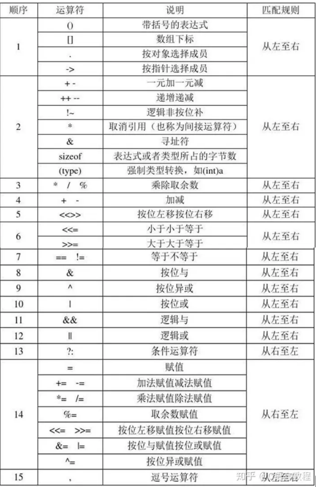
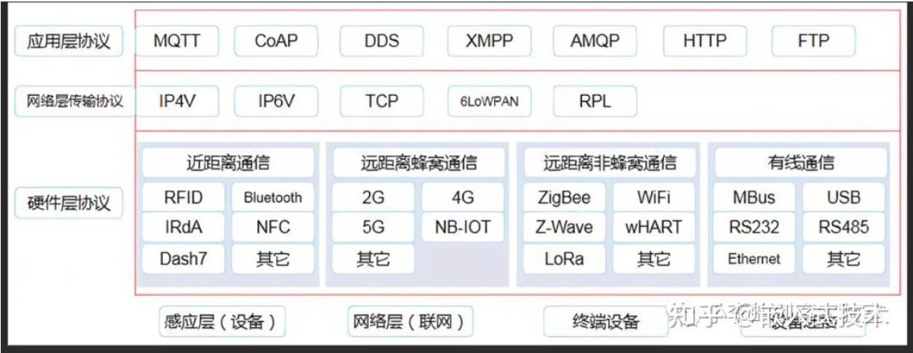
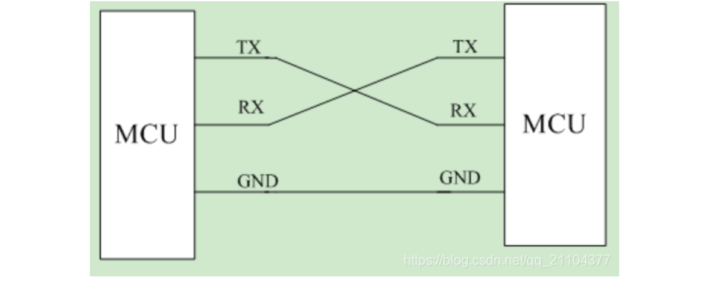
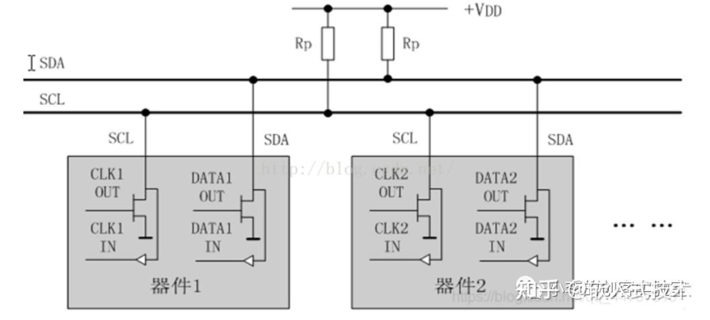
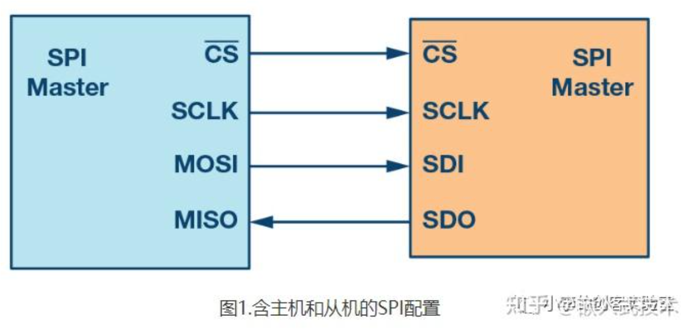
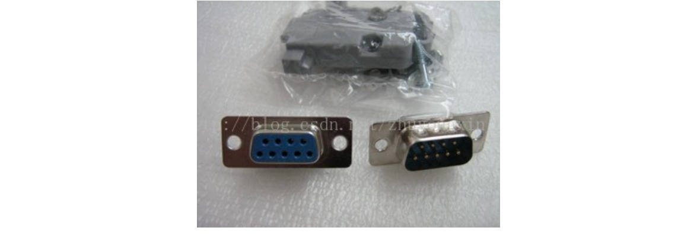
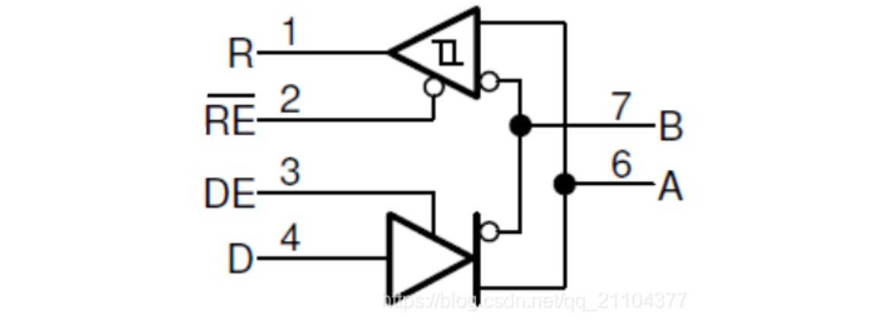
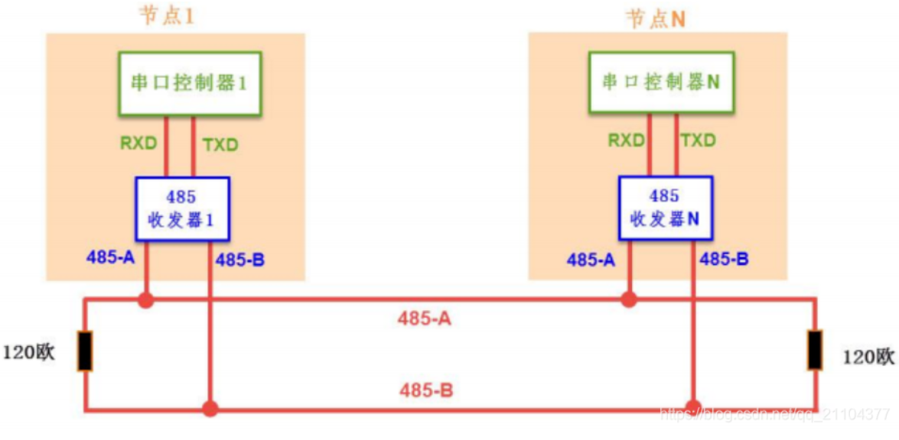

# 嵌入式笔记

# RTOS

### **内核态，用户态的区别**

内核态（Kernel Mode）和用户态（User Mode）是操作系统中两种不同的 CPU 执行状态，它们的核心区别在于 **权限级别** 和 **能访问的资源范围** 。

| 项目     | 用户态（User Mode）                    | 内核态（Kernel Mode）                    |
| -------- | -------------------------------------- | ---------------------------------------- |
| 权限     | 低权限                                 | 高权限                                   |
| 能做什么 | 只能访问受限的资源，不能直接操作硬件   | 可以访问所有资源，包括硬件、内存、中断等 |
| 安全性   | 更安全：防止用户程序破坏系统           | 不那么安全：需要谨慎处理                 |
| 常见场景 | 应用程序运行时（如浏览器、QQ、微信等） | 系统调用、中断、异常发生时               |

操作系统为了保护自己不被应用程序破坏，引入了“特权分级”机制：

- **用户态** ：应用程序只能使用有限的资源，不能直接访问硬件或修改关键寄存器。
- **内核态** ：操作系统内核运行在这个模式下，可以执行任何指令，管理整个系统的资源。

### 进程、线程

#### 进程 Process

- **进程 = 一个正在运行的程序**
- 它是操作系统进行资源分配的基本单位。
- 每个进程都有自己独立的内存空间、文件描述符、全局变量等。
- 进程之间**不能直接访问彼此的内存**，通信需要特殊手段（如管道、Socket、共享内存等）。

#### 线程 Thread

- **线程 = 进程中的执行单元**，**程序执行的最小单位**。
- 一个进程可以有多个线程，这些线程共享进程的资源（比如内存、变量、文件句柄等），但各自有自己的执行路径。

> **概述区别**
>
> 1. 地址
>
> - **进程是资源分配的最小单位，线程是CPU调度的最小单位**，进程有独立分配的内存空间，线程共享进程空间
>
> - 真正在cpu上运行的是线程
>
> 2. 开销
>
> - 进程切换开销大，线程轻量级
>
> 3. 并发性
>
> - 进程并发性差
>
> 4. 崩溃
>
> - 线程的崩溃不一定导致进程的崩溃


### **什么时候使用进程与线程**

多进程：

- 优点：进程独立，不影响主程序稳定性，可多CPU运行
- 缺点：逻辑复杂，IPC通信困难，调度开销大

多线程：

- 优点：线程间通信方便，资源开销小，程序逻辑简单
- 缺点：线程间独立互斥困难，线程崩溃影响进程

选择：频繁创建的用线程，CPU密集用进程，IO密集用线程

**总结：安全稳定选进程，快速频繁选线程**

比如freertos、Java Web 服务器、GUI 程序（如 Qt、Android App）用的多线程。

浏览器一般多进程，新建标签页就是新建进程，放置崩溃互相影响，在任务管理器可以看到多个进程。


### 死锁

**死锁是由于多个线程/进程在请求和持有资源时形成了“循环等待”，导致彼此都无法继续执行。**

条件：

（1） **互斥条件**：一个资源每次只能被一个进程使用。

（2） **不剥夺条件**：进程已获得的资源，在末释放前，不能强行剥夺。

（3） **请求与保持条件**：一个进程因请求资源而阻塞时，对已获得的资源保持不放。

（4） **循环等待条件**：若干进程之间形成一种头尾相接的循环等待资源关系。

解除与预防：打破上述一个条件即可

**避免死锁**

| 方法                                                  | 对应条件             | 说明                                   |
| ----------------------------------------------------- | -------------------- | -------------------------------------- |
| **按顺序加锁**                                        | 破坏循环等待         | 给所有锁编号，每次按照统一顺序申请资源 |
| **一次性申请所有资源**                                | 破坏“持有并等待”     | 避免中途等待资源                       |
| **设置超时机制**                                      | 破坏“不可抢占”       | 如果拿不到资源就放弃当前操作，稍后再试 |
| **使用资源分配图检测算法**                            | 破坏循环等待         | 系统定期检测是否形成资源循环依赖       |
| **使用 `std::lock()` 或 `std::scoped_lock`（C++17）** | 安全地锁定多个互斥量 | 自动处理死锁风险                       |

### 堆和栈

- 堆（Heap）由程序员手动申请和释放的内存区域，用于动态分配数据（如链表、对象等）。
- 栈（Stack）由编译器自动分配和释放的内存区域，用于存储函数调用过程中的局部变量、函数参数、返回地址等。

| 特性           | 堆（Heap）                                     | 栈（Stack）                            |
| -------------- | ---------------------------------------------- | -------------------------------------- |
| **分配方式**   | 手动分配（如`malloc`/`new`）                   | 自动分配（函数调用时局部变量压栈）     |
| **释放方式**   | 手动释放（如`free`/`delete`）                  | 自动释放（函数返回后弹出栈帧）         |
| **生命周期**   | 显式控制，可跨函数使用                         | 仅在当前函数作用域内有效               |
| **访问速度**   | 较慢（需要遍历链表或内存管理结构）             | 极快（CPU 直接支持，连续内存）         |
| **内存碎片**   | 容易产生（频繁 malloc/free）                   | 不会产生（先进后出结构）               |
| **大小限制**   | 大（受限于系统内存）                           | 小（通常 KB 级别，受编译器或系统限制） |
| **线程安全性** | 需要同步机制保护（多线程）                     | 每个线程有独立栈，天然线程安全         |
| **典型用途**   | 动态数据结构（链表、树）、大对象、全局共享数据 | 函数参数、局部变量、函数调用现场保存   |

**✅栈的注意事项：**

- 嵌入式系统中栈空间小，避免定义大数组或递归函数，防止**栈溢出（Stack Overflow）**
- 使用 RTOS 时，每个任务都有自己的栈，需合理配置栈大小

**✅堆的注意事项：**

- 尽量避免频繁使用 `malloc`/`free`，容易导致内存碎片
- 有些嵌入式系统禁用动态内存分配，改用静态内存池或内存块管理
- 若使用堆，务必注意**内存泄漏** 和**悬空指针**

**常见的一些问题**

**`new` 和 `malloc` 的区别？**

| 特性     | `new`                       | `malloc`             |
| -------- | --------------------------- | -------------------- |
| 语言     | C++ 运算符                  | C 库函数             |
| 构造函数 | 会调用构造函数              | 不会调用构造函数     |
| 类型安全 | 是                          | 否（需强制类型转换） |
| 内存不足 | 抛出异常（可指定`nothrow`） | 返回 NULL            |
| 释放方式 | `delete`                    | `free`               |

**什么是内存泄漏？如何避免？**

- **内存泄漏（Memory Leak）** ：堆内存申请后未释放，导致内存浪费。
- 原因 
  - 忘记 `free` / `delete`；
  - 指针被覆盖（丢失引用）；
- 解决方法 
  - 使用智能指针（C++11 起）；
  - RAII 技术（资源获取即初始化）；
  - 静态分析工具（如 Valgrind、AddressSanitizer）。

**什么是栈溢出？如何预防？**

- 栈溢出（Stack Overflow） 

  栈空间被耗尽，通常由以下原因导致：

  - 递归调用过深；
  - 定义超大局部变量；
  - 多线程栈大小设置不合理。

- 预防措施 

  - 避免递归；
  - 使用动态分配（堆）处理大数据；
  - 设置线程栈大小（如 pthread_attr_setstacksize）；
  - 使用静态分析工具检测潜在问题。


### freertos任务间通信

#### **消息队列**

这是一种用于在任务与任务之间、中断与任务之间传递信息的数据结构。消息队列支持超时机制，允许任务等待特定消息的到来或者在规定时间内尝试读取消息。


#### **信号量**

信号量主要用于同步某个任务与单个事件或任务。二值信号量是最基本的形式，用于实现简单的等待-通知机制。计数信号量可以处理信号的积压，而互斥锁（也称为互斥信号量）用于保护共享资源，确保任何时候只有一个任务可以访问该资源。

#### **互斥锁**

互斥锁是一种特殊类型的信号量，它保证在任何给定时间只有一个任务可以执行特定的代码段或访问特定的资源。

#### **事件标志组**

事件标志组主要用于一个任务与多个事件的同步，或者一个任务与多个任务之间的同步。它们允许任务等待多个事件中的任何一个发生。

#### **任务通知**

任务通知具有32位的消息通知值，可以减少RAM的使用，并且运行效率较高。当一个任务完成了某项工作或者发生了某个事件时，它可以通知另一个或多个等待该通知的任务。


# 基础语法

### static关键字

程序启动时创建，程序结束时销毁，初始化一次，

**用途** ：

- 对变量：延长生命周期，仅在定义它的文件或函数中可见。
- 对函数：限制函数的作用域为本文件（内部链接）。
- 对类成员：属于整个类，而非类的对象。

### const关键字

**用途** ：

- 定义静态常量，值不能被修改。
- 修饰指针、函数参数、返回值、成员函数等，增强程序安全性。

```c
const int MAX = 100; // 常量，不能更改

const int* p = &MAX; // 常量指针，指针指向的内容不能改
int* const q = &num; // 指针常量，指针指向不能变
```

`const` 关键字用于声明**只读变量**，它本身并不决定变量的存储位置。如变量本身在栈上加const也是在栈上的。

### volatile关键字

- 告诉编译器这个变量是“随时可能变化”的，不要优化对它的访问。
- 告诉编译器某个变量的值可能会以程序无法预知的方式被改变（例如：硬件自动修改、多线程并发修改）。编译器会针对这种特性调整优化策略，确保变量的读写操作直接与内存交互，而非依赖缓存或寄存器中的副本。

1. **禁止编译器优化内存访问**
   - 编译器通常会将变量值缓存到寄存器中，以减少内存访问次数。但 `volatile` 强制每次读写都直接访问内存，确保数据的实时性。
2. **保证内存可见性**
   - 在多线程或硬件交互场景中，变量值可能被外部修改。`volatile` 确保每次读取时获取的都是最新值，而非缓存的旧值。

`volatile`最常见的场景包括：

- **硬件寄存器**（如串口、定时器的控制寄存器）；

  ```c
  // 假设这是一个硬件状态寄存器的地址
  volatile uint32_t* const STATUS_REG = (uint32_t*)0x40001000;
  // 每次读取都直接访问内存（硬件寄存器）
  if (*STATUS_REG & 0x01) {  // 检查状态位
      // ...
  }
  ```

- **多线程共享的变量**（需结合原子操作或同步机制）；

- **中断服务程序 (ISR)** 中访问的全局变量。

  ```c
  volatile bool flag = false;  // 被ISR修改的标志
  
  // 主程序
  while (!flag) {
      // 等待标志被ISR设置
  }
  
  // 中断服务程序
  void ISR(void) {
      flag = true;  // 直接写入内存，避免优化
  }
  ```

  


### 联合体

**联合体（Union）** 是一种特殊的数据类型，允许不同变量共享同一块内存空间。与结构体（Struct）不同，联合体的所有成员起始地址相同，因此在同一时间只能存储一个成员的值。联合体的主要目的是**节省内存**

```c
union Data {
    int i;      // 4字节
    float f;    // 4字节
    char c[4];  // 4字节
};  // 总大小为4字节

union Data data;
data.i = 10;      // 写入整数
data.f = 3.14f;   // 写入浮点数，覆盖之前的整数
```

**嵌入式系统中的寄存器访问**

```c
union Register {
    uint32_t value;				//作为一个整体访问 32 位寄存器值。
    struct {
        uint32_t bit0 : 1;		//拆分为不同的位断
        uint32_t bit1 : 1;
        uint32_t bit2_7 : 6;
        uint32_t bit8_31 : 24;
    } bits;
};

// 使用示例
Register reg;
reg.value = 0x12345678;		//0001 0010 0011 0100 0101 0110 0111 1000
printf("bit0 = %d\n", reg.bits.bit0);  // 输出: 0

```

### **取u32的某一字节**

```c
// 方法1
union bit32_data {
uint32_t data;
struct {
uint8_t byte0;
uint8_t byte1;
uint8_t byte2;
uint8_t byte3;
}byte;
};
union bit32_data num;
num.data = 0x12345678;
printf("byte0 = 0x%x\n", num.byte.byte0);
printf("byte1 = 0x%x\n", num.byte.byte1);
printf("byte2 = 0x%x\n", num.byte.byte2);
printf("byte3 = 0x%x\n", num.byte.byte3);

// 方法2
#define GET_LOW_BYTE0(x) ((x >> 0) & 0x000000ff) /* 获取第0个字节 */低
#define GET_LOW_BYTE1(x) ((x >> 8) & 0x000000ff) /* 获取第1个字节 */
#define GET_LOW_BYTE2(x) ((x >> 16) & 0x000000ff) /* 获取第2个字节 */
#define GET_LOW_BYTE3(x) ((x >> 24) & 0x000000ff) /* 获取第3个字节 */高
unsigned int a = 0x12345678;
printf("byte0 = 0x%x\n", GET_LOW_BYTE0(a));
printf("byte1 = 0x%x\n", GET_LOW_BYTE1(a));
printf("byte2 = 0x%x\n", GET_LOW_BYTE2(a));
printf("byte3 = 0x%x\n", GET_LOW_BYTE3(a));
```

### strcmp

C/C++ 标准库中的一个字符串比较函数，用于按字典序（ASCII 码顺序）比较两个字符串。

```c
int strcmp(const char* str1, const char* str2);
strcmp("apple", "apple");
```

- 返回值
  - **负数**：`str1` 小于 `str2`（按字典序）。
  - **0**：      `str1` 等于 `str2`。
  - **正数**：`str1` 大于 `str2`。

### 运算符优先级



### 指针、数组指针、指针数组、函数指针

**指针**：指针是一个变量，存储的是另一个变量的内存地址。

**数组指针**：数组指针是一个指针，指向**整个数组**，而非数组的第一个元素。

- 作为函数参数传递多维数组

**指针数组**：指针数组是一个数组，其元素都是指针。

- 字符串数组（每个元素是指向 `char` 的指针）
- 动态内存管理（如数组的每个元素指向一块动态分配的内存）。

**函数指针**：指向函数的入口地址的指针

- 回调函数：一个被作为参数传入另一个函数的函数

  ```c
  #include <stdio.h>
  void greet() {
      printf("Hello, World!\n");
  }
  
  int main() {
      // 定义函数指针并赋值
      void (*funcPtr)() = &greet;
      // 通过函数指针调用函数
      funcPtr();  // 输出 Hello, World!
      return 0;
  }
  
  //示例二
  typedef void (*Callback)();
  void onClick(Callback callback) {
      printf("等待点击...\n");
      // 模拟点击发生
      printf("点击事件触发！\n");
      // 调用回调函数
      callback();
  }
  // 实际的回调函数1
  void onButtonClicked() {
      printf("用户点击了按钮！执行保存操作。\n");
  }
  int main() {
      onClick(onButtonClicked);
      printf("\n");
  }
  ```

- 实现函数表

```c
//指针
int* ptr = &num;			//一个指向int类型的指针
//数组指针
int arr[3] = {1, 2, 3};
int (*ptr)[3] = &arr;  		//  ptr是指向包含3个int元素的数组的指针
//指针数组
int a = 1, b = 2, c = 3;
int* arr[3] = {&a, &b, &c};  // 包含3个int*类型元素的数组
//函数指针
int add(int a, int b) { return a + b; }
int sub(int a, int b) { return a - b; }

int (*op)(int, int) = add;  // op指向add函数
printf("%d\n", op(3, 2));  // 调用add：输出5
op = sub;                  // op指向sub函数
printf("%d\n", op(3, 2));  // 调用sub：输出1

```

### #include <file.h>`和`#include "file.h"

**#include <file.h>**
编译器会去标准库目录或者事先指定好的外部库目录中查找头文件。

**#include "file.h"**
编译器首先会在当前源文件所在的目录下查找头文件。要是没找到，才会去标准库目录中继续搜索。

### 预编译,编译,汇编,链接

编写一个 C/C++ 程序并最终得到一个可执行文件时，背后经历了四个重要的构建阶段：**预编译（Preprocessing）、编译（Compilation）、汇编（Assembly）和链接（Linking）** 。

**预编译**

预编译器处理源代码中的预处理指令（以 `#` 开头的代码，#include、#define）

- 去除了所有预处理指令。
- 宏被替换为实际值。
- 所有 `#include` 的内容被合并进一个“完整”的 `.i` 文件（预处理后的源文件）。

**编译**

检查语法，将预处理后的 `.i` 文件（C/C++ 代码）翻译成 **汇编语言** （`.s` 文件）。

> 编译器会进行以下工作：
>
> 1. **词法分析（Lexical Analysis）** ：识别关键字、标识符、运算符等。
> 2. **语法分析（Syntax Analysis）** ：构建抽象语法树（AST）。
> 3. **语义分析（Semantic Analysis）** ：检查语法是否正确、类型是否匹配。
> 4. **优化（Optimization）** ：对代码进行性能优化（如常量折叠、循环展开等）。
> 5. **代码生成（Code Generation）** ：生成对应的汇编代码。

**汇编**

将汇编语言代码（`.s` 文件）翻译成 **机器语言** ，也就是 **目标文件（Object File）** ，通常扩展名为 `.o` 或 `.obj`。

- 汇编器将每一条汇编指令转换为对应的机器码（二进制）。
- 同时生成符号表（Symbol Table）和重定位信息（Relocation Info）。

**链接**

将多个目标文件（`.o`）和库文件（如 `libc.a`、`libstdc++.a`）**合并** 成一个**可执行文件**。

**总结**

| 阶段       | 输入文件     | 输出文件                      | 主要作用                                                     | 关键工具                 | 典型命令示例                |
| ---------- | ------------ | ----------------------------- | ------------------------------------------------------------ | ------------------------ | --------------------------- |
| **预编译** | `.c`/`.cpp`  | `.i`                          | 处理宏定义、头文件包含、条件编译等预处理指令                 | 预处理器（Preprocessor） | `gcc -E hello.c -o hello.i` |
| **编译**   | `.i`         | `.s`                          | 将预处理后的代码翻译成汇编语言，进行词法分析、语法分析、语义分析、优化等 | 编译器（Compiler）       | `gcc -S hello.i -o hello.s` |
| **汇编**   | `.s`         | `.o`                          | 将汇编代码转换为机器码，生成目标文件（二进制），包含符号表和重定位信息 | 汇编器（Assembler）      | `gcc -c hello.s -o hello.o` |
| **链接**   | `.o`+ 库文件 | 可执行文件（如`.out`/`.exe`） | 合并多个目标文件和库文件，解析符号引用，完成地址重定位       | 链接器（Linker）         | `gcc hello.o -o hello`      |

### **sizeof()与strlen()的区别？**

`sizeof`是运算符，计算能容纳实现所建立的最大对象的字节大小，参数可以是数组、指针、类型、对象、函数等；

`strlen`是函数，功能是返回字符串的长度，参数必须是字符型指针（char*）。

### 二级指针

当需要修改指针指向的值时，直接传递指针；而要改变指针本身的指向，则必须传递二级指针（指针的指针）

**一级指针**：**修改指针指向的值**

```c
#include <stdio.h>

// 修改指针指向的值
void modifyValue(int* ptr) {
    *ptr = 100;  // 修改ptr所指向的内存地址中的值
}

int main() {
    int num = 10;
    int* p = &num;  // p指向num
    printf("修改前: %d\n", *p);  // 输出: 10
    modifyValue(p);  // 传递指针p
    printf("修改后: %d\n", *p);  // 输出: 100
    return 0;
}
```

**二级指针**：**修改指针的指向**

```c
#include <stdio.h>
#include <stdlib.h>

// 修改指针的指向
void modifyPointer(int** ptr_ptr) {
    int* new_ptr = malloc(sizeof(int));  // 分配新内存
    *new_ptr = 200;                      // 初始化新内存
    *ptr_ptr = new_ptr;                  // 修改传入的指针，使其指向新内存
}

int main() {
    int num = 10;
    int* p = &num;  // p初始指向num

    printf("修改前: %d\n", *p);  // 输出: 10
    modifyPointer(&p);           // 传递指针p的地址（二级指针）
    printf("修改后: %d\n", *p);  // 输出: 200

    free(p);  // 释放动态分配的内存
    return 0;
}
```

**二级指针的本质**

- **普通指针（一级指针）**：存储的是**变量的地址**。
- **二级指针**：存储的是**另一个指针的地址**。

```c
int num = 10;     // 变量num，值为10
int* p = &num;    // 一级指针p，指向num的地址
int** pp = &p;    // 二级指针pp，指向p的地址
```

### CRC校验

循环冗余校验（Cyclic Redundancy Check， CRC）是一种用于检测数据传输过程中是否出现错误的校验方法。

- **基本原理**：CRC 校验通过在发送端根据要发送的数据生成一个固定长度的校验码，附加在原始数据后面一起发送到接收端。接收端接收到数据后，使用相同的算法对收到的数据进行计算，得到一个新的校验码。如果接收端计算出的校验码与接收到的校验码相同，那么就认为数据在传输过程中没有出现错误；反之，如果两者不同，则说明数据发生了错误。
- 计算过程
  1. **选择生成多项式**：生成多项式是一个预先选定的二进制数，通常用 *G*(*x*) 表示。不同的应用场景会使用不同的生成多项式，常见的有 CRC-8、CRC-16、CRC-32 等，分别对应不同的校验码长度和生成多项式。
  2. **添加冗余位**：在原始数据后面添加若干个 0，添加 0 的个数等于生成多项式的最高次幂。例如，对于生成多项式 *G*(*x*)=*x*3+*x*+1（对应的二进制数为 1011，最高次幂为 3），若原始数据为 101001，则在其后添加 3 个 0，得到 101001000。
  3. **进行模 2 除法**：将添加冗余位后的数据与生成多项式进行模 2 除法运算。模 2 除法与普通除法类似，但在计算过程中采用异或运算代替减法运算。用 101001000 除以 1011，得到商为 100100，余数为 111。
  4. **得到 CRC 校验码**：将余数作为 CRC 校验码。在上述例子中，余数 111 就是 CRC 校验码。将其替换原始数据后面添加的 0，得到最终要发送的数据 101001111。
- 特点
  - **检错能力强**：能够检测出多种类型的数据错误，包括单个错误、多个错误、突发错误等。对于随机错误，CRC 校验可以检测出大部分错误，检错率高达 99% 以上。
  - **实现简单**：可以通过硬件电路或软件算法高效地实现。硬件实现时，通常使用移位寄存器和异或门等简单逻辑电路来完成计算；软件实现也相对容易，计算速度快，适用于各种数据传输和存储场景。


**CRC实现代码**

```c
#include <stdint.h>

// CRC-32标准多项式 (0x04C11DB7 反转后的值)
#define CRC32_POLYNOMIAL 0xEDB88320

// 预计算的CRC-32表（用于加速计算）
static uint32_t crc_table[256];

// 初始化CRC表
void crc32_init_table() {
    for (uint32_t i = 0; i < 256; i++) {
        uint32_t crc = i;
        for (int j = 0; j < 8; j++) {
            if (crc & 1) {
                crc = (crc >> 1) ^ CRC32_POLYNOMIAL;
            } else {
                crc >>= 1;
            }
        }
        crc_table[i] = crc;
    }
}

// 计算数据的CRC-32值
uint32_t crc32(const void* data, size_t length) {
    const uint8_t* bytes = (const uint8_t*)data;
    uint32_t crc = 0xFFFFFFFF;  // 初始值
    
    // 处理每个字节
    for (size_t i = 0; i < length; i++) {
        uint8_t index = (crc ^ bytes[i]) & 0xFF;
        crc = (crc >> 8) ^ crc_table[index];
    }
    
    return crc ^ 0xFFFFFFFF;  // 最终异或值
}
```

```c
#include <stdio.h>

int main() {
    // 初始化CRC表（只需调用一次）
    crc32_init_table();
    
    // 待校验的数据
    const char* message = "Hello, CRC-32!";
    size_t length = strlen(message);
    
    // 计算CRC-32值
    uint32_t result = crc32(message, length);
    
    // 输出结果（以十六进制表示）
    printf("CRC-32: 0x%08X\n", result);			//CRC-32: 0x84D41CA3
    
    return 0;
}
```

### **静态链接与动态链接**

**静态库在链接阶段的进行组合，动态库在运行时加载**。

在编译过程中，源代码被转换为多个目标文件（.o 或.obj），但这些文件可能依赖于其他库或模块中的函数和变量。**链接**就是将这些分散的目标文件和库组合成一个完整的可执行文件的过程。

1. 静态链接（Static Linking）：

- 在编译时将所有的函数和库代码合并成一个可执行文件。

- 链接是在编译段完成的，链接库和目标代码中提取所需的函数和库代码，将它们合并到最终的执行文件中 - 链接结果是一个独立的、完的可执行文件，包含了所有依赖的函数和库代码。

- 优点：

  执行速度快，为所有代码已经被编译和链接在一起，无需运行时动态加载额外的库文件。

  可执行文件独立，可以在没有安装相应库文件的系统上运行。

- 缺点：

  可执行文件较大，因为所有依赖的函数和库代码都被静态链接到可执行文件中。

  更新和替换依赖的函数和库代码需要重新编译和链接整个程序。

  

2. 动态链接（Dynamic Linking）：

- 在运行通过动态链接库在内存中加载所需的函数和库代码。

- 链接是在运行时完成的，链接器在运程序时动态加载所需的函数和库代码。

- 链接结果是一个可执行文件和一个或多个动态链接库，可执行文件只包含必要的启动代码和符号引用。

- 优点：

  可执行文件较小，因为只包含必要的启动代码和符号引用。

  动态链接库可以在多个可文件之间共享，节省内存空间。

  更新和替换依赖的函数和库代码只需要替换对应的动态链接库。

- 缺点：

  相对于静态链接，运行时需要额外的时间加载和解析动态链接库。 -中必须存在相应的动

  态链接库文件，否则程序无法运行。


# 基础概念

### 虚短和虚断


# [通信协议](https://www.cnblogs.com/lzc978/p/12739337.html)



### 串行通信和并行通信

#### 串行通信

串行接口简称串口，串行接口 （Serial Interface）是指**数据一位一位地顺序传送**。UART、RS232、RS485、TTL都遵循着类似的通信时序协议。

串行通信（serial communication）是指计算机主机与外设之间以及主机系统与主机系统之间数据的串行传送。使用一条数据线，将数据一位一位地依次传输，每一位数据占据一个固定的时间长度。

串行通信按照发送时钟源和接收时钟源是否需要保持一致，又可分为**同步通信**和**异步通信**两种。

##### 同步通信

是指数据传送是以数据块（一组字符）为单位，字符与字符之间、字符内部的位与位之间都同步。一般需要一个同步的时钟。

发送方发送数据后必须等待接收方的响应或确认，才能继续执行。通信是阻塞式的。

> 数据格式：
>
> 　　① 2个同步字符作为一个数据块(信息帧)的起始标志；
>
> 　　② n个连续传送的数据
>
> 　　③ 2个字节循环冗余校验码(CRC)


##### 异步通信

是指数据传送以字符为单位，字符与字符间的传送是完全异步的，位与位之间的传送基本上是同步的（传输的时间间隔）。

发送方发送数据后不等待接收方响应，直接继续执行。通信是非阻塞式的，通常通过回调、事件通知等方式处理结果。

> 数据格式：
>
> 　　① 1位起始位，规定为低电0；
>
> 　　② 5～8位数据位，即要传送的有效信息；
>
> 　　③ 1位奇偶校验位；
>
> 　　④ 1～2位停止位，规定为高电平1。


> 同步通信和异步通信的核心区别在于**是否需要等待响应**。
> 同步通信是阻塞式的，发送方必须等待接收方回应才能继续执行；而异步通信是非阻塞的，发送方发出数据后可以立即做其他事情，接收方处理完后再通过回调或通知的方式反馈结果。
> 同步适用于要求实时性和一致性的场景，比如传统 HTTP 请求；异步更适用于高并发、高性能的场景，比如消息队列、事件驱动架构等。


#### 并行通信

并行通信（Parallel communication）就是指数据的每一位同时在多根数据线上发送或者接收。可以以**字或字节为单位并行**进行。一字等于4/8字节。

### 电平信号和差分信号

1. 电平信号和差分信号是用来描述通信线路传输方式的。也就是说如何在通信线路上表达1 和 0.
2. 电平信号的传输线中有一个参考电平线（一般是 GND），然后信号线上的信号值是由信号线电平和参考电平线的电压差决定。
3. 差分信号的传输线中没有参考电平，所有都是信号线。然后 1 和 0 的表达靠信号线之间的电压差。

总结：电平信号的 2 根通信线之间的电平差异容易受到干扰，传输容易失败；差分信号不容易受到干扰因此传输质量比较稳定，现代通信一般都使用差分信号，电平信号几乎没有了。


### UART

**通用异步收发传输器**（Universal Asynchronous Receiver/Transmitter）



**原理**

- 全双工异步串行通信，无需时钟线，发送端和接收端各自用内部时钟按预定波特率（Baud rate）进行数据采样与发送。
- 数据帧通常包含：起始位（1位）、数据位（5–9位可选）、可选校验位（0/1位）、停止位（1–2位）。

**特点**

- **异步通信**：无需共享时钟，依赖波特率同步。
- **全双工**：双向独立传输。
- **两线制**：TX（发送）、RX（接收）。
- **无握手信号**：需提前约定波特率、数据位、停止位、校验位。


起始位

数据位

奇偶校验位

停止位

#### USART

通用同步异步收发传输器（异步模式同UART）

| **特性**         | **UART（异步）**                         | **USART（同步 + 异步）**                       |
| ---------------- | ---------------------------------------- | ---------------------------------------------- |
| **时钟依赖**     | 无共享时钟，依赖波特率同步               | **支持同步模式**（需外部时钟或内部生成）       |
| **传输线**       | 2 线（TX/RX）+GND                        | 异步模式同 UART，同步模式增加时钟线（如 SCLK） |
| **数据帧结构**   | 起始位 + 数据位 + 校验位（可选）+ 停止位 | 异步模式同 UART，同步模式无起始 / 停止位       |
| **同步机制**     | 仅靠波特率误差容忍（通常≤2%）            | 可通过 SCLK 严格同步，支持更高波特率           |
| **典型应用场景** | 低速设备通信（如蓝牙模块、GPS）          | 高速同步传输（如 SPI 兼容设备、高速传感器）    |

### I²C

**Inter-Integrated Circuit**



**特点**

- **同步通信**：使用 SCL（时钟线）和 SDA（数据线）。
- **半双工**：同一时间只能单向传输。
- **多主多从**：支持多个主设备和从设备，通过地址区分。
- **开漏输出**：需上拉电阻，线与特性。

**通信流程**

1. 主设备发送起始信号（SCL 高电平时， SDA 下降沿）。空闲时刻SCL和SDA都是高电平。
2. 发送从设备地址（7 位地址 + 1 位读写位）。
3. 从设备应答（ACK/NACK）。
4. 数据传输（MSB 优先）。
5. 主设备发送停止信号（SCL 高电平时， SDA 上升沿）。

> 起始条件：SCL高电平期间，SDA从高电平切换到低电平
>
> 终止条件：SCL高电平期间，SDA从低电平切换到高电平


### [SPI](https://blog.csdn.net/as480133937/article/details/105764119)




**Serial Peripheral Interface**

> 所有SPI设备的SCK、MOSI、MISO分别连在一起
>
> 主机另外引出多条SS控制线，分别接到各从机的SS引脚
>
> 输出引脚配置为推挽输出，输入引脚配置为浮空或上拉输入

**特点**

- **同步通信**：使用 SCK（时钟）、MOSI（主发从收）、MISO（主收从发）、CS（片选）。
- **全双工**：双向同时传输。
- **主从模式**：一个主设备控制多个从设备（每个从设备独立 SS 线）。
- **高速率**：可达数十 Mbps。

> SPI只有主模式和从模式之分，没有读和写的说法，**外设的写操作和读操作是同步完成的**。如果只进行写操作，主机只需忽略接收到的字节；反之，若主机要读取从机的一个字节，就必须发送一个空字节来引发从机的传输。也就是说，**你发一个数据必然会收到一个数据**；你要收一个数据必须也要先发一个数据。

CPOL配置SPI总线的极性，CPHA配置SPI总线的相位。CPOL—Clock Polarity，CPHA—Clock Phase。

```
CPOL = 0：表示空闲时是低电平
CPOL = 1：表示空闲时是高电平
CPHA = 0：表示从第一个跳变沿开始采样（接受数据）。第二个跳变移出数据（发送数据）。
CPHA = 1：表示从第二个跳变沿开始采样。			 第一个跳变移出数据。
```

|  mode  | CPOL | CPHA |
| :----: | :--: | :--: |
| mode 0 |  0   |  0   |
| mode 1 |  0   |  1   |
| mode 2 |  1   |  0   |
| mode 3 |  1   |  1   |

下图data位MISO线，发送数据线未标明。


**它们的区别是定义了在时钟脉冲的哪条边沿转换（toggles）输出信号，哪条边沿采样输入信号**。


### [CAN](https://zhuanlan.zhihu.com/p/677658199)

**Controller Area Network** 控制器局域网协议

**特点**

- **异步通信**：基于差分信号（CAN_H 和 CAN_L）传输，具有良好的抗干扰性能
- **多主机模式**：所有节点可主动发送数据。在同一个时刻，只能由一个节点发送数据
- **总线型**：所有节点共享同一总线。
- **错误检测与重传**：支持 CRC 校验、位填充、错误帧。
- **优先级机制**：通过 ID 决定消息优先级（ID 越小，优先级越高）。每一个帧有一个标识符ID。
- 实时性：CAN总线具有优越的实时性
- 低成本

**总线结构**

一个CAN节点的硬件部分一般由CAN控制器和CAN收发器两个部分组成。CAN控制器负责CAN总线的逻辑控制，实现CAN传输协议；CAN收发器主要负责MCU逻辑电平与CAN总线电平之间的转换。

**开环总线结构**


**闭环总线结构**


CAN总线由两根信号线CANH和CANL，没有时钟同步信号。所以CAN是一种异步通信方式。

两根信号线的电压差CANH-CANL表示CAN总线的电平，与传输的逻辑信号1或0对应。


CAN总线上的一个终端设备称为一个节点（Node），在CAN网络中，没有主设备和从设备的区别。一个CAN节点的硬件部分一般由CAN控制器和CAN收发器两个部分组成。CAN控制器负责CAN总线的逻辑控制，实现CAN传输协议；CAN收发器主要负责MCU逻辑电平与CAN总线电平之间的转换。


> - 有11位识别码，区分多达2048个设备；
> - RTR为了区分数据帧或远程请求帧；
> - 控制码有6位，第一位区分标准帧和拓展帧（识别位有29位），第二位是空闲位，接下来4为是DLC，控制数据码的长度，0001表示数据有8位，1000表示数据有64位；
> - CRC是循环冗余校验码，检测到错误时会自动重传；
> - CRC界定符为了把后面信息隔开；
> - 后面2位分别是ACK（接收1则发送0）和ACK界定符；
> - 最后7位是结束位

##### CAN的仲裁机制

高电平低电平同时存在就选择低电平的节点，高的就被放弃。


### TTL电平

TTL是`Transistor-Transistor Logic`的简写，是一种电平逻辑，晶体管-晶体管逻辑。

3.3V/5V等价于逻辑“1”，0V等价于逻辑“0”。UART特指单片机的UART端口，使用的就是TTL电平。嵌入式里面说的串口，一般是指UART口，而**TTL、RS-232、RS-485是指的电平标准(电信号)。**

**标准TTL电平逻辑**
输出电路：电压大于等于（≥）2.4V为逻辑1；电压小于等于（≤）0.4V为逻辑0；
输入电路：电压大于等于（≥）2.0V为逻辑1；电压小于等于（≤）0.8V为逻辑0；

**CMOS电平**
输出电路：电压大于等于（≥）0.9×Vcc为逻辑1；电压小于等于（≤）0.1×Vcc为逻辑0；
输入电路：电压大于等于（≥）0.7×Vcc为逻辑1；电压小于等于（≤）0.3×Vcc为逻辑0；


### **RS-232**

**Recommended Standard 232** 推荐标准



**特点**

- **异步通信**：基于单端信号（TX、RX、GND）。RS232发送是靠TXD和GND之间的电压来传数据。
- **全双工**：双向独立传输。一对一进行通信。
- **高电压电平**：±15V，逻辑 0 为 + 3V~+15V，逻辑 1 为 - 3V~-15V。

优缺点

- **优点**：历史悠久，兼容性强。
- **缺点**：传输距离短（≤15m），抗干扰能力差，电平不兼容 TTL。

真正设备间通信肯定是RS232电平的串口数据，抗干扰能力强，TTL电平是电路板上使用的电平，所以真正传输时，肯定会进行RS232和TTL之间的转换。

**TTL和RS-232互转**

单片机接口一般是TTL电平，如果需要接232电平的外设，就需要加TTL转RS232的模块，转换方向是双向的。能实现TTL和RS232电平互相转换最常用的芯片是MX232。


### RS-485

**特点**

- **异步通信**：基于差分信号（A、B）。
- **半双工**：同一时间只能单向传输。
- **多节点**：支持最多 32 个节点（通过增加收发器可扩展至 256 个）。
- **远距离**：最长 1200m@100kbps。
- ±6V，逻辑0为-6V\~-2V，逻辑1为+2V~+6V

优缺点

- **优点**：抗干扰能力强，传输距离远，支持多节点。
- **缺点**：需软件控制收发切换，不支持全双工。

**TTL和RS-485转换**

比如MAX485，一般左边接MCU的GPIO，用来控制。






### USB

Universal Serial Bus（通用串行总线）

一条USB传输线分别由地线、电源线、D+和D-四条线构成，D+和D-是差分输入线，它使用的是3.3V的电压。

USB设备可以直接和HOST通信，或者通过Hub和Host通信。


### I²S

主要用于音频数据传输
串行，同步，半双工

三根线

- SCK（时钟线）
- WS（左右时钟线，选择左右声道）
- SD（数据线，数据可以是单声道或立体声，格式通常是线性PCM编码）


时钟上升沿时发数据，下降沿时读数据

WS的高低表示不同的声道，在一个SCK时钟周期内，一半的时间用于传输左声道数据，另一半时间用于传输右声道数据。WS跳转表示一字节数据传输的最后一位


### **汇总对比表**

| **协议** | **通信方式** | **拓扑结构** | **速率**      | **传输距离**   | **节点数**  | **典型应用场景**       |
| -------- | ------------ | ------------ | ------------- | -------------- | ----------- | ---------------------- |
| UART     | 异步         | 点对点       | ≤115.2kbps    | ≤几米          | 2           | 调试接口、短距设备通信 |
| I2C      | 同步         | 多主多从     | ≤400kbps      | ≤几米          | 127         | 板内低速多设备通信     |
| SPI      | 同步         | 主从         | 可达数十 Mbps | ≤1m            | 1 主 + 多从 | 高速数据传输           |
| CAN      | 异步         | 总线型       | ≤1Mbps        | ≤1km@5kbps     | 理论无限制  | 汽车电子、工业控制网络 |
| RS-232   | 异步         | 点对点       | ≤20kbps       | ≤15m           | 2           | 早期计算机外设         |
| RS-485   | 异步         | 总线型       | ≤10Mbps@100m  | ≤1200m@100kbps | 32~256      | 工业长距多节点通信     |

#### **选择建议**

- **短距、低速、简单场景**：UART、I2C。
- **高速数据传输**：SPI。
- **长距、高可靠性**：CAN、RS-485。
- legacy 系统兼容：RS-232。


### 其他

接口协议：程序下载、调试

##### JTAG

JTAG 是一种国际标准测试协议，主要用于芯片内部测试及对程序进行调试与下载。它一般需要 5 根信号线：

- TCK（Test Clock）：测试时钟输入，为 JTAG 通信提供时钟信号。
- TMS（Test Mode Select）：测试模式选择，用于控制 JTAG 状态机的转换。
- TDI（Test Data In）：测试数据输入，数据和指令通过此线从主机传入目标设备。
- TDO（Test Data Out）：测试数据输出，数据通过此线从目标设备传回主机。
- TRST（Test Reset）：测试复位，可选信号线，用于复位 JTAG 接口。

借助 JTAG 接口，开发者能够对芯片内部的寄存器和存储器进行访问，实现程序的下载、断点设置以及单步执行等调试操作。

##### SWD

SWD 是 ARM 公司推出的一种调试接口，它对 JTAG 进行了优化，属于一种串行调试协议。相比 JTAG，SWD 只需要两根信号线：

- SWDIO（Serial Wire Data Input/Output）：双向数据线，负责数据的传输。
- SWCLK（Serial Wire Clock）：时钟线，为通信提供时钟。

SWD 在保留与 JTAG 相同调试功能的同时，减少了对引脚的占用，降低了 PCB 设计的复杂度。而且，SWD 的通信效率更高，调试速度更快。STLINK就是这种方式


# STM32

### 启动流程

1. 依据boot引脚选择启动区域

   

   注：引脚的顺讯为boot1,boot0

2. 运行bootloader

   

   - 硬件设置SP、PC，进入复位中断函数Rest_Hander()
   - 设置系统时钟，进入SystemInit()
   - 软件设置SP，__main入栈（统初始化函数）
   - 加载data、bss段并初始化_main栈区

3. 跳转到main

### 中断的过程

#### **中断初始化**

1. 设置中断源，让某个外设可以产生中断；
2. 设置中断控制器，使能/屏蔽某个外设的中断通道，设置中断优先级等；
3. 使能CPU中断总开关

**CPU**每执行完一条指令（指令有多个时钟周期，取指、译码、执行等）都会检查是否有异常中断产生

发现有异常/中断产生，开始处理：

1. 保存现场（PC、LR、MSP、通用寄存器、FPU压栈）
2. 分辨异常/中断，调用对应的异常/中断处理函数
3. 恢复现场（PC与出栈）

##### **关键机制与概念**

**1. 中断向量表（Interrupt Vector Table, IVT）**

- **作用**：存储中断类型号与中断服务程序入口地址的映射关系（如 x86 系统中，0 号中断对应除法错误处理程序，13 号对应内存错误）。

**2. 现场保护与恢复**

- **必要性**：确保中断返回后原程序正确执行，需保存 CPU 寄存器、标志位、栈指针等状态。
- 实现方式
  - 自动保存：由 CPU 在中断响应时完成（如 x86 的 FLAGS、CS:IP）；
  - 手动保存：由中断服务程序通过 PUSH/POP 指令完成（如通用寄存器 AX、BX 等）。


嵌套向量中断控制器NVIC：多个优先级中断到来后的处理顺序

处理流程：CPU收到(interrupt request，IRQ)后，通过上下文切换保存当前工作状态，跳转至中断处理

函数执行（中断向量表），完成后再出栈执行原有程序


### IO口类型


### [推挽输出和开漏输出](https://www.cnblogs.com/lichangyi/p/17957498)

#### 推挽输出

推挽输出使用两个MOS管（图1 一个P型，一个N型）交替工作来直接驱动负载，输出由输出控制决定。

当**输出控制**是高电平时，P型晶体管导通，N型晶体管截止，从而将**输出**接到电源电压(图2 推)；当**输出控制**是低电平时，P型晶体管截止，N型晶体管导通，从而将**输出**接到地（图3 挽）。这种配置允许推挽输出在高电平和低电平时都具有较强的驱动能力。


- 优点：
  1. 不需要外部上拉或下拉电阻。
  2.  输出电压与电源电压几乎没有压差（大约0.7V）
  3.  高低电平的驱动能力都较强 
  4.  切换输出快
- 缺点：不适合用于多路输出共享一条线的应用，因为任何一个输出在低电平时都会将共享线拉低，不支持线与


#### 开漏输出

开漏输出只有一个N型晶体管。

当**输出控制**是低电平时，晶体管导通，**输出**接地（图2）；当需要**输出控制**高电平时，晶体管截止，输出悬空高阻态（开漏）。


- 优点：
  1. 适用于多个设备共享一条数据线（如I²C总线），因为任何设备都不会强制拉高数据线，支持线与。
  2.  可以实现电平转换，输出电平取决于上拉电阻

- 缺点：
  1. 高电平驱动能力差，高电平的驱动能力取决于外部上拉电阻，不如推挽输出强。
  2. 输出电平切换速度取决于外部上拉电阻，电阻越小速度越快。

### ADC采样原理